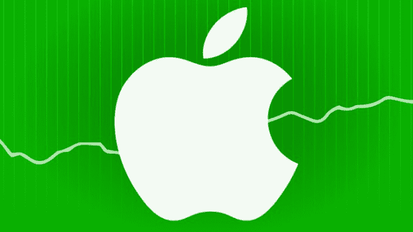

# 苹果刚刚经历了有史以来最赚钱的一个季度 

> 原文：<https://web.archive.org/web/https://techcrunch.com/2015/01/27/apple-just-had-the-biggest-quarterly-earnings-of-any-company-ever/>

# 苹果刚刚经历了有史以来最赚钱的一个季度

苹果公司有一个相当不错的季度。

我说的“相当不错”是指这是历史上最大的一个季度。不仅仅是苹果公司。对于任何公司来说。永远不会。

这一页记录了过去的记录保持者。直到今天，俄罗斯天然气工业股份公司(世界上最大的天然气开采公司)保持着一个季度 162 亿美元的纪录。

苹果现在保持着纪录:180.4 亿美元的利润，2015 财年 Q1。

绝对的。精神错乱。

作为参考，这意味着**苹果每小时赚大约 830 万美元**(一天 24 小时)。

在目前前 20 大记录持有者中，15 家是石油/天然气生产商，主要是埃克森美孚和壳牌。其他五家都是苹果公司，分布在不同的地区。

