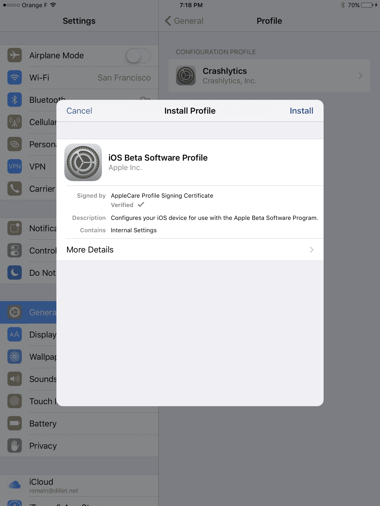

# 苹果刚刚向所有人发布了第一个 iOS 10 测试版 

> 原文：<https://web.archive.org/web/https://techcrunch.com/2016/07/07/apple-just-released-the-first-ios-10-beta-to-everyone/>

# 苹果刚刚向大家发布了第一个 iOS 10 测试版

它在这里。iOS 10 的第一个公测版[现在](https://web.archive.org/web/20221006210140/https://beta.techcrunch.com/2016/07/07/ios-10-preview/)[可以下载](https://web.archive.org/web/20221006210140/https://beta.apple.com/)。你可以下载，甚至你的邻居也可以下载。好消息是，你不必为一个开发者账户每年支付 99 美元。但请记住，这是一个测试版。

如果你迫不及待地想看到 iOS 10 的运行，苹果的公测计划就是为你准备的。该公司希望你在秋季发布新操作系统之前试用一下。开发者测试版让开发者利用所有新的 API，而公共测试版则是为了消除错误。由于苹果几天前刚刚发布了第二个开发者测试版，可以肯定地说第一个公开测试版和第二个开发者测试版是同一个。

但请记住，你不应该在你的主要手机或 iPad 上安装 iOS 测试版。有些东西不工作，而其他的可能会让你的手机完全崩溃。毕竟这是个测试版。但是如果你有一个 iOS 设备，首先备份你的设备。通过进入 iPhone 上的设置应用程序来确保 iCloud 备份是最新的，或者将 iOS 设备插入电脑，在 iTunes 中进行手动备份(或者两者都进行)。

然后，下面是下载的方法。前往[并注册您的兼容 iOS 设备。然后你必须安装一个配置描述文件并更新 iOS。9 月份，你的设备应该会自动更新到 iOS 10 的最终版本。](https://web.archive.org/web/20221006210140/https://beta.apple.com/)

iOS 10 的特点是大量的 Siri 更新与第三方集成。虽然在测试期间很难看到最终结果，因为第三方开发者尚未发布 iOS 10 应用，但它可能会对你使用 iPhone 的方式产生很大影响。

苹果还推出了一个完全重新设计的锁屏，具有丰富的通知，可以显示微小的实时部件，以及一个巨大的照片应用程序更新，具有人脸识别、深度学习分类和智能相册。苹果地图、苹果音乐、HomeKit 和手机应用也在更新。最后，该公司正在用许多许多新功能彻底改造 Messages 应用程序——表情功能、消息效果、类似 Slack 的消息反馈、丰富的链接预览和第三方扩展。

当你下载测试版的时候，为什么不去看看我们的 iOS 10 的早期版本呢？通过这种方式，你将了解关于 iOS 10 你需要知道的一切，这样你就可以用新功能给你的朋友留下深刻印象。

