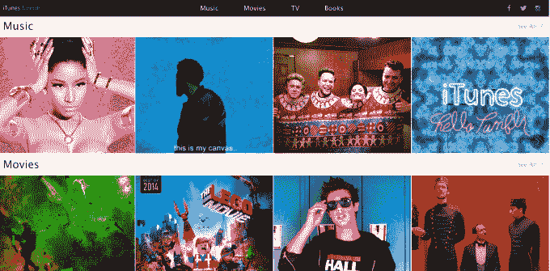

# 苹果推出新的 Tumblr 网站推广 iTunes 

> 原文：<https://web.archive.org/web/https://techcrunch.com/2014/12/22/apple-launches-a-new-tumblr-site-promoting-itunes/>

# 苹果推出新的 Tumblr 网站推广 iTunes

苹果扩大了其社交媒体营销努力，再次将 Tumblr 包括在内，推出了新的 iTunes Tumblr 网站，目前正在推广音乐、电影、电视和书籍的“2014 年最佳”。该博客的特色是每个类别的“最佳”视频，结合可共享的 gif、图像、引用和其他内容，非常适合重新撰写博客。

~~我们也听说，苹果不仅仅是 Tumblr 上的*，它还是一个广告客户*~~。(更新:这个没有得到证实——未来可能会上台面，但不是今天。)然而，截至今天早上，新的 iTunes 博客并没有立即出现在 Tumblr 的广告单元中，比如雷达、趋势或赞助帖子。

无论如何，苹果 Tumblr 博客上的内容显然是为了让 Tumblr 用户进一步分享而设计的，有易于访问的脸书和 Twitter 按钮，以及“收藏”或重新博客的选项。

这不是苹果第一次涉足 Tumblr。今年早些时候，该公司曾推出 Tumblr 网站来推广 iPhone 5c，当时有报道称苹果也在 Tumblr 上做广告。那个网站，【isee5c.tumblr.com】还在直播，但是所有的内容似乎已经被移除了。

此外，正如 [MacRumors](https://web.archive.org/web/20221204114545/http://www.macrumors.com/2014/12/22/apple-new-itunes-tumblr-site/) 所指出的，苹果还在几周前为 iTunes 创建了一个 [Instagram](https://web.archive.org/web/20221204114545/http://instagram.com/iTunes) 账户——这一举动发生在苹果雇佣耐克前社交媒体负责人穆萨·塔里克(Musa Tariq)的几个月之后。

顺便提一下，Tumblr 最近[开始测试一个新的广告平台](https://web.archive.org/web/20221204114545/https://beta.techcrunch.com/2014/11/25/tumblr-rolls-out-mobile-app-install-ads-in-the-form-of-shareable-sponsored-posts/)，通过一个新的广告单元推广移动应用程序，可以增加 iTunes 的流量。如果用户没有下载应用程序，应用程序安装广告将在用户的手机上打开 iTunes 的应用程序商店，或者如果用户已经拥有应用程序，将允许用户在手机上打开应用程序。