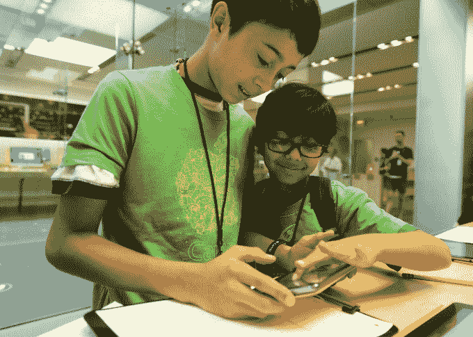

# 苹果公司在其零售店为孩子们开设了编码营

> 原文：<https://web.archive.org/web/https://techcrunch.com/2016/06/21/apple-launches-coding-camps-for-kids-in-its-retail-stores/>

今年夏天，苹果扩大了其苹果夏令营阵容，增加了一门教授儿童编程基础知识的新课程。针对 8 至 12 岁的儿童，为期 3 天的新课程将使用 Tynker 的软件介绍基于块的编码概念，并允许孩子们对 Sphero 机器人进行编程。这些课程将会很小——最多只有十几个人参加——今天早上开始在[注册](https://web.archive.org/web/20230316042557/https://concierge.apple.com/camp/choosestore/en_US),同时还有苹果正在进行的夏令营系列中的其他课程。

虽然苹果已经举办[苹果营](https://web.archive.org/web/20230316042557/http://www.apple.com/retail/learn/youth/)多年，但这是它第一次提供这种“游戏编码和机器人编程”课程。公司参加了代号为的[小时，不过，那是在 12 月，与营地分开。](https://web.archive.org/web/20230316042557/https://hourofcode.com/us)

新的编码类的首次亮相正值苹果公司越来越注重帮助年轻用户引入编码。例如，在 WWDC 的活动中，该公司[推出了一款名为 Swift Playgrounds](https://web.archive.org/web/20230316042557/https://techcrunch.com/2016/06/13/apple-launches-swift-playgrounds-for-ipad-to-teach-kids-to-code/) 的新 iPad 应用，该应用教孩子们用 Swift 编程。

然而，这款应用面向稍大一点的儿童——12 岁及以上的儿童。

在课程的某一天，孩子们将使用 Tynker 的学习软件介绍编码概念。

[Tynker](https://web.archive.org/web/20230316042557/https://www.tynker.com/) ，[刚刚又筹集了 710 万美元](https://web.archive.org/web/20230316042557/https://techcrunch.com/2016/05/31/tynker-raises-7-1m-to-expand-its-code-teaching-programs-to-new-schools-and-regions/)，因为它扩大了在学校和营地的足迹，提供了一个可视化界面，帮助孩子们理解如何使用积木编程。它也作为一种编程 Sphero 机器人的手段。

在另一天的编码课上，孩子们将实际上教他们的机器人使用命令移动和点亮。

苹果营始于 2003 年，是向孩子们介绍苹果技术及其软件的一种方式。该公司在世界各地的零售商店提供课程，但它们不是真正的“夏令营”,不像那些父母把孩子送回家然后去工作的夏令营。

相反，孩子们花 90 分钟学习一项新技术，而父母则呆在苹果零售店上课。在此期间，工作人员将向父母概述他们的孩子正在学习的内容，同时还会就苹果产品的其他家庭功能对他们进行培训，比如如何设置限制或管理家中的多台设备。

苹果之前已经在 iBooks 和 iMovie 上提供了会话，从今天早上开始也可以注册了。iBooks Camp 允许孩子们使用插图和效果创作自己的故事，然后在课程结束时向家长展示他们的最终作品。今年，苹果将扩大该课程，以包括 iPad Pro 和 Pencil 的使用。

与此同时，iMovie Camp 允许孩子们使用苹果设备拍摄和编辑他们自己的电影。

苹果公司在 7 月份每周提供一次夏令营，但在一天中的不同时间进行。7 月 11 日和 7 月 18 日这两个星期将重点关注 iBooks 和 iMovie(“iMovie 动态故事”和“iBooks 互动讲故事”)。然后这个月的最后一周将是新的编码研讨会。

这些课程是免费的，但先到先得。由于班级人数少，在一些市场，班级注册人数会很快增加。苹果再次预计今年将有 60，000 名儿童参加苹果营。

然而，虽然 iBooks 和 iMovie 会话将在所有苹果零售店中提供，但编码类不会。只有美国、英国、加拿大和大中华区的商店才会开设这门课程。在世界其他地方，商店将选择在 7 月的最后一周开设其他课程。