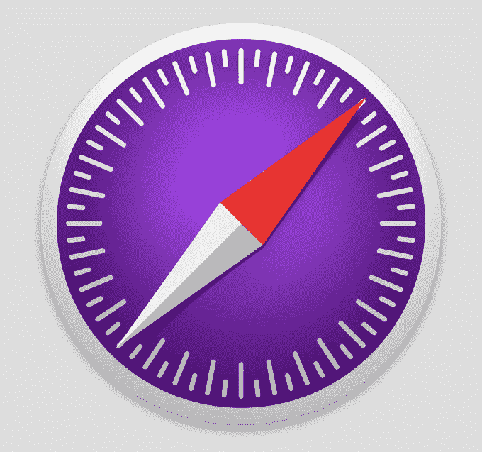

# 苹果推出 Safari 技术预览版，这是一款面向网络开发者的新浏览器

> 原文：<https://web.archive.org/web/https://techcrunch.com/2016/03/30/apple-launches-safari-technology-preview-a-new-browser-aimed-at-web-developers/>

苹果公司今天宣布扩大其在网络开发领域的努力，推出了专门为开发者设计的新版 Safari 网络浏览器。该公司称，这款名为 [Safari Technology Preview](https://web.archive.org/web/20221209065638/http://developer.apple.com/safari/download) 的浏览器将允许开发者提前了解 OS X 和 iOS 即将推出的网络技术，包括最新的布局技术、视觉效果和其他开发工具。

这个想法是为了让开发者更容易地掌握这些技术，并能够进行实验，然后尽早向苹果提供反馈，以便该公司可以做出必要的改进。

当然，苹果长期以来一直提供 WebKit 的夜间版本，这是一个开源浏览器引擎，如今运行在数亿台设备上，并为苹果的 Safari 提供支持。然而，访问这些版本比使用新的 Safari 技术预览浏览器需要更多的努力。相反，在新浏览器中，它的更新通过 Mac App Store 的软件更新机制每两周发布一次。这意味着运行一个拥有最新网络技术(包括 HTML、JavaScript、CSS 和 WebKit)的浏览器会更容易。

此外，该浏览器允许开发人员访问最新版本的 Web Inspector 和响应式设计模式，后者用于帮助开发人员构建跨设备(从桌面到移动设备)工作的网站。

这个版本的 Safari 比使用夜间版本提供的其他优势是，它由 Apple 签名和验证，并且可以与 iCloud 配合使用。事实上，缺乏 iCloud 支持一直是希望将每夜构建作为主要浏览器的 web 开发人员的一个痛点。现在，他们将有一个不同的选项，同时仍然能够使用他们的书签，访问他们的阅读列表和访问他们在其他设备上打开的标签。

此外，Safari Technology Preview 是一个独立的应用程序，这意味着它可以与 Safari 的发货版本并行运行，以便于在两个版本之间切换。(技术预览版将带有一个紫色图标，以区别于发货版。)

虽然大新闻是产品的实际发布，但开发人员也可能有兴趣了解今天发布的首个版本中会有什么。这包括各种首次发布的功能，例如:

*   **ECMAScript 6** :苹果称这是 JavaScript 最新版本 ECMAScript 6 (ES6)最完整的实现之一。ES6 提供了对类的支持，允许开发人员在他们的 JavaScript 代码、迭代器和新 API 中使用面向对象的原则。
*   **B3 JIT JavaScript 编译器:** B3 是一款全新的低延迟编译器，专为 JavaScript 而设计。B3 优化了快速的初始编译时间，同时优化了编译后的 JavaScript 以获得持续的性能。
*   **更新的 IndexedDB 实现:** IndexedDB 允许开发人员在客户端存储大量结构化数据，并快速访问这些数据。开发人员要求一个改进的实现，所以苹果发布了这个改进的 IndexedDB 实现，它更稳定，更符合标准。
*   Shadow DOM: Shadow DOM 允许开发人员在网页上展示元素，并定义它们如何与应用程序交互，从而使构建大型 web 应用程序变得更加容易。WebKit 是第一个实现这个最新版本的浏览器引擎。
*   **支持编程剪切和复制到剪贴板**和内容安全策略级别 2。

虽然 Safari 技术预览版显然是针对开发者的，但任何想尝试的人都可以使用它——你不需要注册苹果开发者账户就可以下载浏览器。

对于技术爱好者来说，运行这个版本的 Safari 仍然有一些优势，即使你不是 web 开发人员。因为浏览器提供了最新的网络技术，所以当您使用网络时，可以看到和感受到真正的消费者利益，例如更好的性能和更丰富的网络体验。

Safari 技术预览版今天发布，截止到 developer.apple.com/safari/download[时间](https://web.archive.org/web/20221209065638/http://developer.apple.com/safari/download)上午 10 点。