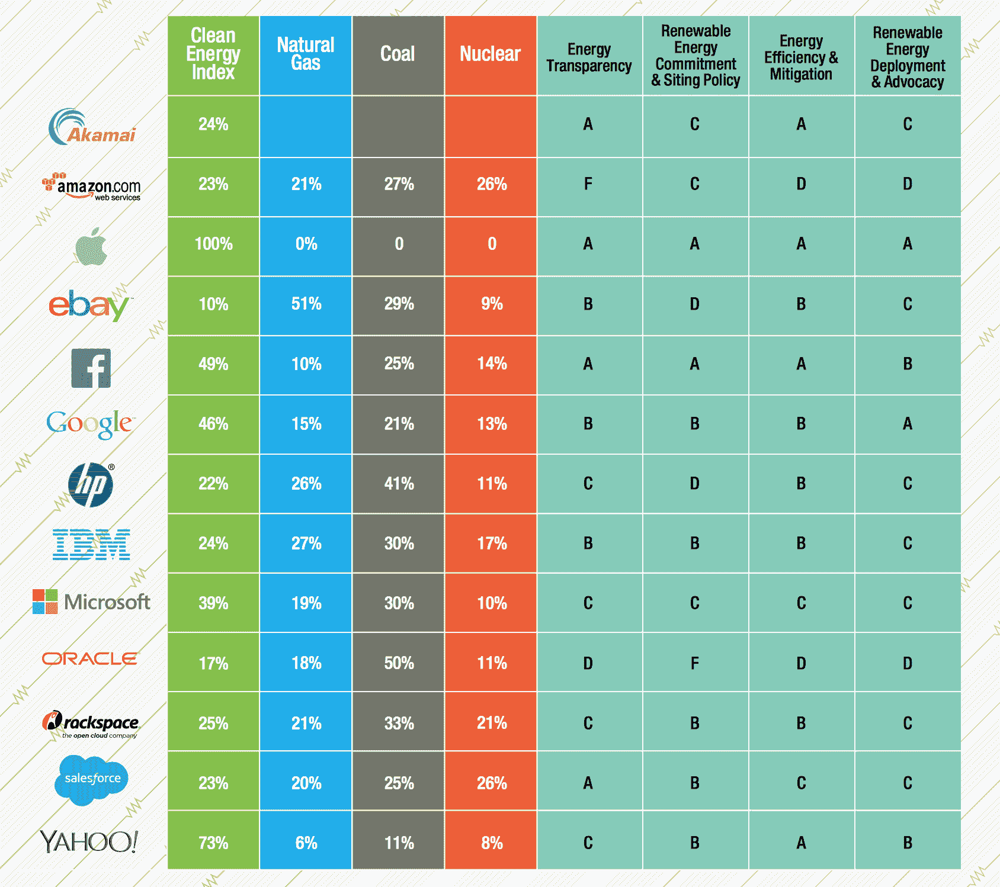

# 苹果在绿色和平组织 2015 年清洁技术更新 TechCrunch 中遥遥领先

> 原文：<https://web.archive.org/web/https://techcrunch.com/2015/05/12/apple-leads-the-pack-in-greenpeaces-2015-clean-tech-update/>

# 苹果在绿色和平组织的 2015 年清洁技术更新中遥遥领先

根据监督机构绿色和平发布的一份新报告，苹果公司仍然是科技公司中环保倡议的领导者。在排名前 13 的科技公司中，苹果是唯一一家在清洁能源指数上获得 100 分的公司，该指数包括其所有计划的数据中心扩张。

在过去的一年里，苹果公司宣布计划在亚利桑那州建立一个新的数据总部，该总部将由苹果公司正在帮助上线的太阳能供电。本周早些时候，该公司还宣布了将 T2 的可再生能源计划扩展到中国 T3 的计划，并透露了二月份在爱尔兰和丹麦 T5 建立 T4 绿色数据中心的计划。

苹果也是唯一一家在能源来源透明度、可再生能源承诺和政策、能源效率和迁移以及可再生能源宣传和部署方面获得 A 级的公司。尽管脸书获得了三个 a 和一个 b，但名单上没有其他公司做到这一点

在详细研究苹果公司的具体策略后，绿色和平组织称赞了苹果公司去年在环保方面的举措。获得巨大支持的部分原因是，该组织表示，苹果的承诺正在推动其合作伙伴及其数据中心运营同行和竞争对手的变革，这意味着它对整体环境状况产生了重大影响。