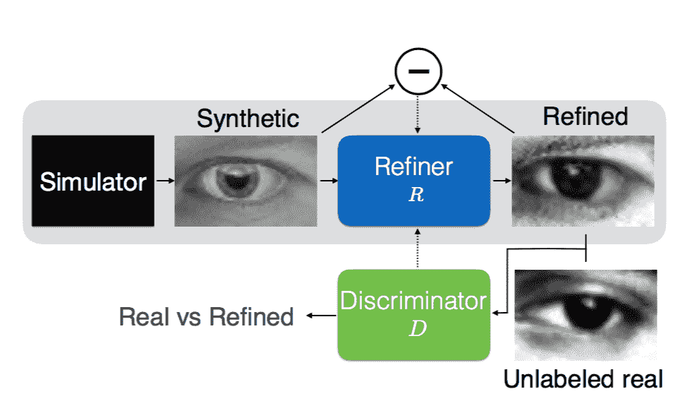

# 苹果通过改进的模拟+无监督学习技术进入人工智能研究

> 原文：<https://web.archive.org/web/https://techcrunch.com/2016/12/26/apple-leaps-into-ai-research-with-improved-simulated-unsupervised-learning/>

# 苹果凭借改进的模拟+无监督学习跃入人工智能研究

苹果公司的企业机器学习研究可能会成为一个新的先锋。来自该公司最近成立的机器学习小组[的六名研究人员发表了一篇论文](https://web.archive.org/web/20221208004755/https://arxiv.org/pdf/1612.07828v1.pdf)，描述了一种模拟+无监督学习的新方法。目的是提高合成训练图像的质量。[这项工作](https://web.archive.org/web/20221208004755/https://twitter.com/Miles_Brundage/status/813206574994964481)标志着该公司渴望在不断发展的人工智能领域成为一个更加引人注目的领导者。

[谷歌](https://web.archive.org/web/20221208004755/https://research.google.com/pubs/MachineIntelligence.html)，[脸书](https://web.archive.org/web/20221208004755/https://research.fb.com/publications/)，[微软](https://web.archive.org/web/20221208004755/https://www.microsoft.com/en-us/research/research-area/artificial-intelligence/)和其他技术机构一直在稳步发展他们的机器学习研究团队。每家公司都有数百份出版物，这些公司的学术追求都被很好地记录了下来，但苹果公司一直很固执——把它的魔力都留给自己。

本月早些时候，当苹果人工智能研究总监 Russ Salakhutdinov[宣布该公司](https://web.archive.org/web/20221208004755/http://www.businessinsider.com/apple-is-finally-going-to-start-publishing-its-artificial-intelligence-research-2016-12)将很快开始发布研究成果时，事情开始发生变化。该团队的首次尝试既及时又务实。

最近，合成图像和视频被更频繁地用于训练机器学习模型。与使用成本和时间密集型的真实世界图像相比，生成的图像成本更低，易于获得和定制。

这种技术有很大的潜力，但是风险很大，因为合成训练材料中的小瑕疵会对最终产品产生严重的负面影响。换句话说，很难确保生成的图像达到与真实图像相同的质量标准。

苹果提议使用[生成对抗网络](https://web.archive.org/web/20221208004755/https://www.youtube.com/watch?v=deyOX6Mt_As)或 GANs 来提高这些合成训练图像的质量。GANs 并不新鲜，但苹果正在为其目的进行修改。

在高层次上，GANs 通过利用竞争神经网络之间的对立关系来工作。在苹果的例子中，一个模拟器生成合成图像，然后通过一个精炼机处理。这些经过提炼的图像随后被发送到鉴别器，该鉴别器的任务是区分真实图像和合成图像。

从博弈论的角度来看，这些网络是在一个双人极大极小游戏中竞争。这类游戏的目标是尽量减少最大可能的损失。

Apple SimGAN variation 试图最小化局部对抗性损失和自我调节期限。这些术语同时最小化了合成图像和真实图像之间的差异，同时最小化了合成图像和精细图像之间的差异以保留注释。这里的想法是，太多的改变会破坏无监督训练集的价值。如果树木看起来不再像树木，而你的模型的目的是帮助自动驾驶汽车识别树木以避开，那么你失败了。

研究人员还进行了一些微调，比如迫使模型使用精确图像的完整历史，而不仅仅是来自小批量的图像，以确保敌对网络可以在任何给定时间识别所有生成的图像都是假的。你可以直接从苹果的作品中读到更多关于这些改变的信息，名为 [*通过对抗训练从模拟和无监督的图像中学习。*](https://web.archive.org/web/20221208004755/https://arxiv.org/pdf/1612.07828v1.pdf)