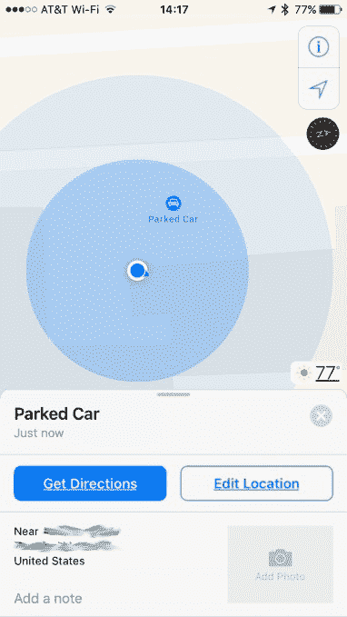

# 苹果地图会记住你把车停在哪里 

> 原文：<https://web.archive.org/web/https://techcrunch.com/2016/06/15/apple-maps-will-remember-where-you-parked-your-car/>

# 苹果地图会记住你把车停在哪里

苹果公司尚未证实其正在制造汽车的传言，但它的目标是让司机的生活更轻松一点，这要归功于苹果地图在 [iOS 10](https://web.archive.org/web/20230128095133/https://techcrunch.com/2016/06/13/apple-announces-ios-10/) 中的新功能，该功能将帮助人们记住他们把车停在哪里。

即将到来的停车提醒被[的 AppleInsider](https://web.archive.org/web/20230128095133/http://appleinsider.com/articles/16/06/14/inside-ios-10-apple-maps-will-remember-where-you-parked-your-car) 阅读器发现，当旅程终止于用户家庭地址之外的某个地方时，它将自动放置一个 pin 来定位汽车的静止位置。

一个停放的汽车图标显然也会显示在苹果地图上，包括一个获取汽车方向和估计到达时间的选项。如果需要的话，还有一个编辑选项来调整放下大头针的精确度。

苹果地图停车提醒将会涉足 App Store 中现有的无数停车提醒/汽车定位应用的领域，这是苹果新功能的常见情况。

在本周早些时候的 WWDC 开发者大会主题演讲中，苹果宣布了 iOS 10 中地图的一些重大变化，包括该应用将向第三方开发者开放，允许直接从地图上执行某些任务，如预订餐厅桌子或通过优步等网站打车。

地图也将支持 Apple Pay，用户将能够沿着特定路线搜索一系列服务。地图也将变得更加智能，例如，从用户的日历中提取数据，自动建议下一次会议的路线，以及推送附近的建议，如餐馆。所以知道你的车停在哪里只会是另一个借口。