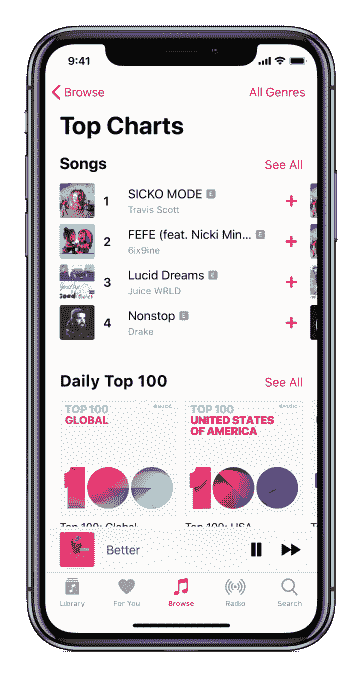

# Apple Music 推出“排行榜”播放列表系列 

> 原文：<https://web.archive.org/web/https://techcrunch.com/2018/09/07/apple-music-launches-a-top-charts-playlist-series/>

Apple Music 正在推出一个新的播放列表系列，将在 Apple Music 上展示全球和 Apple Music 可用的国家的 100 首歌曲。因为它们是播放列表，用户可以将他们国家的排行榜或全球 100 首歌曲添加到他们的曲库，这样他们就可以随时播放或离线收听。

这个功能是由[滚石](https://web.archive.org/web/20230219172936/https://www.rollingstone.com/music/music-news/apple-music-to-publish-its-own-top-music-charts-719345/)最先报道的，苹果给了它一个变化的预览。

在发布时，总共有 116 个图表发布，包括全球前 100 名和每个苹果音乐市场一个。许多国家将可以访问所有这些新的 100 强播放列表，但我们知道可用性会有所不同。

关于 top chart 播放列表的有趣之处还在于，它们将基于苹果音乐流每天在太平洋时间上午 12:00 更新，这使它们保持新鲜。

《滚石》杂志的报告指出，这些图表的发布是由于流式数字的重要性日益增加。它表示，艺术家和他们的经理以及唱片公司和星探在寻找新人才时，往往会参考顶级流媒体排行榜。这个行业也已经适应了，更多地把付费流媒体置于免费流媒体之上。

在这方面，苹果音乐在北美的主导地位意味着追踪它的数字尤其重要。

根据首席执行官蒂姆·库克[在最新财报电话会议上的评论，苹果音乐目前在全球拥有 5000 万付费用户，目前在北美市场领先于 Spotify。](https://web.archive.org/web/20230219172936/https://seekingalpha.com/article/4192790-apple-aapl-q3-2018-results-earnings-call-transcript?part=single)

他在 7 月份表示:“本季度，我们在北美占据了领先地位，在日本和一些我们已经涉足很长时间的市场也占据了领先地位。”。

Spotify 在全球舞台上仍然领先，拥有[8300 万付费用户。](https://web.archive.org/web/20230219172936/https://www.theverge.com/2018/7/26/17616404/spotify-paid-subscribers-83-million-streaming-music-quarterly-results)

然而，值得指出的是，这些新的排行榜不仅仅是作为苹果音乐应用程序的静态部分推出的——它们是动态的播放列表。

也就是说，苹果新的排行榜不会取代现有的 200 首歌曲排行榜。

播放列表是主要流媒体服务之间的一个重要战场，Spotify 非常注重个性化，播放列表包括其旗舰产品 Discover Weekly、plus Release Radar、Daily Mixes(以及一个更新的变体，Your Daily Car Mix)、Your Summer Rewind 和 Time Capsule。

与此同时，Apple Music 为用户提供了一个收藏夹播放列表，以及一个新的音乐组合 Chill Mix，并正在 iOS 12 中推出一个朋友组合。

该功能现在可以在 Apple Music 上使用。你可以看看这些播放列表作为例子: