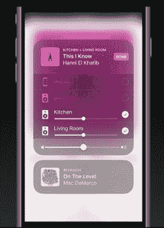

# Apple Music 点击了 2700 万次付费订阅，增加了 MusicKit API 和社交收听

> 原文：<https://web.archive.org/web/https://techcrunch.com/2017/06/05/apple-music-social/>

# Apple Music 点击了 2700 万付费用户，增加了 MusicKit API 和社交收听

Ping 仍然死了，但 Apple Music 变得越来越社会化，越来越灵活，因此它可以与你所有的其他设备或应用程序一起工作。这一系列新功能将在今年 9 月的 iOS 11 中推出。

今天在 WWDC，苹果宣布 Apple Music 现在有 2700 万付费用户，而 Spotify 只有 5000 万。这表明其预装加免费试用的策略正在帮助 Apple Music 通过其免费广告支持层赶上 Spotify。

开发者现在可以使用新的 MusicKit API 来使用你的 Apple Music 订阅在他们的应用中播放完整的歌曲。开发人员可以访问您的云图书馆，为您推荐音乐个性化，surface 特色音乐和图表，以找出最受欢迎的音乐，并通过播放列表、电台和类别进行搜索。

 MusicKit 将支持 Nike+ Run 与您的播放列表的集成，能够即时将您通过 Shazam 识别的歌曲添加到您的曲库，并让您通过播客应用 Anchor 播放 Apple Music 的所有 4000 万首歌曲。MusicKit 为 Apple Music 提供了一个与 Spotify 的一系列 API 和 SDK(T4)竞争的开发平台，后者同样允许付费用户将他们的音乐收藏和 Spotify 的所有歌曲带到其他应用程序中。

新的 [AirPlay 2 通过 HomeKit](https://web.archive.org/web/20230326024645/https://techcrunch.com/2017/06/05/apples-airplay-2-brings-multi-room-audio-streaming-to-homekit-and-beyond/?ncid=mobilenavtrend) 将多房间音频扬声器控制直接烘焙到 iOS 中，这样你就可以通过 Apple Music 轻松地在家里的特定地方播放歌曲。[新的 watchOS 4 还对 Apple Music 进行了一些改进](https://web.archive.org/web/20230326024645/https://techcrunch.com/2017/06/05/apple-announces-watchos-4-with-a-siri-watchface-better-coaching-more/)，包括更好的界面、多播放列表同步和更简单的 AirPods 体验。

Apple Music 用户档案变得越来越社会化。如果您通过 Apple Music 与朋友联系，您将能够看到他们现在最常听或正在听的内容，这样您就可以收听相同的音乐。出于隐私考虑，你可以选择你的监听活动是公开的还是私密的。这再次复制了 Spotify 在 2011 年与脸书一起推出的社交收听功能。朋友们还可以将音乐添加到你的 Up Next 队列中，这就像是 Spotify 协作播放列表的一个轻量级版本。

苹果似乎正在采用 Spotify 的平台和社交剧本，并在外行人的流媒体音乐应用程序中提供这些功能。虽然 Spotify 专注于自己的算法音乐发现播放列表，如 Discover Weekly，但苹果正试图通过专注于简单性和适应性，将以前的 MP3 买家转化为新一代流媒体用户。