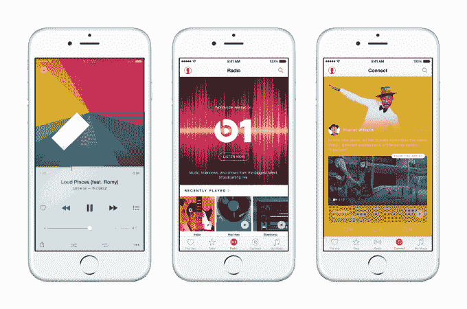

# “数百万人”已经在使用苹果音乐 

> 原文：<https://web.archive.org/web/https://techcrunch.com/2015/07/21/apple-music-users/>

# “成千上万的人”已经在使用苹果音乐了

在流媒体服务苹果音乐(Apple Music)推出不到一个月后，苹果公司首席执行官蒂姆·库克(Tim Cook)宣布,“数以百万计的客户已经在体验苹果音乐，而且这个数字每天都在大幅增长”,这是[今天糟糕的第三季度收益报告(T3)的一部分。问题是，一旦免费试用到期，有多少用户会继续付费，他们每月自动被收取 10 美元的费用。](https://web.archive.org/web/20221007042130/https://beta.techcrunch.com/2015/07/21/apple-q3-2015/)

库克在[今天的收益电话会议](https://web.archive.org/web/20221007042130/http://events.apple.com.edgesuite.net/15piuhasdfvlhbvlhbasvhb07/event/index.html)上指出，15，000 名艺术家已经在 Apple Music 的 Connect 标签上分享社交更新，包括未发布的歌曲和视频。例如，说唱歌手德雷克在该服务上首次推出了他的新音乐视频。库克还表示，数百万人正在收听 Beats 1 电台的应用程序。

虽然含糊不清，但数字范围显示了苹果 iTunes 下载商店的继任者取得的进展。需要注意的是，Apple Music 提供三个月的免费试用。当然，苹果音乐应用程序在 7 月 1 日进行了软件更新，发布给了数亿部 iPhones。有了这样的预装基础，苹果应该不难获得至少几百万美元来尝试它的流媒体服务。

Apple jump 通过收购 Beats Music 开始开发 it 流媒体服务，Beats Music 是一种与 Beats Electronics 耳机业务共享品牌名称的流媒体服务。该应用被关闭，用户转移到苹果音乐，这可能有助于用户群。

苹果音乐[与 Spotify 和谷歌音乐](https://web.archive.org/web/20221007042130/https://beta.techcrunch.com/2015/06/08/no-sound-investment/)等更成熟的服务竞争。相比之下，Apple Music 的主要竞争对手 Spotify 拥有 7500 万听众，其中包括 5500 万广告支持的免费用户和 2000 万付费用户。

但是[苹果音乐的真正机会](https://web.archive.org/web/20221007042130/https://beta.techcrunch.com/2015/06/30/mainstreaming-music/)它从绝大多数从未认真流过音乐的人那里招募每月 10 美元的订户。数亿人使用 iTunes，所以今天的报告只是苹果从音乐下载销售转向流媒体订阅公司的漫长旅程的第一步。