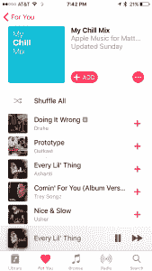
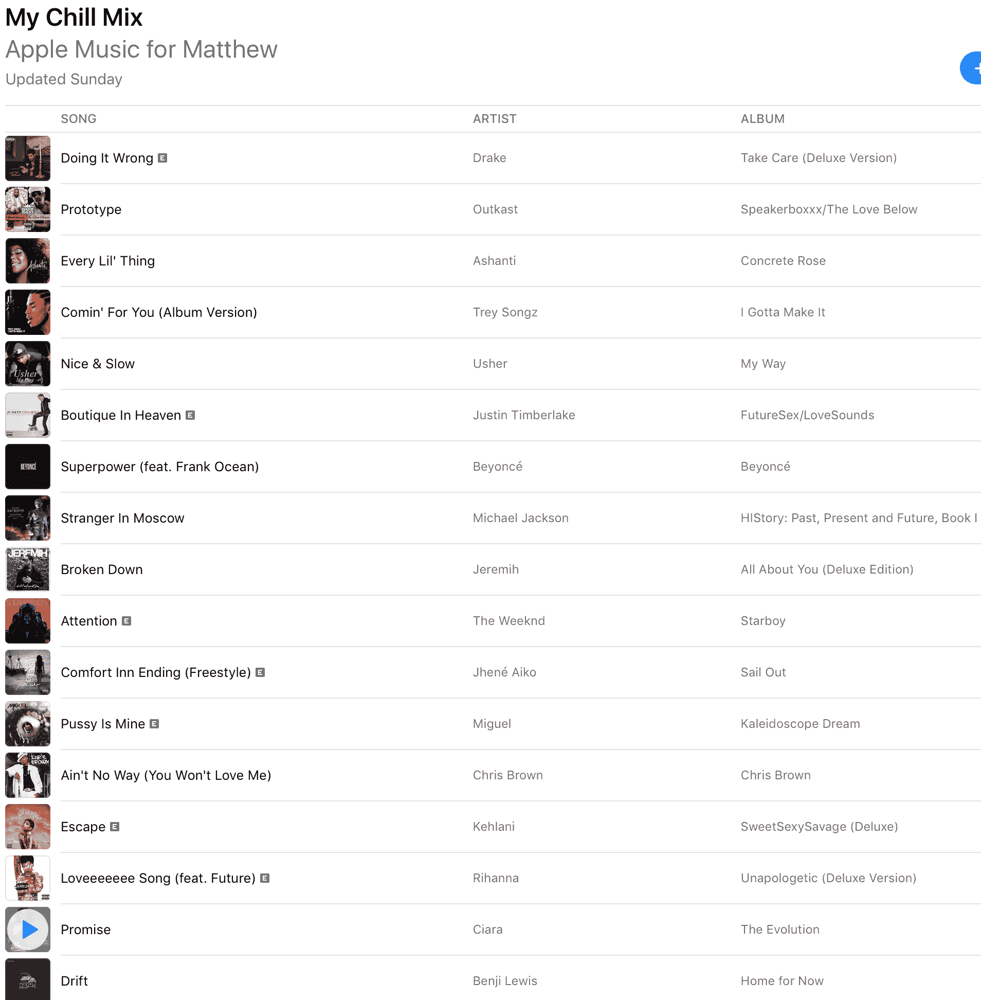

# Apple Music 个性化播放列表 Chill，算法和编辑

> 原文：<https://web.archive.org/web/https://techcrunch.com/2017/06/27/apple-musics-first-new-personalized-playlist-wants-you-to-chill/>

本周，苹果开始在 Apple Music 的“For You”部分推出首个新的个性化播放列表。标题为“Chill”的播放列表[，](https://web.archive.org/web/20230326025740/https://itunes.apple.com/us/playlist/my-chill-mix/idpl.pm-20e9f373919da080a34bb643ed07ebe4)是基于编辑管理和对你的音乐品味的算法解释而混合的。

昨天晚上，一小部分测试用户拿到了新的播放列表。每周日，加入测试小组的用户都会收到一份更新的 Chill 播放列表，该测试小组将在整个夏季推出。

不出所料，它的重点是[的酷乐](https://web.archive.org/web/20230326025740/https://www.youtube.com/watch?v=p2WzkgkufyE)。编辑监管的基础层将用于确定哪些音乐将包含在 Chill 播放列表中，然后将使用 App Music 算法进行增强。从理论上讲，这应该向你展示你可能不熟悉但符合类别的音乐，同时也是你喜欢并真正关心的音乐。

虽然 2700 万 Apple music 用户听许多不同类型的音乐，但其中一个主要主题显然是他们都喜欢放松——他们用音乐来做到这一点。

这就是它变得棘手的地方，因为一个人可能会认为摩托头乐队的“燃烧器”是平滑 jamz 的终极，而另一个人可能会认为约翰·特什的 Roundball Rock 是休息的巅峰。

因此，Chill 播放列表会考虑你最喜欢的音乐和流派，并从这些流派中创建最酷的曲目集。我的组合突出了德雷克、奥特卡斯特、阿散蒂、特雷宋、碧昂斯、杰瑞米和凯拉尼——所以我们知道我在光谱上的位置。但它也根据编辑选择，从这些艺术家的最冷门曲目中挑选，以及一些通用的音乐基因组智慧，如节奏和分类。大约有 25 首曲目和一个半小时左右的音乐。

如果你在接下来的一两个月里突然喜欢上了 EDM，你会看到音乐在曲目层面上混合到你的播放列表中。希望音乐仍然符合你的口味，并有一种缓慢放松的能量。

从理论上讲，我可以有一个以 R&B 为中心的音乐清单，而你可以有一个摇滚或爵士乐的版本，满足同样的基本目标:帮助你放松。

目前，正在进行的算法调整来自苹果音乐领域内部。你如何使用这款应用，你在你的曲库里放了什么，听了什么，这些都是影响 Chill(以及另外两个播放列表，新音乐和我的最爱)如何合成的因素。

目前，不会有任何语音文字内容混合在其中——这都是音乐。所以，如果你是数百万使用 [ASMR](https://web.archive.org/web/20230326025740/https://en.wikipedia.org/wiki/Autonomous_sensory_meridian_response) 和其他舒缓的口语作品来放松的人之一，你必须耐心等待。

对于苹果在这种模式下的第一个新播放列表来说，放松是一个广泛而庞大的目标，但我希望看到更多可以适用于广泛用户的内容。胸怀大志意味着考虑锻炼、通勤、学习等重点工作以及更多包容性。

因为这是全新的，我有兴趣看看你的播放列表是什么样的。在 Twitter 上或者在带有截图或链接的评论中点击 [me up。这是我的:](https://web.archive.org/web/20230326025740/https://twitter.com/panzer/status/879893927418933248)

