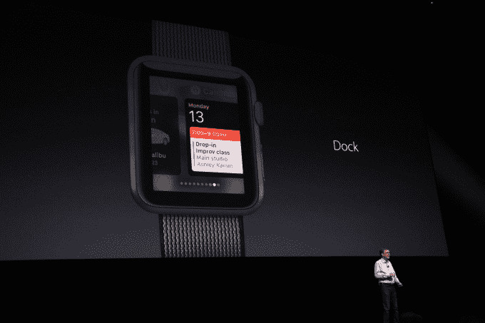
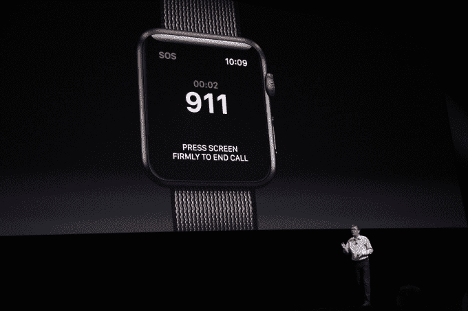

# 苹果用新的用户界面和更快的应用程序发布彻底改变了 watchOS

> 原文：<https://web.archive.org/web/https://techcrunch.com/2016/06/13/apple-overhauls-watchos-with-new-ui-and-faster-app-launching/>

今天在 WWDC，苹果发布了第三版 watchOS，一切都是为了速度。测试版今天将面向开发者，并在秋季面向所有用户。

## 速度

该公司正在大力宣传应用程序的运行速度，这是对第一版和第二版操作系统的滞后的一个急需的改进。事实上，该公司表示，现在应用程序的启动和反应速度比旧操作系统快“七倍”。

那么苹果到底会如何实现这一点呢？允许第三方和内置应用程序保留在内存中，并在后台更新和刷新信息，即使用户没有使用特定的应用程序。

为了帮助你更快地导航，苹果还为 watchOS 添加了一个“dock”，让你向上滑动以快速启动不同的应用程序。

WatchOS 3 也将拥有控制中心，就像在 iOS 上一样。你可以向上滑动，看到快捷的命令，如静音、蓝牙和 Wi-Fi 开关等。

苹果还让在应用程序上发送信息变得更容易。他们推出了一项名为 Scribble 的功能，可以让你画出字母，然后自动转换成文本。这项功能应该真的可以帮助用户在不接触手机的情况下快速发送消息，这是第一款 watchOS 发布时承诺的事情。

## 无线电紧急呼救信号

苹果还推出了一项名为 SOS 的新功能，旨在帮助你应对真正的紧急情况。如果您需要帮助，请按住手表底部的按钮。倒计时将开始，当它到达零时，该设备将通过蜂窝或数据连接呼叫 911。

当你使用 SOS 时，你的手表会自动调出你在 HealthKit 中输入的紧急信息，这可以在急救人员到达时帮助他们。

## 健康

watchOS 的第三个版本也有大量与健康相关的改进。watchOS 中跟踪你的锻炼和健康统计数据的活动越来越有竞争力。

新软件将有一个名为活动分享的功能，这将允许你与你的朋友分享健康指标，如每天的步数和燃烧的卡路里。这种友好的竞争应该有助于用户雇佣朋友，让他们对自己的健身目标负责。

苹果还推出了第二款名为 Breathe 的原生健康应用。该应用程序旨在通过控制呼吸频率来帮助你放松和集中注意力。用户打开他们的应用程序，选择他们想要练习的时间，并通过视觉或触觉提示跟随。

活动和健康工具包现在也将支持坐轮椅的用户。该公司已经调整了他们的算法来跟踪轮椅使用者的运动，并用“滚动时间”取代了“站立时间”等提示

## 开发者集成

WatchOS 还为开发者提供了一些新功能。如上所述，大多数应用程序将能够在后台运行，并为用户预加载数据。此外，开发人员现在可以开发利用设备扬声器的手表应用程序，这为在手腕上播放视频提供了可能性。

新的更新还将支持 Apple Pay inside watchOS 应用程序，以防开发者想要为手腕发布电子商务应用程序。

## 设计

在 watchOS 的设计方面，苹果推出了几个新面孔，包括一个米妮老鼠，一个罗马数字。用户还可以通过在脸上左右滑动来快速切换不同的脸。

[gallery ids="1335940，1335935，1335920，1335911，1335898，1335892，1335893，1335889"]