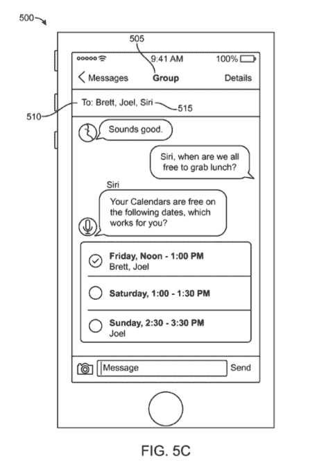

# 苹果专利显示 iMessage 中的 Siri 有助于日程安排、支付等 

> 原文：<https://web.archive.org/web/https://techcrunch.com/2016/11/17/apple-patent-shows-siri-inside-imessage-to-help-with-scheduling-payments-and-more/>

谷歌的智能虚拟助手[谷歌助手](https://web.archive.org/web/20221231022252/https://techcrunch.com/2016/10/18/living-with-google-assistant/)正在进入从该公司的聊天应用 Allo 到 Pixel 智能手机及其亚马逊 Echo 竞争对手 Google Home 的所有领域。现在看来，苹果正在考虑至少在其中一个领域效仿。一项[新发现的苹果专利](https://web.archive.org/web/20221231022252/http://appft.uspto.gov/netacgi/nph-Parser?Sect1=PTO2&Sect2=HITOFF&u=%2Fnetahtml%2FPTO%2Fsearch-adv.html&r=2701&f=G&l=50&d=PG01&s1=(1%2F1.CCLS.+AND+20161117.PD.)&p=55&OS=ccl/1/1+and+pd/11/17/2016&RS=(CCL/1/1+AND+PD/20161117))表明该公司正在考虑将 Siri 整合到自己的消息平台 iMessage 中。

这项专利是由[的 AppleInsider](https://web.archive.org/web/20221231022252/http://appleinsider.com/articles/16/11/17/apple-invention-integrates-siri-into-imessage-aids-in-peer-to-peer-financial-transactions) 博客首先发现的，它解释了 Siri 如何在聊天过程中用于回答问题、安排会议、提供方向、提供天气信息、查看电影时间、预订晚餐、完成金融交易等等。

例如，用户可能会请求 Siri 帮助安排一次会议，该会议适用于群聊中每个人的日程，然后助手可以利用参与者的日历信息来确定他们什么时候有空或忙。

在这种情况下，助理机器人会显示每个人可以见面的时间，群聊中的人可以通过对话中的投票来投票选出最佳日期。

专利申请中提到的另一个例子是使用 Siri 进行个人对个人支付的能力。该助理可以查看每个用户的设备上安装了哪些支付方式，然后选择支付发送者可以选择的选项。这可能有助于缓解不知道是否通过 PayPal、Venmo 或 Square Cash 给某人汇款的问题，尽管如果该公司愿意，它似乎也可以与 Apple Pay 一起使用。

虚拟助手被描述为使用语义分析来理解它何时在对话中被调用，此外，它知道它对某项任务的帮助何时只需要被单个个人而不是整个群组聊天看到。然后，它会相应地呈现给对话参与者。

在典型的苹果时尚中，考虑的是当 Siri 在 iMessage 聊天中可用时，用户如何保持对其个人信息的控制。听起来这项专利提出的一个想法是拥有某种选择加入/选择退出切换开关，类似于苹果允许用户在 iOS 的隐私选项中关闭广告跟踪。

该专利声明“这种[个人信息]的收集只能在得到用户的知情同意后进行。”

虽然一项专利申请并不表明一项功能正在开发中，但这项专利值得注意，因为由机器人增强的聊天和计算趋势似乎不会很快消失。有越来越多的虚拟助手可用，如谷歌助手、亚马逊 Alexa 和苹果的 Siri，以及 Facebook Messenger 机器人和其他消息平台上的机器人。

苹果的竞争对手[三星也刚刚收购了下一代类似 Siri 的助手 Viv，](https://web.archive.org/web/20221231022252/https://techcrunch.com/2016/10/05/samsung-acquires-viv-a-next-gen-ai-assistant-built-by-creators-of-apples-siri/)以更好地竞争。苹果自己也一直在收购[机器学习](https://web.archive.org/web/20221231022252/https://techcrunch.com/2016/09/22/apple-acquires-another-machine-learning-company-tuplejump/) [初创公司](https://web.archive.org/web/20221231022252/https://techcrunch.com/2016/08/05/apple-acquires-turi-a-machine-learning-company/)，尽管它错过了一个更早的竞争对手 Emu，[被卖给了谷歌](https://web.archive.org/web/20221231022252/https://techcrunch.com/2014/08/06/google-acquires-emu-an-im-client-with-siri-like-intelligence/)，后者本来可以给 iMessage 带来上述功能，因为它专注于聊天会话中的集成协助。

如果我们打算花更多时间与机器人交谈，苹果公司希望在自己的消息服务中利用 Siri 是有道理的——特别是现在 Siri 不仅可以从苹果公司自己的服务中获取信息，如其日历应用程序，也可以从第三方获取信息。