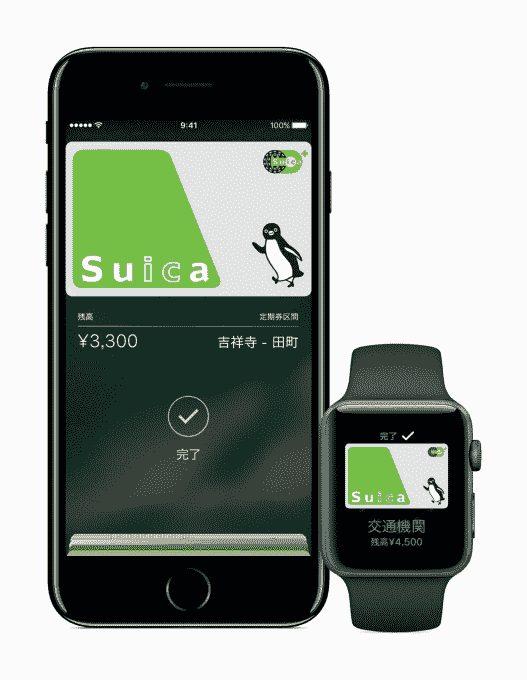

# 苹果支付将于今年秋天登陆日本、新西兰和俄罗斯；9 月 13 日登陆网络

> 原文：<https://web.archive.org/web/https://techcrunch.com/2016/09/07/apple-pay-comes-to-japan-new-zealand-russia-this-fall-hits-the-web-on-september-13/>

苹果支付将在今年秋天到达另外三个国家:日本、新西兰和俄罗斯，并将随着 9 月 13 日 iOS 10 的发布登陆网络。苹果支付服务的网络版将在 2012 年推出的任何一款苹果电脑上提供给 Safari 用户，该电脑也运行最新的操作系统——MacOS Sierra。

该公司在今天的苹果 7 活动中详细介绍了在日本推出的苹果支付平台[，](https://web.archive.org/web/20230328050102/https://techcrunch.com/2016/09/07/apple-iphone-7-live-blog-september/)特别提到了该服务如何与该国使用的不同版本的非接触式点击支付技术 FeliCa 兼容。由索尼公司开发的 FeliCa 芯片通常被日本智能手机用户使用，他们通过点击来支付公共汽车和火车票等费用。

[彭博此前曾报道苹果计划在日本推出其支付技术，并指出其将如何与 Suica 和 Pasmo 网络等主要厂商合作。苹果公司](https://web.archive.org/web/20230328050102/http://www.bloomberg.com/news/articles/2016-08-25/apple-said-to-plan-iphone-for-japan-with-tap-to-pay-for-subways)[今天证实了](https://web.archive.org/web/20230328050102/http://www.apple.com/newsroom/2016/09/apple-pay-coming-to-japan-with-iphone-7.html)Suica 新闻，称日本用户可以使用 JR East 的 Suica 通勤并支付日常用品，还可以在商店、应用程序和网络上付款。

苹果表示，iOS 10 中地图的升级版本也将帮助日本乘客了解乘车详情，包括票价明细，该明细将自动在他们的设备上显示 Suica 定价。

日本的主要金融品牌也将支持苹果支付，这意味着它将在日本最大的商店以及附近的商店和餐馆工作。

苹果公司表示，随着 iPhone 7、iPhone 7 Plus 和苹果手表系列 2 的发布，苹果支付将登陆日本。

尽管没有在舞台上宣布，苹果还将于今年秋天在国际上推广 Apple Pay，10 月份在新西兰推出，俄罗斯的推出时间定在“今年秋天”。

这些国家将加入最近加入的法国、瑞士和香港的行列，后者已于 7 月份上线。有了这些新功能，Apple Pay 现在已经在九个市场上线，超过一半的交易量来自美国以外的市场。

支付技术本身也越来越受欢迎。它现在的用户量是一年前的五倍多，并且每周增加一百万用户。消费者已经在 Apple Pay 上花费了数十亿美元，尤其是在 2015 年下半年出现了加速增长。

当时，苹果的增长率是上半年的 10 倍，而与上半年相比，2015 年下半年其应用程序的使用量增加了一倍多。

这项技术目前拥有数千万用户，估计 6 月份的月活跃用户数同比增长超过 450%。

Apple Pay 在全球超过 1100 万个非接触式地点上线，仅在美国就有 300 万个。

目前，这项技术在美国移动支付市场也占据了最大份额。正如菲尔·席勒今天在台上吹嘘的那样，超过 90%的无线交易是通过 Apple Pay 完成的。

Apple Pay 将在 9 月 13 日推出 iOS 10 的同时登陆网络。届时，[你将可以通过 Safari 使用 Apple Pay，只要你在 2012 年或之后推出的 Mac 上运行 macOS Sierra](https://web.archive.org/web/20230328050102/https://techcrunch.com/2016/06/22/an-early-look-at-macos-sierra/) 。

要使用 Apple Pay online，你需要在受支持的网站上寻找结账按钮，然后通过 iPhone 上的 TouchID 或使用 Apple Watch 完成购买。

通过 Apple Pay 支付，你的交易在你的设备和 Apple Pay 服务器之间被加密，在线商家不需要保存你的实际信用卡号码，增加了另一层保护。