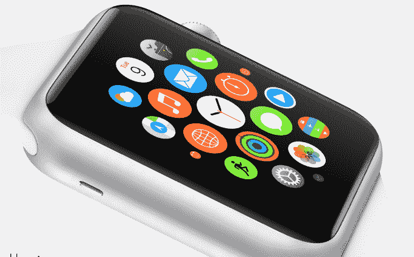
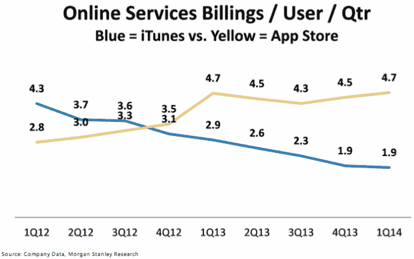
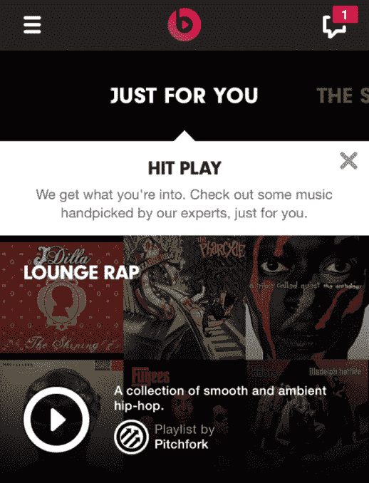
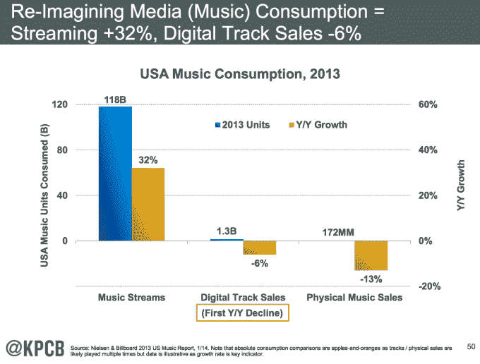

# 苹果计划关闭 Beats Music 

> 原文：<https://web.archive.org/web/https://techcrunch.com/2014/09/22/apple-plans-to-shut-down-beats-music/>

据五位消息人士称，苹果将停止其在 5 月份收购的流媒体音乐服务 Beats Music，其中包括苹果和 Beats 的几位知名员工。Beats Music 的许多工程师已经离开该产品，转到苹果的其他项目，包括 iTunes。尚不清楚吉米·艾奥文和德雷博士的音乐服务将于何时关闭，也不清楚苹果将如何处理流媒体，但我们采访的所有知情人士都同意苹果计划关闭 Beats 音乐品牌。

[ **更新**:苹果已经告诉 TechCrunch，我们关于 Beats 被关闭的报道“不属实”，但熟悉情况的消息人士告诉 [Re/code](https://web.archive.org/web/20230404091943/http://recode.net/2014/09/22/apples-beats-music-brand-may-go-away-apples-beats-music-service-is-sticking-around/) 苹果“然而，随着时间的推移，可能会修改[Beats Music]，其中一个变化可能涉及改变 Beats Music 的品牌。”这与我的消息来源所说的一致，即 Beats Music 品牌将被关闭，但不清楚苹果在流媒体音乐方面想做什么。Beats 音乐产品似乎很有可能会被整合到 iTunes 中，而不是被“关闭”，但这只是语义上的。

苹果的回应真的要看对“关机”的解读了。如果苹果将 Beats Music 引入 iTunes，并从 App Store 中移除专用的 Beats Music 应用，我会称之为被关闭。Beats Music 本身来自于“更名”，也就是关闭它收购的 MOG 音乐流媒体服务。如果苹果在 iTunes 中加入流媒体，我们会看到会发生什么，但苹果是否会将 Beats Music 作为自己的品牌和独立产品值得怀疑。]

事实上，新 iPhones 没有预装 Beats Music，而其他几个苹果应用程序[在 6 和 6 Plus 上装载](https://web.archive.org/web/20230404091943/http://www.imore.com/yes-iwork-apps-are-pre-installed-64gb-and-128gb-iphone-6-and-iphone-6-plus)，这应该是一个危险信号。在 Apple Watch 发布会上，也没有提到 Beats Music，尽管该服务的收音机和一劳永逸的播放列表可以在可穿戴设备上很好地工作。8 月份，Beats Music 向 iOS 7 的新用户做了广告，然而在 9 月份的发布会上，Beats Music 唯一一次被间接提及是在苹果公司首席执行官蒂姆·库克说 U2 的新专辑将在那里发售的时候。

Apple Watch 没有 Beats Music，而是采用了一个~~未经宣布的音乐应用~~【更新:远程应用】，它有一个蓝色的播放按钮(在下面照片的右上角)，在演示过程中点击它就可以立即开始播放歌曲。

考虑到苹果对简单、统一品牌的偏好，以及它对碎片化的蔑视，关闭 Beats Music 是非常有意义的。与 iTunes 并行运行第二个音乐服务，迫使人们学习一个全新的界面，这可能会让客户感到困惑。Beats Music 的首席执行官 [Ian Rogers 也被任命负责 iTunes Radio](https://web.archive.org/web/20230404091943/http://blogs.wsj.com/digits/2014/08/01/with-apple-beats-deal-complete-ian-rogers-to-run-itunes-radio/) ，这意味着他已经开始分配自己的时间，而不仅仅是专注于 Beats Music。

关闭 Beats Music 也符合这样的报道，即收购 Beats 主要是为了获得吉米·艾奥文和[德瑞医生的](https://web.archive.org/web/20230404091943/https://techcrunch.com/2014/05/22/apples-beats-deal-is-happening-and-its-a-dre-acquihire/)才能，并收购耳机业务，而不是流媒体音乐。将 Beats 作为音乐配件的副业品牌是很自然的，但在软件方面似乎有些笨拙。我们联系了苹果公司，请求对其节拍音乐的计划发表评论。[更新:对上述更新的回应。]

Beats 最近推出了一个[苹果电视频道](https://web.archive.org/web/20230404091943/http://9to5mac.com/2014/09/17/apple-tv-september-2014-update/)，并发布了一个[“立即收听”与 Shazam](https://web.archive.org/web/20230404091943/http://9to5mac.com/2014/08/13/beats-music-listen-now-feature-starts-rolling-out-to-shazam-ios-app/) 的整合，但两者似乎都可以直接在管道中。Beats Music 的一名员工告诉我，一些非技术团队被告知要保持“一切照常”。

此举将让苹果专注于其旗舰音乐产品，该产品拥有庞大的 8 亿用户群和超过 4 亿张存储信用卡。

与 Spotify、Rdio、谷歌音乐(Google Music)和 Pandora 等竞争对手相比，Beats Music 的增长可能受到了起步较晚的阻碍。虽然它的策略是通过精选的播放列表和基于情绪的广播来区分自己，但这些都没能抓住主流听众的注意力。多亏了美国电话电报公司为期 7 天的免费试用和数月的演示，截至 5 月份，已有 500 万人试用了 Beats，但只有 25 万人注册了付费订阅。与 Spotify 上的 1000 万付费用户和 4000 万听众以及 Pandora 上的 7640 万活跃听众相比，这是一个很小的数字。然而，与 iTunes 的用户群相比，Beats Music 对苹果来说只是沧海一粟。苹果在收购音乐流媒体服务 Lala 后，当然毫不犹豫地关闭了它。

最大的问题是苹果将如何处理流媒体音乐。即使没有 Beats Music 品牌，购买 Beats Music 仍可能通过人才、技术和行业关系帮助 Apple hear。

一位消息人士称，苹果可能会将流媒体引入 iTunes。对于苹果来说，这可能是最符合逻辑的策略，如果它能找到一种方法，让传统的音乐文件下载客户满意，同时为希望从云上收听的早期用户开放其目录。或许 iTunes 中也可以有播放按钮，而不仅仅是购买按钮。另一位消息人士称，苹果计划在明年上半年发布一些重要的音乐产品。

苹果正处于一个棘手的位置，试图平稳地将其音乐业务从下载时代过渡到流媒体时代。2013 年，数字音乐销售额下降了 13.3%，而美国流媒体增长了 32%。随着[流媒体下载](https://web.archive.org/web/20230404091943/https://techcrunch.com/2014/07/03/streaming-is-killing-downloads/)，苹果将不得不做出改变，或者至少适应流媒体。但它不只是想一夜之间放弃销售。2013 年，在线销售了 12.6 亿首歌曲和 1.176 亿张专辑，为音乐产业提供了[至关重要的资本](https://web.archive.org/web/20230404091943/https://techcrunch.com/2014/05/22/bridging-the-download-and-cloud-music-eras/)。

迫使用户跨越从 iTunes 到 Beats Music 的鸿沟似乎是不稳定的，特别是在 Spotify 和 Google Music 等点播流媒体竞争对手试图抓住潜在客户的情况下。令人怀疑的是，苹果会仅仅因为 Beats 加入这个大家庭就放弃其成功 13 年的 iTunes 品牌。发展一个统一的苹果音乐服务听起来比两个不同步播放要好得多。

*【图片来源:摩根士丹利研究 via [9To5Mac](https://web.archive.org/web/20230404091943/http://9to5mac.com/2014/05/28/declining-itunes-sales-underline-need-for-apple-to-launch-a-streaming-music-service/) 、玛丽·米克尔[互联网趋势报告](https://web.archive.org/web/20230404091943/https://techcrunch.com/gallery/mary-meeker-internet-trends/)】*