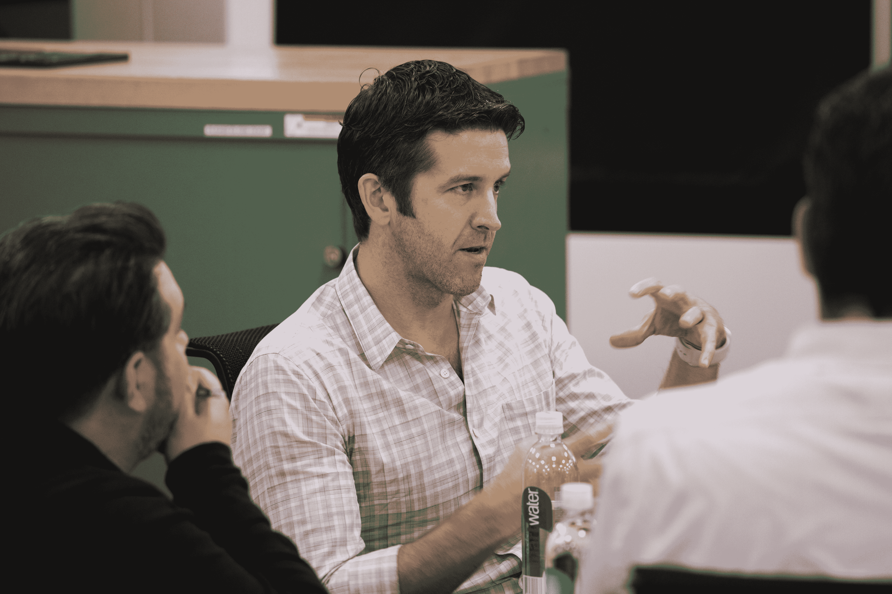
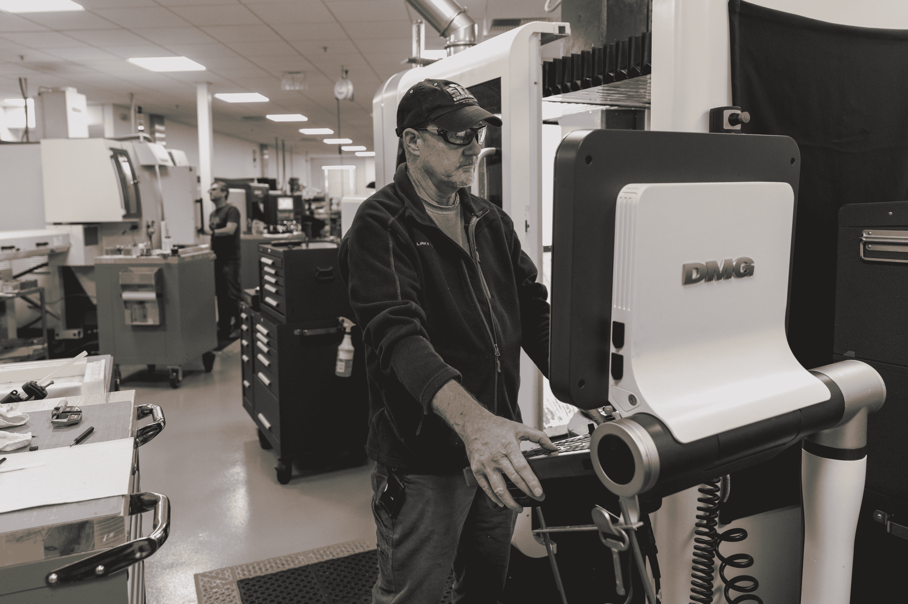

# 苹果将在未来几年推出新的 Mac Pro、Pro iMacs 和外部显示器

> 原文：<https://web.archive.org/web/https://techcrunch.com/2017/04/04/apple-pushes-the-reset-button-on-the-mac-pro/>

“如果我们暂停了升级和更新，我们很抱歉 Mac Pro 发生了什么——我们将推出更好的东西来取代它。”

苹果 全球营销高级副总裁菲尔·席勒正在库比蒂诺苹果总部附近的一栋白色灰泥建筑里和一小群记者交谈。讨论的目的，虽然开始有点不清楚，但几分钟后就显露出来了。

消息，如果你想知道真相的话:苹果承认他们在 2013 年推出的 Mac Pro 因其设计的巧妙而搁浅，他们正在重新考虑整台机器。此外，他们将发布一款新的外部显示器——这是它之前选择退出的东西。

但是这些都不会在今年出现。今天，我们将看到 Mac Pro 旧设计的性能提升，目前仍将继续销售。今年晚些时候，我们将看到改进的 iMacs，苹果认为这也会吸引一部分专业用户。

Mac Pro 是如何走到这一步的值得探索，席勒、软件工程高级副总裁克雷格·费德里吉(Craig Federighi)和硬件工程副总裁约翰·特尔努斯(John Ternus)以一种不同寻常的(至少是公开的)开放和坦率的方式做到了这一点。

在一个半小时左右的时间里，他们剖析了 Mac Pro 出了什么问题，苹果如何在整个产品线中解决 Pro 客户的问题，是的，还有未来的产品。

**PRL**

这座低矮的建筑坐落在库比蒂诺市中心苹果公司拥有的众多商业园区中的一个。当我们被引进时，人们正搬进几英里之外引人注目的新的类似宇宙飞船的总部。这是苹果公司的 PRL——Mac 产品实现实验室。苹果在这里制作 Mac 台式机和笔记本电脑的原型，以测试关于其设计和可用性的理论。大厅里展示了苹果公司多个时代的 MAC 电脑。从模仿超薄 12 英寸 MacBook 的实心铝块到发黄的塑料粗糙的 Performa。Jony Ive 在担任苹果公司所有设计部门的负责人之前，就已经勾勒出了著名的 20 周年纪念版 Mac 的轮廓。

许多机器的窗户上拉着黑色窗帘，隐藏着里面正在制作的组件。我们进入的第二个房间中央的矮脚会议桌似乎不合适。这是一个做事的地方，而不是说话的地方，但坐在这里的是苹果公司负责 Mac 电脑硬件、软件和营销的三个人。

**尽职调查**

作为对话的开始，席勒首先讨论了 Mac 的发展。毕竟，我们是来讨论 Mac 系列产品的。

当然，背景是苹果对 Mac 的专注最近在核心专业客户中受到了哲学上的打击。这种说法是，苹果没有投入必要的资源让 Mac 为专业人士服务，忽视了更新，甚至可能朝着没有 Mac、只有 iOS 设备的未来努力。无论如何，这是你从思考片段中得到的画面。

不过，首先，席勒想确保我们知道 Mac 作为苹果业务的一部分做得有多好。为了做到这一点，他提供了一些背景和一些数字，其中一些是新的。见鬼，我甚至会加粗这些，所以如果你是一个截稿日期的作家，你正在梳理这篇文章寻找相关的统计数据，你可以。

席勒分享了一些他认为对苹果有意义的数字。Mac 用户群已经接近 1 亿用户。作为一家企业，它也接近 250 亿美元的运营成本(T4)，并接近成为财富 100 强公司。苹果现在以 80%的笔记本电脑和 20%的台式电脑的比例出货，这个数据他们已经有一段时间没有向公众公布了。MacBook Pro 的销售一直很强劲，Q1 财政年度同比增长 20%。

席勒指出，对苹果来说，这是一种不同寻常的简报，每个人都同意这一点。正如他所指出的，这是新产品发布的中间环节。

席勒说:“现在没有黑布会从什么东西上掉下来。“这不是我们来这里的原因。虽然这些时刻真的很有趣，但我们认为值得花点时间来谈谈 Mac，尤其是面向我们专业用户的 Mac。 我们将谈论正在发生的事情，坦率地说，我们正在做的一些事情，我们将要去的一些地方会更加透明，因为我们的专业用户希望这样，我们非常关心他们，我们致力于与他们良好沟通，帮助他们了解我们正在做的事情和我们要做的事情。我们希望对我们的专业用户尽可能透明，帮助他们做出购买决定。他们在 Mac 上投资如此之多，我们想要支持他们，我们深深地关心他们。这就是我们在这里的原因。”

席勒说，苹果一直在和它的专业用户交流，接触他们，试图了解他们如何使用苹果产品，以及他们的实际工作流程是什么样的。他说 MacOS 很受欢迎，专业用户告诉他们他们喜欢工作流程和应用程序。

但这与其说是软件，不如说是硬件。因此，[象限被调用](https://web.archive.org/web/20230316161016/https://www.youtube.com/watch?v=VkVs4ZqWgN8)。

**职业象限**

“首先，当我们谈论专业客户时，重要的是要清楚没有一个典型的专业客户。Pro 是一个非常宽泛的术语，它涵盖了许多类别的客户。我们关心所有这些类别，这些客户需要各种不同的产品，”Schiller 说。

“有音乐创作者，有视频编辑，有图形设计师——这是 Mac 的一个真正伟大的领域。科学家、工程师、建筑师、软件程序员——越来越多，尤其是我们在应用商店的应用开发。所以有很多很多东西和人被称为专业人士，专业工作流，所以我们应该小心不要过度简化，说‘专业人士想要这个’或‘不要那个’——这比那要复杂得多。”

他说，15%的 Mac 用户每周会多次使用“专业”类别的应用。基本上，他们以专业身份使用应用程序。30%的苹果 Mac 用户使用专业应用的频率低于每周一次，但仍然使用。而且绝大多数把自己定义为专业人士的客户都用苹果的笔记本。

不出所料，接下来是 iMac。近年来，iMacs 被专业用户大量使用。无论是由于更新的速度，还是由于增加的功能和“专业”定义的更广泛传播，都在空气中。可能两者都有。

苹果 Mac 用户中的“个位数百分比”是 Mac Pro 用户，可以很有把握地认为这是个位数范围的低端。

然后席勒平静地放下锤子。“ 我们正处于我们所谓的‘彻底反思’Mac Pro 的过程中，”他说。

**新款 Mac Pro**

Mac Pro 于 2013 年推出，伴随着口号(由席勒提供)“不能创新我的屁股”，Mac Pro 目前的化身是一个非常容易识别的圆柱体，装有三面底盘，其上安装了双 GPU、处理器和内存芯片。这种设计大胆、新颖、巧妙——但即使在一开始，它也对其可配置性和设计的寿命提出了质疑。四年后的今天，它的功能却没有重大的更新。

“我们正在努力，”席勒说。“我们有一个团队正在努力工作，我们希望对它进行设计，以便我们可以通过定期改进来保持它的新鲜感，我们致力于使它成为我们为要求苛刻的专业客户设计的最高端、高吞吐量的桌面系统。

“根据定义，这是一个模块化系统，作为新 Mac Pro 的一部分，我们也将进行 Pro 展示。今年你将看不到这些产品。我们正在这样做。我们认为为想要 Mac pro 模块化系统的 Pro 客户创造一些好东西非常重要，这将需要比今年更长的时间来完成。”

是的，没错，新的 Mac Pro 和新的外部 Pro 显示器都在路上。但是他们今年不会来了。

值得注意的是，当被问及微软 Surface Studio 等产品的触摸显示屏时，席勒回答说“不”

他说:“这是我们可以展开的另一个漫长的讨论，但可以说，这不是我们试图解决的 Mac Pro 客户的大需求。”。“你再次提到我们是如何谈论 iMac 和 MacBook 的，我确实认为我们对 iMac 和 Mac Pro 采取了双管齐下的桌面战略，我们认为它们对 Pro 桌面都很重要。”

因此，苹果的道路不会像他们所说的那样，将他们引向触摸 Mac 屏幕的方向。相反，Federighi 建议，让他们觉得有更好的绘图体验的 iPad Pro 在 Mac 上更好地工作才是答案。

“我们认识到客户经常[使用两者]——我们当然都使用两者——所以我们真的专注于让他们很好地合作，”他说。

因为我们认为在很多任务中，这实际上是最好的解决方案。所以我们所有的顾客都应该可以自由地购买多种产品，”他笑着开玩笑说。“我们鼓励这样做。”

**Mac Pro 的散热角**

我们是怎么走到这一步的？当前的 Mac Pro 是作为一台适合各种需求的机器推出的，它可以随着这些需求的扩展而更新，并提供了 Pro 桌面电脑未来的一个相当独特的愿景。

Federighi 说:“我认为公平地说，我们今天谈论的部分原因是，Mac Pro——我们推出的当前产品——我们想做一些大胆和不同的事情。“回想起来，它并不太适合我们试图接触的一些人。对某些人来说很好。这是一台令人惊讶的安静的机器，这是一台漂亮的机器…但它没有满足我们希望通过 Mac Pro 接触到的所有客户。”

他所指的客户范围并不包括所有的 Mac Pro 用户。苹果说，有些人对这台机器非常满意，它完全满足了他们的需求。但其他人，尤其是那些对图形处理芯片或单线程 CPU 性能要求很高的人，发现配置或更新速度是一个障碍。

特尔纳斯说:

> 我认为该系统的基础之一是双 GPU 架构……对于某些工作流、某些类别的专业客户来说，这是一个很好的解决方案。但是……对菲尔来说,“职业”太宽泛了，不一定适合所有职业的所有需求。
> 
> 该系统的设计方式不适合那些想要不同 GPU 组合的人进行重大的重新配置…这时我们意识到我们必须后退一步，完全重新设计我们正在做的事情，并构建一些东西，使我们能够进行快速、定期的更新，保持最新和最先进的状态，并允许在适应不同专业客户的不同需求方面有更多的灵活性。

Federighi 阐述道:

> 我认为我们把自己设计成了一个有点热的角落，如果你愿意的话。我们设计了一个系统，我们认为它具有我们当时认为需要的那种 GPU，并且我们认为我们可以很好地为双 GPU 架构服务…这是我们需要的热限制，或者说我们需要的热容量。但是工作负载并没有像我们希望的那样广泛。
> 
> 能够放置更大的单个 GPU 需要不同的系统架构和比系统设计所能容纳的更大的散热能力。因此调整变得相当困难。与此同时，如此多的客户正在转向 iMac，我们看到了一条解决许多许多发现自己受到 Mac Pro 限制的人的道路，通过下一代 iMac……并真正投入了大量精力。[但是，]虽然那个[升级的 iMac]系统对大量客户来说将是非常棒的——我们想做得更多。

Ternus 表示，该团队直到比他们希望的晚得多的时候才完全掌握这种架构的局限性——尽管没有一个发言者会给出确切的时间表。GPU 架构中从并行性转移的延迟以及从头重新设计新 Mac Pro 的决定意味着新机器不会在今年到来，而是定于明年或更久的时间出现(苹果没有说明)。

具体来说，正如上面提到的，Mac Pro 散热芯的独特三角形设计被证明是限制因素。因为它的设计是为了在所有三个方面承载大致平衡的热量负载，所以它不具备支持现在非常流行的单个强大 GPU 配置的能力。

简单来说，它不是为了让三角形的三条边中的一条变得超级热而建造的。

相反，苹果把未来的赌注压在了双 GPU 阵营的中间——它甚至为开发人员设计了处理双图形处理器的特定框架。但是，这种并行 GPU 并行运行的飞跃从来没有一起发生过。尽管苹果认为目前的 Mac Pro *对某些客户来说*运行良好，但对其他应用来说，它基本上已经到了“变得更好”的极限

我问，到底是哪些专业用户最需要 Mac Pro 中更强大的 GPU。

Federighi 说:“某些科学负载对 GPU 非常敏感，他们希望尽可能使用最大的 GPU。“有大量 3D 图形[应用]或图形和计算混合负载。这些可能是在虚拟现实中，这些可能是在某些高端电影制作任务中，其中大多数针对这些任务编写的软件不知道如何在多个 GPU 之间很好地平衡自己，但可以在单个大型 GPU 之间扩展。”

我还问他们知道当前 Mac Pro 的设计不是前进方向的那一刻是什么样的转折点。

“我希望我能给你你想要的那种答案，那就是，‘哦，有一天有一个会议，我们都聚在一起说 X，’”席勒说，“但它很少这样工作。”

费德里基笑着说:“我想说，我们都经历了自己的情感旅程。“有否认和接受的时候。我们都走上了那条弧线。”

费德里吉谨慎地指出，尽管苹果计划用 Mac Pro 做一些新的和不同的东西，“我们没有从一个形状开始，然后说，‘嗯，这是我们能放在那个盒子里的最快的机器。’实际上，我们从性能目标开始，提出了我认为非常巧妙的热内核和热架构设计，以适应我们认为正确的电源架构。”

他说:“我认为我们当时没有完全意识到的是，我们当时是如何如此量身定制地设计这一特定愿景的，以至于在未来，我们会发现自己有点被局限在一个圆形之中。”。

“我们被一个圆圈围住了，”他开玩笑说。

我问他苹果在外置 GPU 上的理念是什么？

“我认为他们有一席之地，”他说，然后就此打住。

**目前来看，一撞**

新款 Mac Pro 还有很长的路要走。从现在到那个时候，有很多个月的时间，当前的 Mac Pro 适合的人可能会愿意购买一台，即使知道其他人也在地平线上。所以苹果将从今天开始提供一些中间更新。

“在此期间，我们知道有很多顾客会继续购买。需要明确的是，我们目前的 Mac Pro 已经满足了部分客户的需求，我们清楚地知道并不是所有的客户。这些都不是非黑即白的，而是各种各样的客户。有些……这是他们想要的那种系统；其他人则不然，”席勒说。

“与此同时，我们将更新配置，使其更快、更物有所值。这不是新型号，也不是新设计，我们只是要更新配置。我们本周正在这样做。”

从今天起，2，999 美元将为您提供 6 核英特尔至强处理器、双 AMD FirePro D500 GPUs 和 16GB 内存，而 3，999 美元将为您提供 8 核处理器和双 D700 GPUs。

席勒指出，公布这些更新以及随后的更新是为了给苹果的专业用户增加额外的透明度，这些用户一段时间以来感觉苹果似乎正在慢慢地从 Mac 转向 iPad 和 iPhone。

“我们意识到他们希望从我们这里听到更多。所以我们想和他们更好地交流。席勒说:“我们希望他们了解他们对我们的重要性，我们希望他们了解我们正在投资新的 Mac 电脑，不仅是新的 MacBook Pros 和 IMAC，还有 Mac Pros，我们希望他们知道我们将为模块化系统开发显示器。”

“我们希望他们知道，我们将继续投资 MacOS 以及我们面向专业人士的专业应用软件……这些是我们希望*明确*传达给他们的事情，”他继续说道。“是的，我们想让他们知道，虽然我们没有对当前的 Mac Pro 进行更新，但我们会将它保留在价格列表上，因为有些客户需要它来做他们需要做的事情……我们希望在做这些事情的同时，至少让它的价值更高。”

他们想要仔细交流这些事情的愿望已经表露无遗，当然，事实上，我们正在进行这次谈话，而你正在阅读这篇文章。在苹果公司最近的历史上，他们如此坦率地谈论失败和重置肯定是不寻常的。

**新 iMacs**

虽然在我们的讨论中没有花太多时间在 iMac 上，但 Federighi 多次指出，苹果认为 iMac 吸引了一部分专业人士，他们认为 iMac 能够满足他们的需求。

为了促进这一点，苹果今年将推出新的 iMacs，这些新的 iMacs 将对专业用户更具吸引力。我们不知道他们什么时候来，但是他们现在正在工作。

苹果还在乎 Mac 吗？

这个问题基本上是我们来到这个房间的原因。虽然苹果表示，它正在尽最大努力满足专业用户的需求，但它显然认为，专业社区对其举措(或延迟)的反应正趋向于它认为的对 Mac 未来的误解。

“Mac 在苹果公司有一个重要而漫长的未来，苹果公司非常关心 Mac，我们非常愿意继续发展并投资 Mac，”席勒在谈到苹果公司是否还会关心 Mac 时这样说道，尤其是在 iPhone 和 iPad 取得成功的情况下。

“如果我们暂停了升级和更新，我们很抱歉 Mac Pro 发生了什么，我们将推出更好的东西来取代它。这就是我们的意图，”他说，这是我记忆中苹果公司最明显的认错。

费德里基继续:

> 正如我所知道的那样，我们确实看到了互联网论坛上各种各样的观点，包括我们的产品。我认为这并不是完全没有道理，可以理解的是，一些人非常喜欢他们的 MAC 电脑，看到苹果公司以 iPad 的形式谈论的新东西，他们中的一些人产生了一种不安全感:“这意味着什么？“有一件事我真的很关心，我不想看到它消失，我看到现场的另一个新事物，这对我意味着什么，这对我爱的产品意味着什么，”所以我理解这种担心会以这种正在发生的形式出现，但这并没有发生。Mac 是——我们一遍又一遍地说，我们在这里再次说——我们未来的很大一部分，我们深深地投资于它。”

> “这是一个合理的问题，这也是我们今天在这里的原因，特别是为了解决这个问题。我们致力于 Mac，我们在 Mac 上有很好的人才，包括硬件和软件，我们为未来计划了很好的产品，就我们的地平线可以看到，Mac 是苹果产品的核心组成部分，包括对我们的专业客户。
> 
> 我们对这个想法非常认真，我们想知道如何更好地与专业人士沟通。我们知道他们的工作依赖于这些东西，他们就这些东西做出重要决定——他们需要听取我们的意见。我们确实需要经历一个过程，来制造产品，并且不告诉竞争对手我们在做什么等等。但我们正试图让它不全是单向的，并在那里找到正确的平衡。”

就这样，我们的谈话以一些闲聊结束。在讨论过程中，高管们只有几次要求私下澄清一些事情。令人惊讶的是，他们在这些点上变得如此活跃，你可以感觉到他们在权衡每一个字。

作为这个星球上最大公司的代表，他们需要考虑他们所说的一切如何被用户和市场解读，这并不令人震惊。但这确实凸显了他们试图实现平衡的难度。从长远来看，与专业用户(以及其他用户)进行对话是健康的，看到苹果在这方面进行尝试令人欣慰。另一方面，我有一个明确的印象，那就是从五百万观众到数百万观众的对话是一个很大的实验。

当我们鱼贯走出大楼时，我能听到机器开始蚕食下一代 MAC 电脑的呜呜声，这是有史以来第一次明确承诺。

感谢 Greg Kumparak、Brian Heater 和 Anthony Ha 的转录工作。

*更新:在查看了我与的对话的[文字记录后，我对这篇报道做了一些小小的编辑，因为我不相信苹果曾明确说过 Mac Pro 会在明年上市。有可能，但是他们从来没有说过，即使出席的记者在提问中提到过。我在这篇文章中澄清了时间，我提到了一个时间表来反映这一点。](https://web.archive.org/web/20230316161016/https://techcrunch.com/2017/04/06/transcript-phil-schiller-craig-federighi-and-john-ternus-on-the-state-of-apples-pro-macs/)*