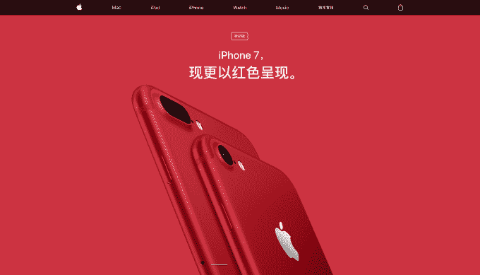
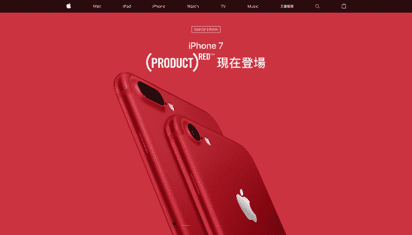

# 苹果在中国的红色 iPhone 的 drops AIDS 慈善品牌

> 原文：<https://web.archive.org/web/https://techcrunch.com/2017/03/22/apple-red-iphone-china/>

# 苹果在中国为其红色 iPhone 做艾滋病慈善品牌推广

昨天，苹果公司发布了红色版本的 iPhone 7，这是支持艾滋病慈善机构[【红色】](https://web.archive.org/web/20230313122436/https://red.org/)的最新举措，这给了全世界的 iPhone 爱好者一个新的玻璃平板。

(产品)红色特别版 iPhone 7 是苹果第一次通过其旗舰手机支持慈善机构，之前的(产品)红色版包括 Beats 耳机和苹果配件，因此它肯定会提高国际知名度，并产生额外的资金，因为每次购买都包括对慈善机构的捐款。从本周五开始，限量版 iPhone 将在全球 40 多个地区发售，但慈善搭售不会被人注意的一个市场是中国，这个世界上人口最多的国家。

尽管在中国销售潜力巨大——在这里，iPhone 是身份的象征，独特的颜色可以让限量版特别受欢迎——但红色 iPhone 没有使用(产品)红色品牌进行推广。

眼尖的互联网用户注意到了该设备在苹果中国网站上与在台湾网站上获得的不同营销。在中国，红色的 iPhone 7 完全没有提到(产品)红色品牌，尽管它包含所有其他细节，包括发布日期和时间。

> 苹果中国网站上的手机

> 苹果台湾网站上的手机

这不是苹果或其网站团队的疏忽。艾滋病毒和艾滋病在中国是一个棘手的话题。援助机构和媒体经常警告中国“迫在眉睫”的艾滋病危机。[尽管在学生和年轻人中取得了一些令人印象深刻的进展](https://web.archive.org/web/20230313122436/http://thediplomat.com/2015/06/chinas-impressive-performance-on-hivaids/)，政府的政策并没有阻止这种疾病在中国男同性恋人群中的上升，正如[《环球邮报》去年详细报道的](https://web.archive.org/web/20230313122436/http://theweek.com/articles/632926/chinas-looming-aids-epidemic)。

苹果在中国因涉嫌使用定位数据而受到政治关注，特朗普总统咄咄逼人的贸易政策可能会通过解除该设备与红色的联系来避免争议。这也适用于政府和消费者。

无论如何，一些分析师仍然不相信这款手机能够影响苹果在中国的销售下滑。IDC 的 Bryan Ma 指出，其他竞争对手已经提供红色设备，真正的考验将是下一代 iPhone，这也标志着该设备的十周年纪念。该设备被认为具有一系列新技术，可能包括有机发光二极管屏幕。许多专家认为，提供与 iPhone 7 和 iPhone 6s 系列的真正区别将促进苹果在中国的销售，因为以前推出的设备被认为太相似，许多消费者都不愿掏钱升级。

苹果没有回复对此事的置评请求。