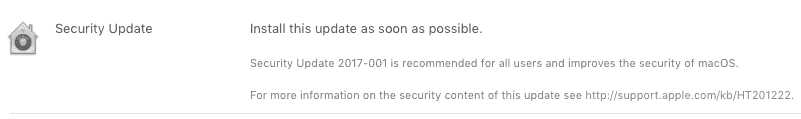
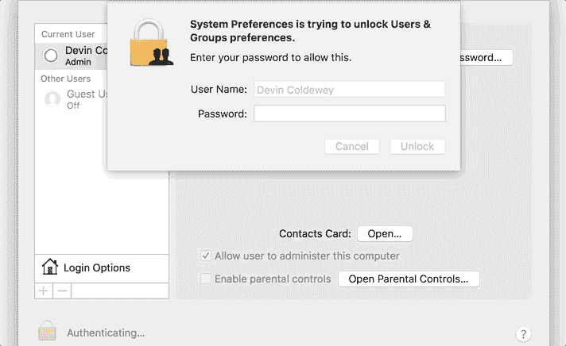

# 苹果发布 macOS 安全更新以修复巨大的登录安全漏洞

> 原文：<https://web.archive.org/web/https://techcrunch.com/2017/11/29/apple-releases-a-macos-security-update-to-fix-huge-login-security-flaw/>

# 苹果发布 macOS 安全更新以修复巨大的登录安全漏洞

苹果刚刚发布了 macOS High Sierra 的安全更新，你应该马上更新(苹果将在今天晚些时候自动推送安全补丁)。本次更新修复了昨天的[非常令人担忧的](https://web.archive.org/web/20230315095321/https://techcrunch.com/2017/11/28/astonishing-os-x-bug-lets-anyone-log-into-a-high-sierra-machine/)漏洞，该漏洞允许任何人无需您的密码即可登录您的 Mac。

要安装更新，请打开 Mac App Store 并点击“更新”标签。有趣的是，发行说明上写着“尽快安装本更新。”苹果已经工作了很长时间来尽快修复昨天的缺陷。但是一开始就不应该发生。

该安全漏洞影响了所有运行最新版本 High Sierra(至少 10.13.1 — 17B48 版本)的 MAC 电脑。在登录屏幕或首选项面板中，您可以通过输入 root 用户名而不输入密码来绕过所有安全屏幕。TechCrunch 的许多人测试了这个缺陷，并可以毫不费力地复制它。之后，即使不是你的，你也能看到电脑上的所有东西。它甚至可以与屏幕共享会话一起工作。对于黑客来说，这是访问你的电子邮件、个人数据等的好方法。

补丁[发布说明](https://web.archive.org/web/20230315095321/https://support.apple.com/en-us/HT208315)很短。"凭据验证中存在逻辑错误。苹果公司表示:“这个问题通过改进凭证验证得到了解决。”。

**更新:**苹果将在今天晚些时候为所有受影响的人自动推出更新。苹果公司提供了以下声明:

> “安全性是每一款苹果产品的重中之重，遗憾的是，我们在 macOS 的发布上栽了跟头。
> 
> 当我们的安全工程师在周二下午意识到这个问题时，我们立即开始进行更新，以弥补这个安全漏洞。今天上午 8:00，该更新可供下载，从今天晚些时候开始，它将自动安装在运行最新版本(10.13.1)的 macOS High Sierra 的所有系统上。
> 
> 我们对此错误深感遗憾，并向所有 Mac 用户道歉，包括发布此漏洞以及由此引起的担忧。我们的客户应该得到更好的服务。我们正在审核我们的开发过程，以帮助防止这种情况再次发生。"