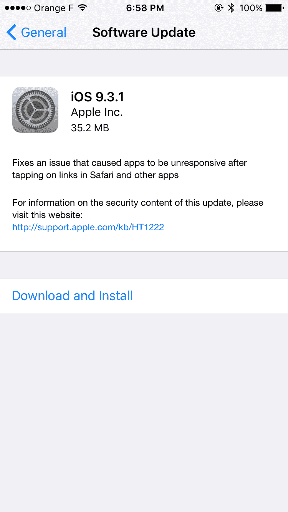

# 苹果发布 iOS 9.3.1，修复了导致点击链接导致 iPhones 崩溃的错误

> 原文：<https://web.archive.org/web/https://techcrunch.com/2016/03/31/apple-releases-ios-9-3-1-with-fix-for-bug-that-causes-tapping-links-to-crash-iphones/>

# 苹果发布 iOS 9.3.1，修复了导致点击链接导致 iPhones 崩溃的漏洞

嗯，真快。在[一个影响 iOS 的错误成为新闻](https://web.archive.org/web/20221025223000/https://beta.techcrunch.com/2016/03/28/its-not-just-you-clicking-on-links-in-ios-9-3-can-crash-your-iphone/)的几天后，苹果发布了一个修复程序。现在可以在 iPhone 和 iPad 上使用的 iOS 9.3.1 修复了这个错误。变更日志很短，因为只有一个项目。“修复了在 Safari 和其他应用程序中点击链接后导致应用程序无响应的问题，”它说。

提醒一下，许多用户[在苹果论坛](https://web.archive.org/web/20221025223000/https://discussions.apple.com/thread/7505840)上报告说，如果他们点击一个链接，Safari 或任何其他应用程序都会崩溃。原来一些第三方应用开发者开始滥用 iOS 9 的一个功能，通用链接。这个错误不仅影响了 iOS 9.3，也影响了旧版本 iOS 9 的用户。

随着 [iOS 9](https://web.archive.org/web/20221025223000/https://beta.techcrunch.com/2015/09/16/ios-9-review/) ，苹果推出了[通用链接](https://web.archive.org/web/20221025223000/https://developer.apple.com/library/ios/documentation/General/Conceptual/AppSearch/UniversalLinks.html)，这是一种全新的处理本地应用链接的方式。YouTube 等应用开发者可以注册域名，绕过 Safari，直接在应用中打开网页链接。

这就是为什么当你点击一个`youtube.com/somethingsomething`链接时，iOS 会打开 YouTube 应用，而不是在 Safari 中加载网页。这是一个很棒的功能，除非应用开发者滥用它。

但是一些开发者，比如 Booking.com，把他们的应用和各种各样的领域联系在一起——太多的领域了。由于 Booking.com 应用程序中有 2.4MB 的域名深层链接条目，检查通用链接的 swcd 进程溢出了。换句话说，苹果没有对通用链接进行限制，一些应用程序开发者滥用了它。

很高兴看到苹果公司反应如此迅速。但这一缺陷也表明，通用链接仍然是一项年轻的技术，苹果仍然需要做一些工作来优化它们。如果你遇到了这个问题，请打开你的 iOS 设备上的设置应用程序。然后前往“通用”>“软件更新”并更新您的设备。

