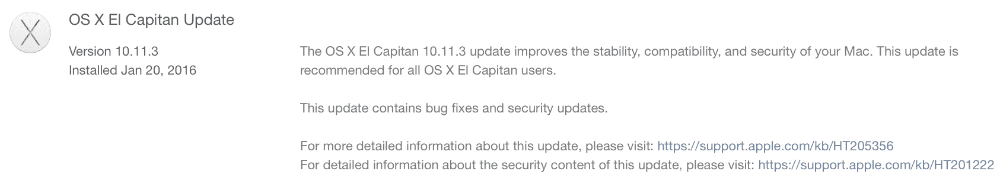
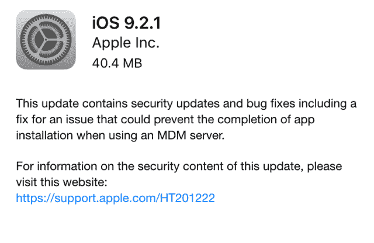

# 苹果发布 iOS 和 OS X 更新，修复了错误并提高了性能 

> 原文：<https://web.archive.org/web/https://techcrunch.com/2016/01/20/apple-releases-ios-and-os-x-updates-with-bug-fixes-and-performance-improvements/>

# 苹果发布了 iOS 和 OS X 更新，修复了错误并提高了性能

苹果刚刚发布了 Mac、iPhone 和 iPad 的两个软件更新。这些都是次要的软件更新，主要集中在错误修复、安全修复和性能改进上。在 Mac 电脑上，OS X 10.11.3 [修复了](https://web.archive.org/web/20230127141317/https://support.apple.com/en-us/HT205356)一个外置 4K 显示器的错误和一些[安全漏洞](https://web.archive.org/web/20230127141317/https://support.apple.com/en-us/HT205731)。至于 iOS 9.2.1，它包含了类似的[安全修复](https://web.archive.org/web/20230127141317/https://support.apple.com/en-us/HT205732)。不幸的是，这个版本没有修复[电池电量计错误](https://web.archive.org/web/20230127141317/http://arstechnica.com/apple/2016/01/apple-investigating-inaccurate-battery-percentage-in-iphone-6s/)。

今天的更新可以被认为是苹果在 iOS 9.3 和 OS X 10.11.4 中引入新功能之前的中间更新。除此之外，Mac 用户应该期待在下一个版本中，OS X 的信息中有[生活照片](https://web.archive.org/web/20230127141317/https://techcrunch.com/2016/01/14/live-photos-support-coming-to-messages-on-mac/)和笔记密码。

在下一个版本中，iOS 用户将获得[新功能](https://web.archive.org/web/20230127141317/https://techcrunch.com/2016/01/11/apple-rolls-out-new-betas-across-its-platforms/)，如“夜班”、苹果新闻定制、健康应用程序中 Apple Watch 的健康数据、CarPlay 改进和新的学校管理工具，以便与班级共享一个 iPad。提醒一下，夜班晚上消除蓝光，提高你的睡眠质量。天黑时，暖色对你的眼睛更好看。

让我们也期待 iOS 9.3 修复电池电量计 bug。目前，如果你手动更改时区，屏幕顶部的小电池指示灯可能会卡住。这不是一个交易破坏者，但它可能会令人困惑地看到你的 iPhone 与绿色电池指示灯死亡。

像往常一样，去 App Store 点击 Update 标签接收最新更新。在你的 iPhone 和 iPad 上，进入设置应用程序，通用，并寻找软件更新页面。

