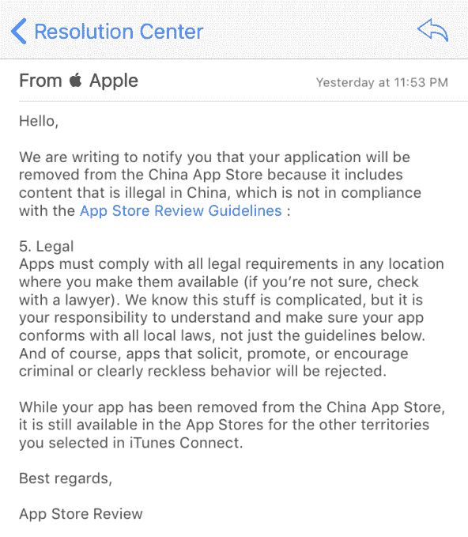

# 苹果从中国应用商店移除 VPN 应用

> 原文：<https://web.archive.org/web/https://techcrunch.com/2017/07/29/apple-removes-vpn-apps-from-the-app-store-in-china/>

中国政府对互联网的打击仍在继续，有消息称，苹果(Apple)已经从中国的应用商店(App Store)下架了所有主要的 VPN 应用，这些应用帮助互联网用户克服该国的审查制度。

这一举动首先被中国境外的提供商 express VPN(T1)注意到，它在[的一篇博客文章](https://web.archive.org/web/20230329161227/https://www.expressvpn.com/blog/china-ios-app-store-removes-vpns/)中说，“所有主要的 VPN 应用”包括它自己的已经从苹果中国商店中清除。该公司分享了苹果公司的一份说明，解释其应用程序被删除是因为“它包含在中国非法的内容。”

该公司表示，这款应用将继续面向中国以外的全球用户开放。然而，[在另一个国家创建应用商店账户的过程](https://web.archive.org/web/20230329161227/http://www.makeuseof.com/tag/anyone-can-download-apps-from-the-us-app-store-here-is-how/)对许多用户来说是未知的，所以它不太可能填补缺失的中国应用的空白。

另一家提供商 Star VPN[发推文](https://web.archive.org/web/20230329161227/https://twitter.com/star_vpn/status/891191888547651584)称其应用也已被移除。

截至发稿时，苹果公司尚未回复置评。在[稍后发布的一份声明](https://web.archive.org/web/20230329161227/https://techcrunch.com/2017/07/30/apple-issues-statement-regarding-removal-of-unlicensed-vpn-apps-in-china/)中，该公司表示“要求”移除这些应用，因为它们违反了中国法律。

> ExpressVPN 分享了苹果通知其在中国移除应用程序的通知

App Store 的清洗影响巨大，因为 VPN 代表了中国个人绕过国家审查控制、不受限制地访问互联网的唯一途径。当一月份颁布的新规定要求虚拟专用网络必须获得政府批准才能运营时，中国政府实际上已经将虚拟专用网络非法化。这似乎是苹果被迫移除 ExpressVPN 和其他类似产品的原因。

苹果可能认为，与北京方面的要求合作对其业务来说是最好的，但这次 App Store 清理行动只是为中国历史上的免费互联网制造了最大的挫折之一。

“我们对这一进展感到失望，因为它代表了中国政府迄今为止采取的阻止使用 VPN 的最严厉措施，我们对苹果协助中国的审查努力感到不安。ExpressVPN 强烈谴责这些威胁言论自由和公民自由的措施，”ExpressVPN 在其博客上写道。

今天的新闻是一系列反对中国免费互联网的最新进展。

本月早些时候，中国两家流行的虚拟专用网服务被迫离线，这让他们的用户别无选择，其中包括需要访问全球互联网进行工作的专业人士。[政府官员否认了](https://web.archive.org/web/20230329161227/https://www.hongkongfp.com/2017/07/13/chinese-ministry-denies-reports-will-block-access-vpns-2018/) [来自彭博](https://web.archive.org/web/20230329161227/https://www.bloomberg.com/news/articles/2017-07-10/china-is-said-to-order-carriers-to-bar-personal-vpns-by-february)的报道，该国移动运营商被告知在 2018 年初禁止 VPN 应用，但显然已经采取了其他措施。路透社本月早些时候报道称，中国互联网审查机构“防火长城”已经升级了新功能。VPN 服务随后发现，他们遭到了迄今为止最复杂的来自中国的攻击。高端酒店甚至已经停止向客人提供 VPN 服务。

这些新功能显然也让政府有可能干预即时通讯应用。虽然现在已经被完全屏蔽， [WhatsApp 用户发现他们无法通过聊天应用发送视频和照片](https://web.archive.org/web/20230329161227/https://www.nytimes.com/2017/07/18/technology/whatsapp-facebook-china-internet.html)，而且[问题似乎延伸到了中国最受欢迎的消息服务微信](https://web.archive.org/web/20230329161227/https://www.bloomberg.com/news/articles/2017-07-18/facebook-s-whatsapp-partially-blocked-in-mainland-china?utm_source=SupChina&utm_campaign=184a7c1c9e-20170716-336China%E2%80%99sMiddleEasternBalancingAct&utm_medium=email&utm_term=0_caef3ab334-184a7c1c9e-164861417)。审查似乎与对异议人士刘晓波死亡的反应有关，刘晓波是诺贝尔和平奖的获得者，他在本月早些时候因肝癌输掉了一场战斗，并被拒绝离开拘留所去海外寻求治疗。

由于苹果公司控制着在中国可以使用的应用程序，直接联系苹果公司正成为实施审查的一种有效方式。今年早些时候，这一策略在中国被证明是成功的，当时苹果从中国本地应用商店下架了《纽约时报》的应用。根据审查监控服务机构大火，时报和华尔街日报是在中国[被屏蔽的众多国际新闻网站之一。](https://web.archive.org/web/20230329161227/https://greatfire.org/)

目前还不清楚中国的安卓商店是否也采取了类似的行动。谷歌 Play 商店不在中国，在中国，少数第三方应用商店是最有影响力的安卓应用分销商。

[非营利组织 GreatFire](https://web.archive.org/web/20230329161227/https://techcrunch.com/2015/03/30/greatfire/) 提供“防审查”的替代服务，如其 Android VPN [FreeBrowser](https://web.archive.org/web/20230329161227/https://freebrowser.org/) 和其他服务，包括[与《纽约时报》的合作](https://web.archive.org/web/20230329161227/https://play.google.com/store/apps/details?id=org.greatfire.nyt)，但苹果的 iOS 不允许类似的选项。

苹果刚刚宣布伊莎贝尔·葛·马和成为中国业务的第一任总经理，除了与在中国的销售下滑作斗争之外，这位长期担任苹果高管的人还肩负着管理与中国关系的艰巨任务。这家美国公司最近宣布了开发其首个中国数据中心的计划，此举被认为与 6 月 1 日生效的中国新网络安全法有关。