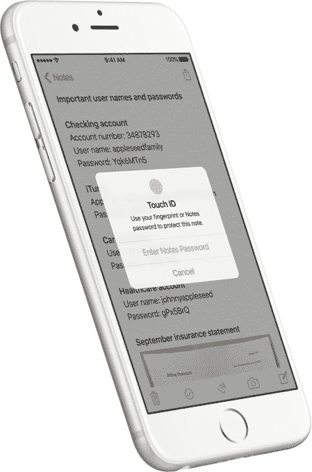
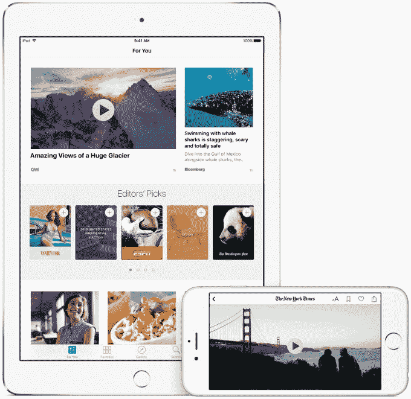
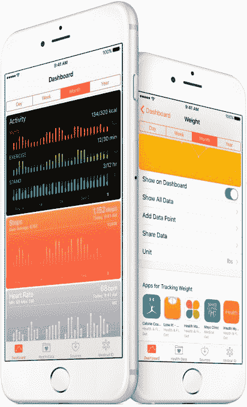

# 苹果在其平台上推出新的测试版 

> 原文：<https://web.archive.org/web/https://techcrunch.com/2016/01/11/apple-rolls-out-new-betas-across-its-platforms/>

苹果周一快乐！该公司刚刚为其每个平台推出了新的软件测试版，包括桌面(El Capitan 10.11.4)、移动(iOS 9.3)、苹果电视(tvOS 9.2)和苹果手表(watchOS 2.2)。苹果配置器 2.2 和 [Xcode 7.3](https://web.archive.org/web/20221208111434/http://adcdownload.apple.com/Developer_Tools/Xcode_7.3_beta/Xcode_7.3_beta_Release_Notes.pdf) 的测试版也同时推出。

升级中的一些突出功能包括支持多块 Apple Watches 与一部 iPhone 配对的新功能、watchOS 中的新地图体验、iOS 中用于更好夜间阅读的“夜班”模式、支持触控 ID 的升级 Notes 应用程序、更好的健康应用程序、面向教育用户的新功能等等。

**iOS 9.3**

iOS 9.3 中更有趣的[功能之一是“夜班”——该功能将在夜间慢慢改变 iOS 设备的调色板，以消除蓝光及其打断我们自然睡眠模式的能力的问题。](https://web.archive.org/web/20221208111434/http://www.apple.com/ios/preview/)[亚马逊的 Fire 平板电脑](https://web.archive.org/web/20221208111434/https://beta.techcrunch.com/2015/12/02/amazon-fire-tablets-get-expanded-parental-controls-plus-a-blue-shade-feature-for-better-nighttime-reading/)和[谷歌 Play Books](https://web.archive.org/web/20221208111434/http://www.cnet.com/how-to/get-the-new-night-light-mode-in-google-play-books/) 最近也做了同样的事情，尽管苹果用户可能更熟悉这一功能，这要归功于一款名为 [F.lux](https://web.archive.org/web/20221208111434/https://justgetflux.com/) 的用于 Mac 设备的应用程序，以及[其用于 iOS 设备的越狱版本。](https://web.archive.org/web/20221208111434/https://justgetflux.com/ios.html)

苹果在其新软件的[预览网站上解释道，“夜班使用你的 iOS 设备的时钟和地理定位来确定你所在位置的日落时间。然后，它会自动将显示器中的颜色转移到光谱的暖色端，使您的眼睛更加舒适。早上，它会将显示屏恢复到正常设置。”](https://web.archive.org/web/20221208111434/http://www.apple.com/ios/preview/)

也就是说，当一天晚些时候，设备会自动进行调整。显然，这已经成为移动设备的一个新的标准功能，因为今天更多的用户在睡觉前在手机和平板电脑上阅读，但随后面临睡眠障碍。随着亚马逊和苹果现在都在他们的平台上提供这种设置，他们也可能为竞争对手建立一个新的基线。

Notes 应用程序也已经升级，包括对触控 ID 的支持——这意味着你可以安全地访问该应用程序，其中许多人会随意记录医疗细节和密码等内容。现在，您可以根据自己的喜好，输入密码或使用指纹来启动备忘录。苹果公司表示，你还可以按照创建日期、修改日期或字母顺序对笔记进行排序。

苹果的新闻应用在 iOS 9.3 中更加个性化，对趋势话题和编辑推荐等内容提供了更多建议。此外，它现在可以在你的 feed 中播放视频，速度稍快，并支持 iPhone 上的横向模式。

与此同时，健康应用现在让你更容易找到第三方健康应用，因为体重、锻炼和睡眠等类别有一个新的滑块菜单，可以帮助你找到相关的应用商店应用。它现在还可以从你的 Apple Watch 上显示你的移动、锻炼和站立数据，以及目标。

[CarPlay](https://web.archive.org/web/20221208111434/http://www.apple.com/ios/carplay/) 在 9.3 版本中增加了一些新功能，包括 Apple Music 的“新”和“为你”推荐，以及“地图”中的“附近”功能，现在可以帮助你找到加油站、停车场、餐馆等。

更重要的是，[iOS 9.3](https://web.archive.org/web/20221208111434/http://www.apple.com/education/preview/)极大地推动了教育，升级后的软件引入了更多功能，使 iOS 在课堂环境中提供更好的体验，包括为学校管理员添加了一个名为“苹果学校管理器”的单一门户，支持一种名为“受管苹果 ID”的新型教育 ID，这是一款面向教师的新课堂应用程序，以及支持学生共享 iPad。

这里的重点是为学校、管理员和教师提供更多在课堂上使用苹果设备的工具，从管理员可以购买应用程序并为 MDM(移动设备管理)准备设备的学校管理器仪表板，到让学生在课堂上登录 iPad 并将其变成自己的工具。

希望这种多账户支持可以在未来进入消费者端，因为家庭经常共享一个设备——就像与孩子共享的 iPad 但没有办法创建单独的个人资料或个人体验。

[gallery ids="1260890，1260872"]

**watchOS 2.2**

与此同时，在 watchOS 上，有上面提到的对多个手表与单个 iOS 设备配对的支持，这需要 iOS 也运行 iOS 9.3

此外，地图应用程序和 glance 现在可以提供快速定位、搜索和查看附近景点的功能。一个新的附近功能也可以让用户轻松浏览食物、饮料、购物、旅行和健康等类别，并在每个类别中找到最近的地方。轻按一个类别将为您提供更多选项，如娱乐类别中的夜生活、音乐和戏剧、公园和娱乐以及电影选项。

WatchOS 2.2 还提供了升级的核心文本框架，允许复杂的文本布局和渲染图形上下文，并包括对 HealthKit 框架的升级，该框架现在包括用户一天活动的摘要(例如站立时间、锻炼时间、消耗的积极能量)。)

**tvOS 9.2**

随着 [Apple TV 的软件升级](https://web.archive.org/web/20221208111434/https://developer.apple.com/tvos/download/)，该平台也获得了大量新功能，包括支持配对蓝牙键盘，将应用程序移动到主屏幕上的文件夹中的能力，新的应用程序切换器界面，以及它自己的播客应用程序。

使用 iPhone 版本的人会对[播客应用](https://web.archive.org/web/20221208111434/http://9to5mac.com/2016/01/11/photos-with-tvos-9-2-apple-tv-adds-podcasts-app-folders-bluetooth-keyboard-support-new-app-switcher-and-more/)很熟悉，因为它也提供了未播放、我的播客、精选、排行榜和搜索标签。

[gallery ids="1260901，1260902，1260903"]

*上图:tvOS 新功能；图片来源:[9 to 5 MAC](https://web.archive.org/web/20221208111434/http://9to5mac.com/2016/01/11/photos-with-tvos-9-2-apple-tv-adds-podcasts-app-folders-bluetooth-keyboard-support-new-app-switcher-and-more/#jp-carousel-414347)*

推出对 Apple TV 的文件夹支持表明，苹果已经在考虑用户体验，让用户更容易找到喜欢的应用程序，而无需大量滚动。该功能与 iOS 设备上的功能类似——你可以按下播放/暂停按钮，将应用程序移动到文件夹或删除它们。

Siri 现在还会说西班牙语(美国)和加拿大法语。

**OS X 10.11.4(埃尔卡皮坦)**

与 iOS 甚至 watchOS 相比，OS X 测试版更像是一个增量版本。根据发布文本，它将专注于稳定性、兼容性和安全性的改进。