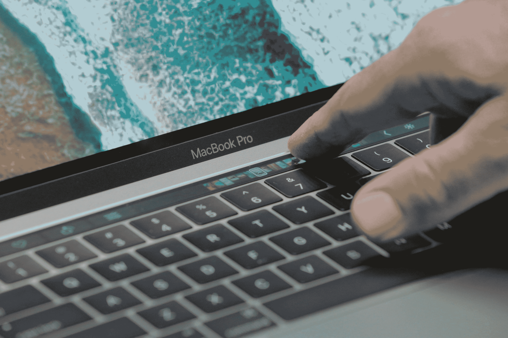

# MacBook Pro 上的 Touch Bar 有严格的开发者准则

> 原文：<https://web.archive.org/web/https://techcrunch.com/2016/10/27/apple-says-no-fun-allowed-on-the-touch-bar/>

[摸杠](https://web.archive.org/web/20230327065412/https://techcrunch.com/2016/10/27/heres-what-you-can-do-with-the-touch-bar-on-the-new-macbook-pro/)是*正经事*。苹果的界面指南警告人们不要玩各种有趣的东西，当本周早些时候新的 MacBook Pros [泄露](https://web.archive.org/web/20230327065412/https://techcrunch.com/2016/10/25/this-is-the-new-macbook-pro-with-the-magic-toolbar-mini-display/)时，开发人员可能已经开始考虑这些东西了。毫无疑问，即使在苹果党内警察的严厉目光下，一些应用程序也会找到一种有创意的方式，但这显然是不被鼓励的。

以下是苹果指导方针中的几个选项，告诉开发者如何创建 Touch Bar 界面:

*   将 Touch Bar 用作键盘和触控板的延伸，而不是显示器。
*   触摸栏不应该显示警告、消息、滚动内容、静态内容或任何其他会吸引用户注意力或分散他们在主屏幕上工作的东西。
*   避免动画。Touch Bar 被认为是键盘的延伸，人们并不期望他们的键盘中有动画。
*   有品味地、最低限度地使用颜色。一般来说，Touch Bar 的外观应该与物理键盘相似。
*   一般来说，Touch Bar 不应该包含诸如查找、全选、取消选择、复制、剪切、粘贴、撤销、重做、新建、保存、关闭、打印和退出等任务的控件。

现在，不可否认的是，这些事情中的一些可能会很烦人或者做得不好。很明显，苹果希望开发者和用户都将 Touch Bar 视为键盘的延伸，而不是屏幕的延伸。但是以这种方式规定用法通常不是一个好主意。事实上，这两者都是，而且应该用于两者。

谁不想要一个股票报价器，一个 Twitter feed，或者一个下载和文件操作的进度条呢？这里有大量的可能性可以探索，坚持事物保持单色、钥匙形和静态似乎是有害的。

 就我个人而言，我在想第一款 Touch Bar 游戏会是什么样子，或者它如何能充当雨量计，或者是我的机器的一目了然的视图。

即使我们要让事情变得无聊，为什么不把复制、粘贴、保存等等放在那里呢？当然，他们复制快捷键，但他们今天在舞台上展示的一堆东西也是如此。

标准化的东西，让用户或多或少知道期待什么是一个好主意，特别是有了这样的新功能，但这比标准化更令人窒息。对新颖用户界面的实验创造出了各种有趣的应用程序，这些程序都有直观有趣的控制。苹果假装它已经知道该如何使用这个界面的一切，而实际上它是一个广阔的开放领域。

这些是否重要，很大程度上取决于苹果如何严格执行这些设计准则。它会满足于简单地鼓励自己对 Touch Bar 上应该出现的内容的有限愿景，还是会积极阻止超越它的应用程序？我们很快就会知道。但是，如果看到这个很酷的新功能没有发挥出它的潜力，那就太可惜了。