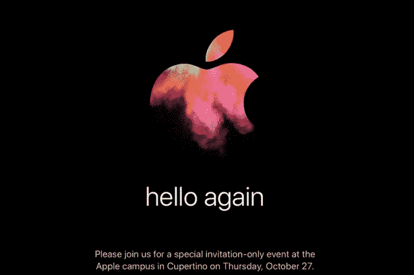
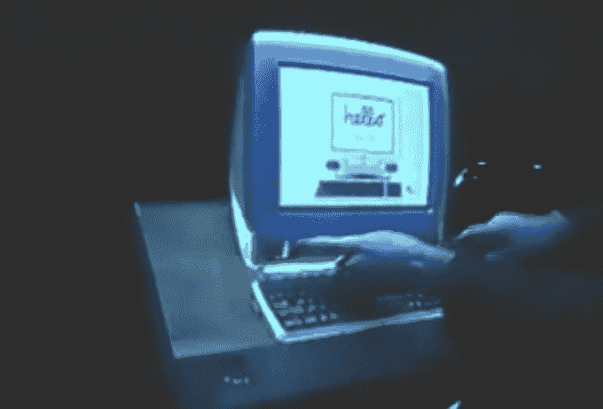

# 苹果发出 10 月 27 日活动的邀请，暗示新 MAC 即将到来 

> 原文：<https://web.archive.org/web/https://techcrunch.com/2016/10/19/apple-sends-out-invites-for-an-october-27th-event-hints-that-new-macs-are-coming/>

# 苹果发出了 10 月 27 日活动的邀请，暗示新的苹果电脑即将到来

就在那里。

[我们听说](https://web.archive.org/web/20221207205436/https://beta.techcrunch.com/2016/10/18/waiting-impatiently-for-apple-to-release-new-macs-youll-get-them-on-october-27th/)苹果计划在 10 月 27 日发布公告。具体来说，我们听说他们终于，*终于*将展示一些新的苹果电脑——这是他们一年多来没有做过的事情(除了更新 MacBooks)。

果不其然，苹果刚刚开始向媒体发出活动邀请……果不其然，活动将于 27 日举行。

除了活动的时间和地点之外，苹果的邀请函细节不多——至少第一眼看上去如此。

不过，请注意“再次问候”的部分——然后再看一遍 1984 年的这则麦金塔广告:

https://www.youtube.com/watch?v=YaFTLrULHwg

如果你赶时间，跳到 0:18(或者只看缩略图)。“hello”这个词在最初的麦金塔电脑中占了很大一部分——通常都是小写的，就像这个新的 invite 一样。

然后在 1998 年，随着 iMac 的推出，乔布斯再次挖掘了“你好”的主题:

在这些小暗示和我们最近听到的低语之间，是的:期待 10 月 27 日的新 MAC。

苹果还证实，他们将于太平洋时间 27 日上午 10 点开始在 Apple.com 直播此次活动。