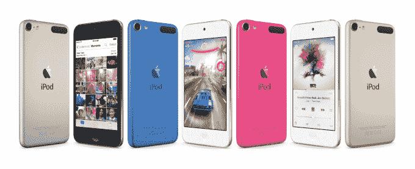

# 苹果通过 A8 处理器、摄像头升级和新颜色向 iPod touch 展示了一些爱

> 原文：<https://web.archive.org/web/https://techcrunch.com/2015/07/15/apple-shows-ipod-touch-some-love-with-a8-processors-camera-upgrades-and-new-colors/>

有迹象表明，苹果仍然认为 iPod touch 适合某个特定的领域，这些都是以少量硬件升级的形式出现的。更新的型号具有更强大的处理器，更好的相机硬件和成像软件，并专注于 iPod 作为游戏和摄影平台。**更新了以下基准。**

## 刷新

新的 iPods 一般意味着新的颜色，这也不例外。新款 iPod touch 将有银色、太空灰、(产品)红色、粉色、蓝色和金色可选。该批次中的新颜色为粉色、蓝色和金色。除了更大的触感之外，这些新颜色也出现在 nano 和 shuffle 型号中。iPod nano 和 shuffle 型号的功能和价格保持不变。

新的 iPod touch 型号正在内部升级到 iPhone 6 使用的 A8 处理器，这是从以前的 A5 处理器进行的受欢迎的升级。这也是相当大的飞跃，因为 iPod touch 处理器通常比当前的 iPhone 落后一代(尽管它们以前一直不相上下)。它证明了 A8 的能效，它甚至是电池容量低得多的设备的可行选择。目前还不知道处理器的时钟频率，所以它是否被推到了最大值还是个未知数。

当然，这一转变的重要性在于苹果正在努力让所有的触摸设备运行 64 位处理器。在这一点上，最后一个设备是 iPhone 5c，它运行在 A6 芯片上。这是关键，原因有几个，包括成本效益和性能，但也因为苹果现在可以轻松地要求所有为 App Store 构建的应用程序都与 64 位架构兼容。

新处理器还支持 Metal，这是苹果的底层框架，允许游戏开发者直接访问图形处理器。这导致游戏速度提高了约 10 倍，CPU 速度提高了 6 倍。

除了 A8，新的 iPod touch 还配备了苹果的 M8 运动协处理器。这是一种芯片，可以让你的设备记录运动和活动，以记录在健康数据库和其他地方——而使用的电池比保持主处理器运行少得多。新的 iPod 也获得 801.11ac 无线支持。

新款 iPod touch 的整体电池寿命保持不变。

## 光脚

iPod touch 也将获得一个新的后置摄像头和一些前置软件更新。

新的后置摄像头是 800 万像素，配有一个新的图像处理芯片。不清楚 ISP 是否和 iPhone 6 里的一样，但肯定是升级了。新的流水线处理允许 6 的一系列功能进入 iPod touch。后置摄像头现在包括 10fps 的连拍模式。可以用 120fps 的 slo-mo 拍摄视频。它在视频模式下也有电影般的稳定性。人脸选择算法也得到了改进。

前置摄像头的分辨率没有变化，但像素间距变大了，更适合弱光自拍。HDR 的剧照和视频现在可以在前置摄像头中看到，连拍模式也是如此。

新款 iPod touch 的起价仍然是 199 美元。32GB 249 美元，64GB 299 美元，他们还增加了一款新的 128GB 型号，售价 399 美元。请注意，16GB 和 32GB 之间的跳跃相当小，这是值得欢迎的。

## 什么是 iPod？

尽管 iPhone 的大规模崛起蚕食了 iPod touch 的销量，但这仍然是一门生意。苹果可能会改变围绕“iPod 的衰落”的叙述——这使得分析师可以在真空中查看 iPod 的数据——不再单独报告他们的销售数据。尽管有所下降，但“配件和 iPod”类别仍占 Q1 2015 年收入的 26.8 亿美元。

iPod touch 在过去几年中的发展和完善已经阐明了苹果认为 iPod 仍然很棒的地方。它不再仅仅是一个音乐播放器；它是一个游戏平台和一个摄像头。这种用法就发生在我面前，因为我的女儿把她的触觉作为一种(多产的)摄影工具，拍摄她自己、我们的狗、我们、我们汽车座椅靠背的照片……你明白了。有理由认为 iPod touch 可以被定位为独立的相机，就像最初的 iPod 被定位为媒体播放器一样。

iPod touch 成为新的傻瓜相机。

一台相机，当然，它也能玩上千种游戏。

iPod touch 成为新的游戏机。

无论使用情况如何，很明显 iPod touch 不是新的 iPod。当一切都在播放音乐的时候，一个专门的播放器越来越没有意义。

**更新**:我们这里有一些新的 iPod 可以玩，我们对 iPod touch 进行了初步的基准测试。该处理器似乎每核运行 1.10GHz，而 iPhone 6 的 A8 处理器为 1.39 GHz。geek bench 的分数为 1379 和 2440，这是我能管理的最大空闲状态。这意味着 iPod touch A8 处理器*比 iPhone 6*的时钟频率低一些，考虑到我上面提到的电池限制，这并不奇怪。它似乎也有 1GB 的内存。

[gallery ids="1183323，1183324，1183325"]