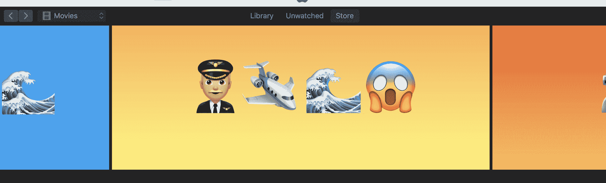

# 苹果在世界表情符号日 展示了一些新的表情符号

> 原文：<https://web.archive.org/web/https://techcrunch.com/2017/07/17/apple-shows-off-some-of-its-new-emoji-on-world-emoji-day/>

苹果透露了一些表情符号，将于今年晚些时候在 iOS、watchOS 和 macOS 上发布，这是为世界表情符号日准备的一份小礼物。新的表情图标包括《侏罗纪公园》中的一只霸王龙和一只小精灵，LOTR 的粉丝们厌倦了键入他们英雄的名字，还有一些新的表情符号，鼓励更多样化的交流，包括戴头巾的女性和哺乳的表情符号。

这些表情符号都是 Unicode 表情符号 5.0 标准版的一部分，该标准版于 3 月定稿，并于 5 月向公众发布。总清单包括 69 个表情符号，苹果今天展示了超过 12 种对新标准化图标的解释。

[gallery ids="1515344，1515345，1515346，1515347，1515348，1515349，1515350，1515351，1515352，1515353，1515354，1515355，1515357，1515358，1515359"]

苹果今天分享的其他新表情符号包括一个爆炸的头像笑脸，以及非常说明问题的呕吐笑脸。有一只斑马和一个精灵，增加了动物学和神秘动物学的范围，还有一个三明治，看起来几乎足够好吃。

我们即将迎来完全用象形文字交流的那一天。事实上，我真正需要的是霸王龙表情符号来传达我的全部情绪，所以我等不及了。

苹果公司还做了一些其他事情来庆祝世界表情符号日，包括在 iTunes 商店用表情符号解释替换一些电影的名字。只需在 iOS 上或桌面上的 iTunes 中查看商店的电影部分，就可以尝试解释表情符号的翻译。

