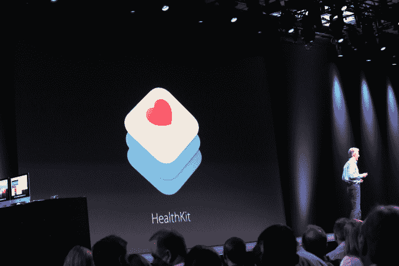

# 苹果不再忽视女性的健康，iOS 9 HealthKit 更新，现在具有周期跟踪功能 

> 原文：<https://web.archive.org/web/https://techcrunch.com/2015/06/09/apple-stops-ignoring-womens-health-with-ios-9-healthkit-update-now-featuring-period-tracking/>

苹果将最终解决其[健康](https://web.archive.org/web/20230102213718/https://www.apple.com/ios/whats-new/health/)应用程序及其对女性的实用性方面的一个明显疏忽:[在 iOS 9](https://web.archive.org/web/20230102213718/http://www.apple.com/pr/library/2015/06/08Apple-Previews-iOS-9.html) 中，该应用程序将支持女性跟踪其生殖健康的能力。是的，终于来了:苹果正在让周期跟踪成为 iPhone 的内置功能。昨天在旧金山举行的 [WWDC](https://web.archive.org/web/20230102213718/https://techcrunch.com/2015/06/08/join-our-wwdc-2015-keynote-live-blog-at-10-am-pt/) 活动上，苹果软件工程的 SVP 克雷格·费德里吉(Craig Federighi)简要宣布了苹果 HealthKit 平台的一系列更新中即将推出的功能，该功能现在也可以存储与紫外线照射、水摄入量和用户久坐状态有关的数据。

苹果忽略了周期跟踪这一关键功能，这并不完全是一个惊喜，大约有一半的人希望看到它包含在一个全面的健康跟踪应用程序中。

今天的苹果是一家公司，只有 30%的员工是女性，只有 20%的工程师是女性。虽然苹果一直试图弥补其缺乏多样性(例如，通过[增加 WWDC 2015 奖学金](https://web.archive.org/web/20230102213718/https://techcrunch.com/2015/04/15/to-promote-diversity-apple-increases-the-number-of-wwdc-scholarships/)以包括更多鼓励女性工程师的组织，或者[在 2015 年 WWDC 上让女性高管登台](https://web.archive.org/web/20230102213718/http://mashable.com/2015/06/08/apple-women-onstage-wwdc/)——在男性主题演讲人[年](https://web.archive.org/web/20230102213718/http://readwrite.com/2014/06/04/apple-women-wwdc-keynote)之后——以及基本上承认其令人不安的比率都是[自己的错](https://web.archive.org/web/20230102213718/http://mashable.com/2015/06/08/tim-cook-apple-diversity-women-future/))但健康应用程序的问题是一个完美的例子，表明内部没有正确的平衡实际上是如何的

苹果健康应用发布后，公司[被](https://web.archive.org/web/20230102213718/http://www.theverge.com/2014/9/25/6844021/apple-promised-an-expansive-health-app-so-why-cant-i-track) [广泛](https://web.archive.org/web/20230102213718/http://fusion.net/story/100781/apple-ios-update-new-version-of-healthkit-still-doesnt-track-periods/) [批评](https://web.archive.org/web/20230102213718/http://www.theatlantic.com/technology/archive/2014/12/how-self-tracking-apps-exclude-women/383673/)忽视女性健康问题。[正如《大西洋月刊》指出的](https://web.archive.org/web/20230102213718/http://www.theatlantic.com/technology/archive/2014/12/how-self-tracking-apps-exclude-women/383673/)，女性跟踪自己的周期已经有几千年了——很早就知道月经和生育之间的关系。

毕竟，周期跟踪是量化自我跟踪的最早例子之一。

融合记者克什米尔·希尔咆哮道，“一个承诺让你‘看到你的整体健康状况’的应用程序怎么能忽视女性健康最重要的一个方面呢？”

今天，苹果的应用程序商店[充斥着](https://web.archive.org/web/20230102213718/https://www.google.com/webhp?sourceid=chrome-instant&ion=1&espv=2&ie=UTF-8#q=period%20tracker%20itunes)提供这种简单但关键的跟踪功能的应用程序，包括那些旨在帮助女性怀孕(或避免怀孕)的应用程序，如 [Bellabeat](https://web.archive.org/web/20230102213718/https://techcrunch.com/2015/01/16/bellabeat-leaf-a-health-tracker-for-women-will-now-track-your-reproductive-cycle-too/) 和 [Glow](https://web.archive.org/web/20230102213718/https://techcrunch.com/2014/10/02/glow-gets-17-million-in-series-b-funding-from-formation-8-founders-fund-and-andreesen-horowitz/) ，以及简单地让你知道月经何时来临的应用程序。其中一些比另一些更好。

但是怀孕并不是周期追踪器有用的唯一原因。正如大多数女性所知，月经不调可能意味着其他健康问题，包括压力、疾病、激素问题等，月经周期的时间也可能受到饮食、旅行、锻炼、药物使用、母乳喂养和其他变化的影响。

如果有什么不同的话，女性的月经周期是通用健康应用程序包含的理想数据。

然而，苹果公司推出了相对小众的跟踪选项，如健康工具包中的铜摄入量或硒摄入量，然后才开始像周期跟踪一样基本的东西。

关于 iOS 9 的 HealthKit 更新中的新“生殖健康”跟踪功能，苹果在舞台上的声明或新闻稿中没有透露太多信息，但[其开发者网站](https://web.archive.org/web/20230102213718/https://developer.apple.com/library/prerelease/ios/documentation/HealthKit/Reference/HealthKit_Constants/#//apple_ref/doc/uid/TP40014710-CH2-DontLinkElementID_17)提供了更多线索。

此处列出的新 HealthKit 常量引用了与经期跟踪相关的数据点，包括跟踪宫颈粘液的能力(增加表明生育能力，用户将能够输入颜色和稠度数据)，以及月经量(轻、中、重)。另一项让妇女输入排卵家庭测试的结果是阳性还是阴性。

综合来看，很明显，苹果 iOS 9 中的健康应用将在很大程度上专注于跟踪周期，因为它们与生育有关。这显然是跟踪月经周期的一个关键原因，但不是唯一的原因——如上所述，有许多与健康相关的原因导致女性可能需要手头有这些数据。

尽管如此，对苹果来说，这是朝着正确方向迈出的一步——希望有一天， [Siri 会足够聪明地](https://web.archive.org/web/20230102213718/https://techcrunch.com/2015/06/08/apple-announces-proactive-assistant-its-google-now-competitor/)告诉你什么时候该去买卫生棉条了。这要求不过分吧？