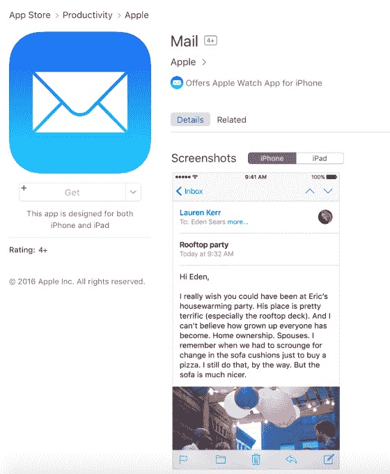
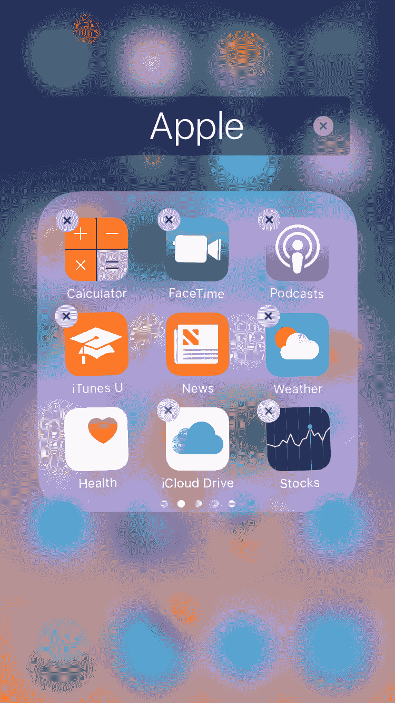

# 苹果将邮件、地图、音乐等原生应用进行了拆分，放入了应用商店 

> 原文：<https://web.archive.org/web/https://techcrunch.com/2016/06/13/apple-unbundles-its-native-apps-like-mail-maps-music-and-more-puts-them-in-the-app-store/>

苹果今天对其 iOS 设备的原生应用套件进行了重大改变，如邮件、股票、指南针、计算器、手表、天气等:[它现在在 iTunes 应用商店中提供独立下载](https://web.archive.org/web/20221205234748/https://itunes.apple.com/us/developer/apple/id284417353?mt=12&iPhoneSoftwarePage=2#iPhoneSoftwarePage)。对于 iOS 设备的最终用户来说，这意味着大多数预装的股票应用程序都可以被删除。这让用户能够更好地控制他们的设备。

是的:[你现在可以从你的 iPhone 上移除股票应用，还有其他的](https://web.archive.org/web/20221205234748/https://beta.techcrunch.com/2016/06/13/ios-10-beta-finally-lets-you-remove-all-those-built-in-apps/)。

此前，苹果的应用程序只有在该公司发布 iOS 更新时才会更新。这降低了苹果增加新功能、修复漏洞、解决安全问题或做出其他改变的能力。这一直是苹果内部开发团队非常头疼的问题。

然而，并不是所有的苹果应用都受到了这一限制。该公司已经将许多应用程序作为独立下载提供，包括 iTunes U、iMovie、Apple Store 应用程序以及 iWork 套件中的应用程序(Pages、Keynote、Numbers)。)

现在它将以下内容添加到该列表中:播客、地图、指南针、提示、计算器、手表、语音备忘录、联系人、股票、天气、iCloud Drive、日历、邮件、音乐、提醒、视频、FaceTime、笔记、查找我的 iPhone、查找我的朋友、音乐及其新的家庭应用程序。

通过在应用商店提供这些应用程序，苹果可以开始以更快的速度发布应用程序的更新，如果它选择这样做的话。然而，我们从知情人士处了解到，苹果决定分拆应用的主要原因是用户可以从他们的设备上删除应用。苹果目前没有加快应用程序更新的计划。

周一，苹果悄悄地将这些应用发布到了 iTunes 网站上。[产品搜索](https://web.archive.org/web/20221205234748/https://www.producthunt.com/tech/mail-by-apple)在 iTunes 中发现了[邮件应用](https://web.archive.org/web/20221205234748/https://itunes.apple.com/us/app/mail/id1108187098?mt=8)，这要感谢来自欧文·威廉姆斯的[推文](https://web.archive.org/web/20221205234748/https://twitter.com/ow/status/742409737552171008)，这导致人们猜测苹果的其他应用也将通过 App Store 提供。

事实证明，他们[是](https://web.archive.org/web/20221205234748/https://itunes.apple.com/us/developer/apple/id284417353?mt=12&iPhoneSoftwarePage=2#iPhoneSoftwarePage)。

这一消息并没有在周一早上的 WWDC 主题演讲中宣布，也没有在苹果的 iOS 10 新闻稿中宣布。iOS 10 测试版安装后我们会知道更多。

**更新，美国东部时间下午 6:30**:

在安装了 iOS 10 的第一个测试版后，我们发现用户可以删除地图、视频、手表、提醒、联系人、天气、播客、FaceTime、计算器、iCloud Drive、语音备忘录、提示、邮件、指南针、股票、日历、音乐和查找朋友。

留下来的应用包括健康、活动、时钟(为什么？？？)、新闻、查找 iPhone、信息、照片、钱包、电话、相机、Safari 和设置。[游戏中心应用在第一个测试版中不可用](https://web.archive.org/web/20221205234748/http://appleinsider.com/articles/16/06/13/apple-nixes-game-center-app-in-first-ios-10-beta)。

并非所有的应用程序都已经发布到 iTunes 上，但是[苹果网站上的这个页面](https://web.archive.org/web/20221205234748/https://itunes.apple.com/us/developer/apple/id284417353?mt=12&iPadSoftwarePage=2&iPhoneSoftwarePage=1#iPhoneSoftwarePage)显示了未来哪些应用程序将会在应用商店上提供。

*注意:这篇文章随着更多信息的出现而更新。最初，我们声明 iTunes 中可用的应用程序可以加快发布时间。为什么这在技术上是可能的，我们知道苹果目前不打算加快更新进度。我们还能够在 iOS 10 测试版上测试应用移除，并更新以注意到哪些应用现在可以移除。*

