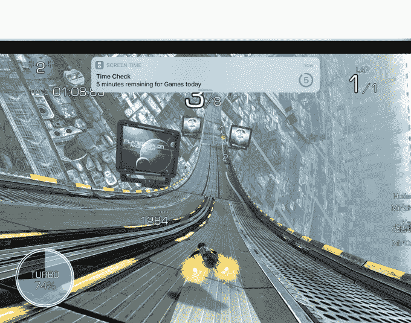

# 苹果推出一系列新的“数字健康”功能，以更好地管理屏幕时间 

> 原文：<https://web.archive.org/web/https://techcrunch.com/2018/06/04/apple-unveils-a-new-set-of-digital-wellness-features-for-better-managing-screen-time/>

苹果成为最新一个优先考虑数字福祉的科技巨头。在今天早上的全球开发者大会上，苹果宣布了一系列新的控制措施，允许 iOS 用户监控他们在设备上花费的时间，设置应用使用的时间限制，控制通知的分散性，以及控制他们的孩子对设备的使用。

这些功能的添加先前已经被彭博泄露，但是关于它们如何工作的细节还不知道。

在即将发布的 iPhone 和 iPad iOS 12 软件版本中，苹果将包括一系列专注于数字健康的功能，首先是升级的勿扰功能，该功能将帮助那些倾向于在晚上看 iPhone，然后发现自己被过多的通知分散注意力的人。使用“就寝时间请勿打扰”,您可以配置，以便在您自定的时间内，当您晚上查看手机时，iPhone 不会显示您的通知。

该功能还可以在一天中的其他时间帮助你——例如，如果你不想在上课或开会时被打扰。

此外，这一功能将包括一个新的早晨唤醒屏幕，同样没有通知，这样你就可以“轻松地进入你的一天”

在控制中心，您还可以配置“勿扰模式”何时结束。

与此同时，苹果也推出了更好的方式来管理你的通知。Siri 甚至会根据它知道你不再使用的应用程序，向你建议应该关闭哪些通知。

Siri 还可以提示你完全关闭通知，或者安静地发送通知。

但是更有用的可能是对分组通知的支持。这意味着通知不仅会按应用程序分组，还会按主题和线索分组。你可以进入这些群组，查看来自特定应用程序的群组，只需轻轻一扫，就可以对所有这些分组通知进行分类。

苹果数字健康功能的另一部分包括报告你如何在你的设备上花费时间。

这包括每周活动总结，向你展示你在一周内是如何使用 iPhone 或 iPad 的。这份完整的活动报告将向您显示您在设备和应用上花费的时间，以及每天的细分情况。您还可以查看哪些应用程序向您发送的通知最多，因此您可以更好地决定要停用哪些应用程序的通知。

另一个功能是让你为占用你空闲时间的应用程序设置时间限制，这是你在使用方面想得更多的。当你的时间快到了，你会得到一个提醒，当时间到了，一个新的“时间到了”屏幕出现。苹果指出，如果需要的话，你可以延长工作时间，但你仍然会得到休息的提示。

其他新功能针对的是那些希望控制孩子看电视时间的家庭。

这包括为父母提供的关于孩子的设备和应用使用情况的活动报告，以及为孩子创建津贴的选项。

一个“停机”选项将帮助孩子拔掉电源，父母可以通过类别或单个白名单应用程序来限制应用程序的使用。这样，父母可以确保关键应用程序即使在停机期间也能正常工作，比如手机应用程序或书籍。

然而，在停机期间，应用程序的通知不会显示，应用程序上会出现一个徽章，让孩子们知道他们目前不能使用。

屏幕时间限制可以让父母在设备完全不能使用的时候，比如就寝时间。此功能适用于家庭共享。

苹果公司表示，所有这些都是由父母从他们自己的设备上远程配置的。

苹果并不是第一家反思自己在设备成瘾问题上的责任的科技公司。

就在一个月前的谷歌开发者大会上，公司[向](https://web.archive.org/web/20221127152329/https://techcrunch.com/2018/05/08/android-rolls-out-a-suite-of-time-management-controls-to-promote-more-healthy-app-usage/)介绍了自己为安卓用户开发的一套时间管理工具。它的工具可以帮助用户跟踪屏幕时间和应用程序的使用，并包括一些新功能，如“嘘”模式，通过翻转手机来打开勿扰模式，以及就寝时间的“放松”颜色减少模式。

此外，其他主要科技公司也开始在更新产品时考虑数字福利。

例如，脸书在 2018 年早些时候[改变了其新闻订阅的运作方式](https://web.archive.org/web/20221127152329/https://techcrunch.com/2018/01/11/facebook-time-well-spent/)，以减少用户在网站上花费的时间，从而有利于健康。[脸书旗下的 Instagram 刚刚推出了第一个名副其实的功能](https://web.archive.org/web/20221127152329/https://techcrunch.com/2018/05/21/scroll-responsibly/)，当用户浏览完所有新帖子时，它会告诉用户“你已经被吸引住了”。

这个想法是，当人们使用设备和应用程序时，他们不知道什么时候该停下来，并且缺乏信息和工具来帮助他们决定他们想在设备上花多少时间，以及他们实际上花了多少时间。

对硅谷来说，围绕数字福祉的运动是一个相当新的转变，在此之前，硅谷的公司一直鼓励不断吸引和吸引用户的软件和应用的设计，而不考虑心理成本。压力、焦虑、失眠、注意力分散、无法集中、情绪问题等等都是这些公司希望让用户粘在他们的设备上的结果。

但现在，一些早期的科技高管开始反击。

 脸书前总统肖恩·帕克公开担心[社交媒体对孩子大脑的影响](https://web.archive.org/web/20221127152329/http://fortune.com/2017/11/09/sean-parker-facebook-childrens-brains/)，并承认被设计用来[利用人类心灵的弱点](https://web.archive.org/web/20221127152329/http://fortune.com/2017/12/12/chamath-palihapitiya-facebook-society/)让用户上瘾。前谷歌高管特里斯坦·哈里斯(Tristan Harris)发起了一个由技术专家和活动家组成的联盟，名为[人道技术中心](https://web.archive.org/web/20221127152329/http://humanetech.com/)，旨在鼓励实施新的设计原则，帮助用户重新控制他们的技术使用。

随着关于数字成瘾的传言不断升级，其他趋势也正在出现——比如“正念”应用程序的蓬勃发展的业务和帮助用户(T2)练习自我照顾的业务，包括放下手机和照顾我们的其他需求。最近，一些人以一种极端的方式实践了这一点——西蒙·考威尔说他[实际上完全放弃了他的手机](https://web.archive.org/web/20221127152329/https://www.theguardian.com/media/2018/jun/03/simon-cowell-says-giving-up-mobile-phone-has-made-him-happier)，结果感觉快乐多了。

有了自己的新工具，苹果有能力为整个行业设定一个新基调，考虑到其他人如何复制它的设计——一直到 iPhone X 的缺口。但在这种情况下，模仿将是一件好事。

围绕技术使用创造一种新的文化，停止测量“花费的时间”和重复会话作为成功的衡量标准，这将最终使每个人受益。

