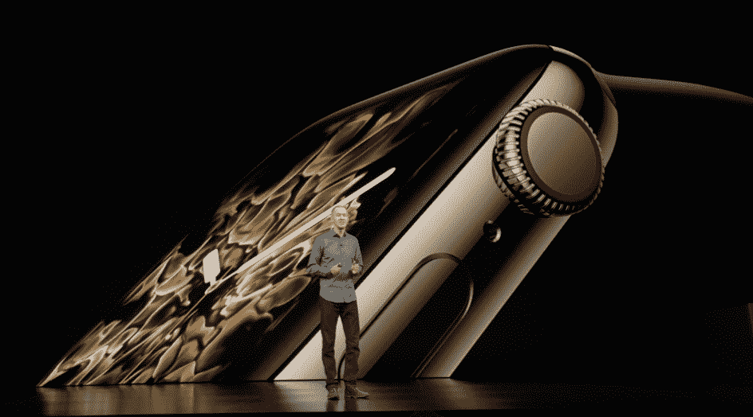
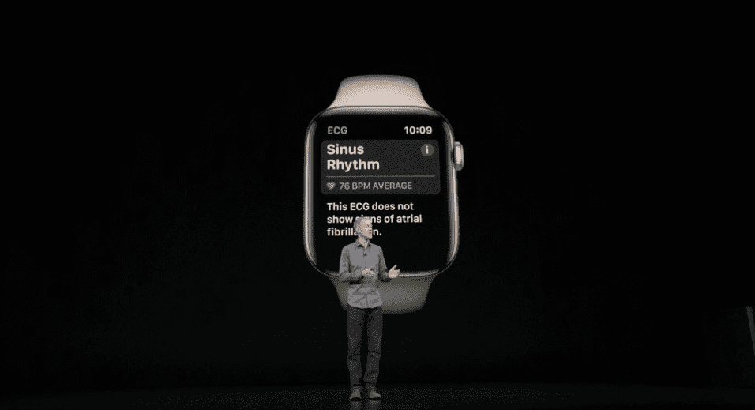
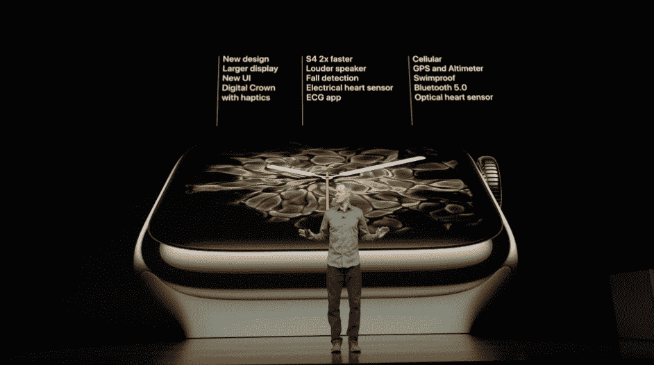

# 苹果发布 Apple Watch 系列 4 

> 原文：<https://web.archive.org/web/https://techcrunch.com/2018/09/12/apple-unveils-the-apple-watch-series-4/>

苹果刚刚发布了一款更新的 Apple Watch。而今年的新款手表，全部是显示屏。得益于更薄的边框和略大的外壳，您可以在屏幕上看到更多内容。

“Apple Watch 不仅仅是排名第一的智能手表，它还是世界上排名第一的手表，”苹果首席执行官蒂姆·库克在介绍苹果首席运营官杰夫·威廉姆斯之前说道。

威廉姆斯将 Apple Watch 框定为通信设备、健身设备和健康监测工具。例如，如果你的心率不正常，Apple Watch 可以通知你。很明显，苹果已经抛开了 Apple Watch 是一个应用平台的想法。

“它的一切都被重新设计和再造，”威廉姆斯说。设计看起来还是很熟悉，但是很明显屏幕更大了。有深色表盘的时候不一定看得出来。例如，它在 Breath 应用程序中非常引人注目。

小版本的显示屏大 32%，大版本的显示屏大 35%。得益于全新的表盘，您可以一次放置多达八种复杂功能。它看起来很忙，但很有效。

为了允许更大的显示屏，该公司不得不将手表做得稍微大一点。38mm 型号现在叫 40mm 型号，42mm 型号现在大了 44mm。

威廉姆斯表示，由于更薄的设计，Series 4 型号的总体积仍然小于 Apple Watch Series 3 的体积。这就是你要的——更薄的表身，更大的手表。

显示屏现在有圆形边缘，就像 iPhone X 上的一样。数字表冠经过重新设计，可以给你触觉反馈。扬声器的声音大了 50%。我不确定谁使用这个扬声器，但如果你需要打一个快速电话或使用 watchOS 5 中的新对讲机功能，它现在更好。

该设备的背面现在由黑色陶瓷和蓝宝石晶体制成，这应该有助于手机接收。新的片上系统(S4)的速度应该是 Series 3 中的两倍。由于一个新的陀螺仪，手表可以检测跌倒，这对老年人来说特别有用。如果设备感应到跌倒，而你一分钟都没有动，Apple Watch 会自动呼叫紧急服务。

除了传统的心跳数据，该设备现在还可以跟踪心律，并在您患有房颤时通知您。但是你现在甚至可以从手表上做一个完整的心电图。你只需要打开应用程序，用手指按住表冠 30 秒。然后，你所有的数据都会存储在 iPhone 的健康应用程序中。然后，您可以与医生分享您的心电图 PDF 文件。

苹果已经在手表上写了关于心电图的专利，但它已经上市的事实令人惊讶。你一般不能在柜台上买到心电图仪。Apple Watch 已经获得了 FDA 对 Apple Watch 心电图功能的许可。

AFib 检测和心电图将于今年晚些时候在美国推出。该公司随后将把它们推广到世界其他国家。

威廉姆斯利用这个机会提醒大家，公司不会接触到你的医疗信息。您所有的健康和健身数据都在您的设备上加密。

这就是新款 Apple Watch 的包装。它具有全新的心率功能、设计精致的更大显示屏、更快的芯片组和相同的电池寿命。Apple Watch Series 4 有相同的铝制和不锈钢版本。除了灰色和黑色不锈钢，还有新的金色不锈钢选项。

所有现有的表带都将与新款手表兼容。你还可以购买新的耐克表带和新的爱马仕表带。系列 3 的价格仍为 279 美元。Series 4 铝合金版起价 399 美元，带蜂窝功能的铝合金版起价 499 美元。预购于周五开始，该设备将于 9 月 21 日上市。

