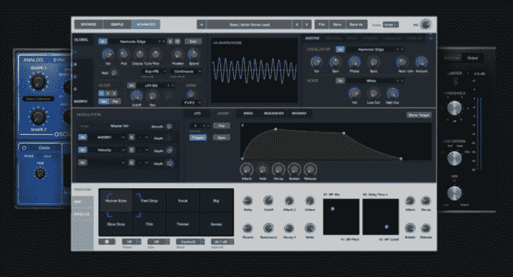

# 苹果用 Alchemy Synth 更新 Logic Pro X 音乐程序，并支持 Apple Music 的 Connect 

> 原文：<https://web.archive.org/web/https://techcrunch.com/2015/08/25/apple-updates-logic-pro-x-music-program-with-alchemy-synth-and-support-for-apple-musics-connect/>

# 苹果用 Alchemy Synth 更新 Logic Pro X 音乐程序，并支持 Apple Music 的 Connect

苹果专业级音乐创作工具 [Logic Pro X](https://web.archive.org/web/20221208105712/http://www.apple.com/logic-pro/) 今天刚刚获得了一次重大更新(10.2)，将众所周知的 Alchemy 合成器添加到混音中，同时也允许使用该产品的艺术家通过 Apple Music 的 Connect 功能与粉丝分享他们的作品。

这是 Logic Pro X 今年的第二次重大更新，与上一次更新一样，该程序的现有所有者可以免费获得。全套仍然是 199 美元。

Alchemy sample manipulation synth 无疑是对该套件的一次重大升级，帮助普通用户找到新样本，同时为高级用户提供制作完美声音的复杂方法。

在技术方面，Alchemy 明显拥有多个合成引擎和先进的变形功能，允许制作人真正拨通他们脑海中的确切声音或四处播放，直到他们找到更好的东西。一项名为 Transform Pad 的功能允许用户选择多达 8 个样本，并将它们加载到屏幕控制中，用户可以通过移动屏幕光标来改变声音。

至于控制，苹果还旨在使这个工具更容易被不完全精通 synth 技术的用户使用，并在这次更新中引入了许多性能控制，以帮助用户更容易地构建和调整他们的声音。

Logic Pro X 10.2 还让用户可以选择将 14GB 的内容放在他们的驱动器上，Apple notes 的数千种声音主要针对电子艺术家制作的 EDM、trap 和 hip-hop 曲调。

除了所有疯狂的新 synth 功能，苹果还让 Logic Pro X 10.2 与 Apple Music 有了更紧密的联系，允许艺术家通过该服务的 Connect 功能直接与粉丝分享正在进行的作品和完成的曲子。

除了对 Logic Pro X 的重大更新，苹果还在[应用商店](https://web.archive.org/web/20221208105712/https://itunes.apple.com/us/app/logic-remote/id638394624?mt=8)发布了针对 iPad 的 Logic Remote (1.2.2)更新，并在 [Mac 应用商店](https://web.archive.org/web/20221208105712/https://itunes.apple.com/us/app/mainstage-3/id634159523?mt=12)发布了 MainStage (3.2)更新。