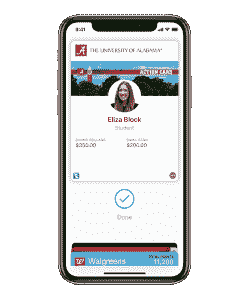
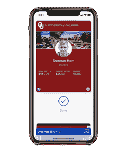

# 苹果将学生证添加到苹果钱包中，以访问建筑物、购买食品等 

> 原文：<https://web.archive.org/web/https://techcrunch.com/2018/10/02/apple-wallet-university/>

教育市场长期以来一直是苹果硬件业务增长的基石之一，如今，该公司正在利用其在 it 领域的知名度，特别是在大学生中的知名度，来建立一个更新的努力。今天，苹果开始将大学学生证——用于进入大楼、支付食物或书籍以及任何其他交易性校园服务——集成到钱包中，这是苹果手表和 iPhone 上的非接触式支付系统。第一批上线的学校是杜克大学、阿拉巴马大学和俄克拉荷马大学。

苹果公司实际上早在六月宣布了这项服务，在 WWDC 期间，指定了今天上线的三所学校。它表示，约翰霍普金斯大学、圣克拉拉大学和天普大学将在今年年底开始使用这项服务。

此次扩张正值苹果手机钱包增长势头强劲之际。iPhone 和手表的拥有者已经被证明是他们设备的狂热用户，可以进行购物(似乎是 Android 用户的三倍)，在这种情况下，Apple Pay——目前已在 24 个市场上线——声称是当今最受欢迎的非接触式移动支付，仅上个季度就有约 10 亿笔交易，比一年前增长了三倍。

许多交易都与 Apple Pay 有关，使用美国运通或 Visa 信用卡等更传统的支付卡，在传统的零售场所进行——苹果公司表示，预计到今年年底，60%的美国零售场所将支持 Apple Pay，包括 100 家最大的零售连锁店中的 70 多家。

但苹果也一直在寻求第二波增长，以使钱包变得有用，鼓励人们上传并使用他们的各种卡来提供各种其他服务，如会员卡和城市交通系统通行证。美国 12 个大城市已经在使用 Apple Pay，在英国、中国和日本等国际市场也取得了进展。

苹果公司表示，增加大学学生卡就在这个范围内。

“iPhone 和 Apple Watch 将我们带入了一个新的移动时代，有助于改变日常体验，”苹果互联网服务副总裁詹妮弗·贝利在一份声明中说。“当我们推出 Apple Pay 时，我们的目标是取代实体钱包。通过增加运输卡、积分卡和非接触式票务，我们将钱包的功能扩展到了支付之外，我们现在很高兴能与校园合作，增加非接触式学生证，为客户带来更加轻松、便捷和安全的体验。”

Apple Pay 可能不会直接给苹果带来巨大的利润——正如[和其他人](https://web.archive.org/web/20221025222112/https://money.cnn.com/2015/01/26/technology/apple-pay/index.html)指出的那样，支付交易的百分比很小——但它确实间接给公司*带来了另一种联系，即人们如何使用他们的手机和手表，使这些设备对他们的所有者更有价值，这些用户与苹果生态系统联系更紧密。*

在大学(和其他学校)，我们已经看到越来越多的人使用学生证，不仅是为了证明自己的身份，也是为了获得服务和进入建筑物，以及支付东西，非接触式版本的学生证的使用也越来越多。这样做的部分原因是安全:一卡多用意味着学生需要携带更少的贵重物品，如果他们丢失或被盗，卡可以更容易地更换。与此同时，手表和手机不是他们留下的物品，所以进一步整合，通过苹果的设备锁使这些卡更加安全，是有意义的。

我们不知道的是，苹果是否会从通过这些学生卡进行的支付交易中获得佣金(哪怕是很少的一点)。我们已经询问了该公司，并将在了解更多信息后进行更新。

教育机构并不是唯一被纳入钱包的非严格意义上的零售场所。苹果公司一直在增加体育场馆，让与会者使用钱包携带门票，然后在你进入后购买食物和其他优惠。(看看苹果如何利用一项非委托交易来引导你用它来做一项可能的交易？)

今天，据估计苹果在美国的 K-12 教育市场中占有 14%到 17%的份额，谷歌和微软也在努力推动这里和高等教育的增长，你可以看到增加更多这样的服务会如何帮助苹果扩大它的份额。