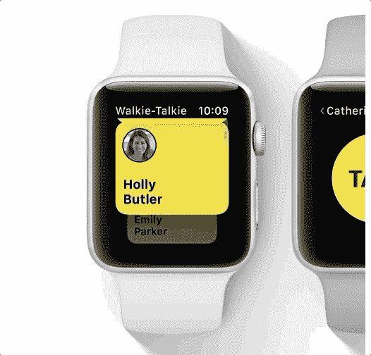

# 苹果手表获得对讲机模式

> 原文：<https://web.archive.org/web/https://techcrunch.com/2018/06/04/apple-watch-gets-walkie-talkie-mode/>

# 苹果手表获得对讲机模式

在今天的苹果年度开发者大会上，该公司展示了 Apple Watch 的一项新的对讲机功能。该应用程序被独特地称为对讲机。

“这是一种与朋友和家人交谈的有趣、简单的方式，”苹果技术副总裁凯文·林奇在 WWDC 说。

第一次使用它时，你向你的朋友发送一个请求，他可以接受或拒绝。如果他们接受了，你就可以随时用对讲机通知他们。这种手表到手表的连接通过手机和 Wi-Fi 工作，让你可以用 Apple Watch 给朋友和家人发送简短的语音信息。一旦你按下通话键，你的朋友会感觉到一些触觉反馈，然后立即听到你的声音。

这看起来像是我不想一直拥有的功能类型，但它肯定会很有趣。苹果在 2014 年首次开始谈论对讲机功能，次年苹果手表才推出。但这项功能直到现在才出现在 Apple Watch 上。

对讲机功能大约在 2014 年推出

在 WWDC，苹果还发布了手表 OS5，你可以在这里阅读更多关于[的信息。](https://web.archive.org/web/20230307140329/https://techcrunch.com/2018/06/04/apple-introduces-watchos-5/)

