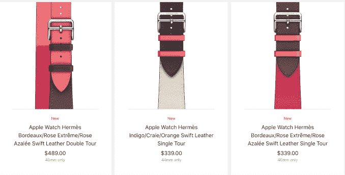
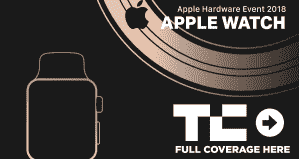

# Apple Watch 爱马仕系列获得新的拼色面孔和表带 

> 原文：<https://web.archive.org/web/https://techcrunch.com/2018/09/12/apple-watch-hermes-collection-gets-new-color-blocked-faces-and-bands/>

苹果今天推出了一套新的 Apple Watch 手环，以配合今天上午在库比蒂诺举行的公司[硬件活动](https://web.archive.org/web/20221025230240/https://techcrunch.com/tag/Apple-Hardware-Event-2018/)上宣布的 [Apple Watch Series 4](https://web.archive.org/web/20221025230240/https://techcrunch.com/2018/09/12/apple-unveils-the-apple-watch-series-4/) 。苹果表示，将于今年秋天与 Series 4 设备一起亮相的表带也将适用于老一代手表。它们包括为 Apple Watch Nike+设计的新系列以及 Apple Watch Hermès Series 4 edition，后者结合了手工制作的皮革表带和独家表盘。

在 [Nike+阵容](https://web.archive.org/web/20221025230240/https://www.apple.com/apple-watch-nike/)中，苹果将增加新的表带颜色，以匹配更新后的 Nike watch 表盘。该系列将包括一个纯铂金/黑色运动表带和一个带有反光纱线的顶级白色运动圈。

与此同时，爱马仕系列将推出色块表带，以搭配随着分针移动而从一种颜色转换到另一种颜色的表盘。

新款表带包括 [Indigo/Craie/Orange Swift 皮革双行款](https://web.archive.org/web/20221025230240/https://www.apple.com/shop/product/MTQ42AM/A/apple-watch-herm%C3%A8s-40mm-indigo-craie-orange-swift-leather-double-tour?fnode=ff9cf4bc0e716e1eae7be56e9e51217e9021285617cb40f74fd3715e6b1d259521d7c75fa0b0937d9d9a50dcf763455e5406e4ad0c7d334d91af5a0e3f5647f244e58d716dab0d8361d24f4d437a903f)和[Bordeaux/Rose extrême/Rose azalée Swift 皮革双行款](https://web.archive.org/web/20221025230240/https://www.apple.com/shop/product/MTQ32AM/A/apple-watch-herm%C3%A8s-40mm-bordeaux-rose-extr%C3%AAme-rose-azal%C3%A9e-swift-leather-double-tour?fnode=ff9cf4bc0e716e1eae7be56e9e51217e9021285617cb40f74fd3715e6b1d259521d7c75fa0b0937d9d9a50dcf763455e5406e4ad0c7d334d91af5a0e3f5647f244e58d716dab0d8361d24f4d437a903f)(489 美元)，这两款表带均在手腕上缠绕两次，采用 Barenia 皮革、纹理化 Epsom 皮革或柔软的 Swift 皮革在法国手工制作。

这些相同的表带也有[单巡回](https://web.archive.org/web/20221025230240/https://www.apple.com/shop/product/MTQD2AM/A/apple-watch-herm%C3%A8s-44mm-indigo-craie-orange-swift-leather-single-tour?fnode=ff9cf4bc0e716e1eae7be56e9e51217e9021285617cb40f74fd3715e6b1d259521d7c75fa0b0937d9d9a50dcf763455e5406e4ad0c7d334d91af5a0e3f5647f244e58d716dab0d8361d24f4d437a903f)款式(339 美元)——这意味着它们只在手腕上缠绕一次。

此外，还有一款新的[fave Grained Barenia 皮革单人拉力赛](https://web.archive.org/web/20221025230240/https://www.apple.com/shop/product/MU7C2AM/A/apple-watch-herm%C3%A8s-44mm-fauve-grained-barenia-leather-single-tour-rallye?fnode=ff9cf4bc0e716e1eae7be56e9e51217e9021285617cb40f74fd3715e6b1d259521d7c75fa0b0937d9d9a50dcf763455e5406e4ad0c7d334d91af5a0e3f5647f244e58d716dab0d8361d24f4d437a903f)(439 美元)款式。

总共有五个新的爱马仕表带，其中大多数都是为了配合新的爱马仕表盘而设计的。当你习惯了颜色在手表屏幕上的移动，你就可以不用看时针和分针就能知道时间了——颜色本身的位置就足够了。

爱马仕手环将于 9 月 14 日周五在澳大利亚、加拿大、中国、丹麦、法国、德国、香港、意大利、日本、新加坡、西班牙、瑞典、瑞士、阿联酋、英国和美国的苹果商店应用程序上发售

从 10 月 5 日(星期五)开始，Nike+手环将在澳大利亚、奥地利、巴林、比利时、加拿大、中国、捷克共和国、丹麦、芬兰、法国、德国、希腊、关岛、香港、匈牙利、爱尔兰、意大利、日本、科威特、卢森堡、澳门、摩纳哥、荷兰、新西兰、挪威、阿曼、波兰、葡萄牙、波多黎各、卡塔尔、俄罗斯、沙特阿拉伯、新加坡、南非、西班牙、瑞典、瑞士、阿联酋、英国和美国广泛发售。

它们稍后也会出现在爱马仕[网站](https://web.archive.org/web/20221025230240/https://www.hermes.com/ca/en/watches/apple-watch-hermes/#%7C%7CCategory)上。

