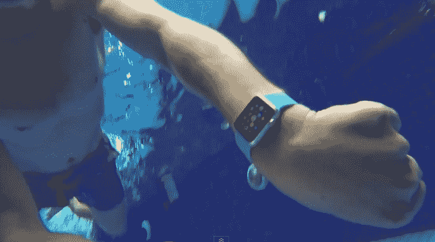

# 苹果手表在水下 15 分钟后仍在滴答作响

> 原文：<https://web.archive.org/web/http://techcrunch.com/2015/04/24/apple-watch-keeps-ticking-after-15-minutes-under-water/>

# 苹果手表在水下 15 分钟后继续滴答作响

今天天气很热。你跳进泳衣，跳进泳池，然后……突然想起你的苹果手表还在手腕上。

糟糕，600 美元的腕式电脑毁了，对吧？没有。

至少在早期用户测试中，Apple Watch 看起来非常防水。在 [FoneFox](https://web.archive.org/web/20230326054017/https://www.youtube.com/channel/UCcHWmqcj6XTrYWabi8w1YRw) 的人把一块运动版手表扔进了游泳池的浅水区——15 分钟后，它还在滴答作响。他们甚至能够让设备在水下工作，尽管电容式触摸屏在水下会失控，为所欲为。

*注意:视频中有一个赤膊男子在淋浴时擦肥皂，如果你在上班，这可能会让你的老板/同事觉得有点奇怪。*

这是否意味着你应该经常带着它去游泳？没有。

你会注意到苹果在他们的营销中并不怎么强调防水——在 Apple 的任何地方都只在规格表底部深处的脚注中提到过。

这是有充分理由的:虽然它是“防水的”，但它几乎不是防水的。Apple Watch 的防水等级为 IPX7，这意味着它应该能够在偶尔深达 1 米(3.2 英尺)的水中存活 30 分钟。但是，如果做得更深，或者时间更长，你就是在玩命。考虑到大多数泳池娱乐会让你潜到 3 英尺以下，所以最好把它放在干燥的地方。

但作为一个曾经在一场小雨后把 iPhone 放进衬衣口袋的人，知道 Apple Watch 更宽容一点令人欣慰。