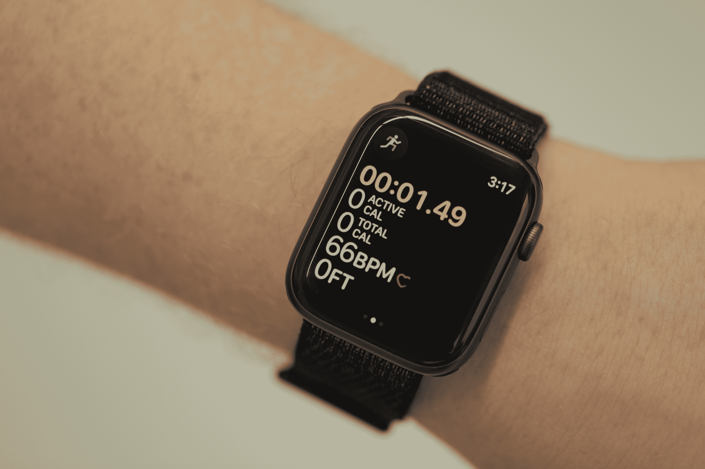
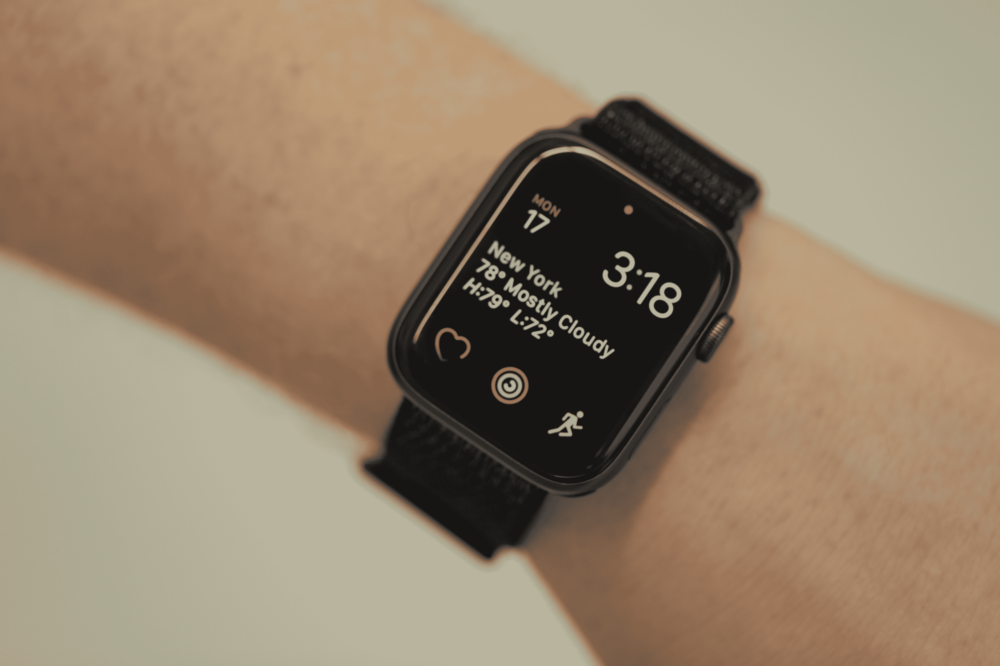
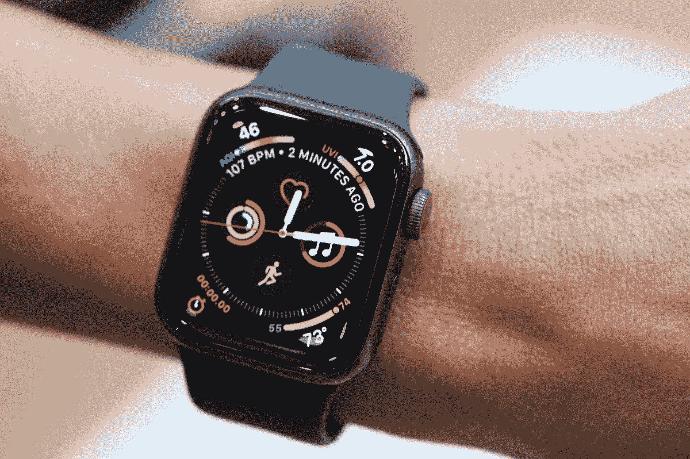
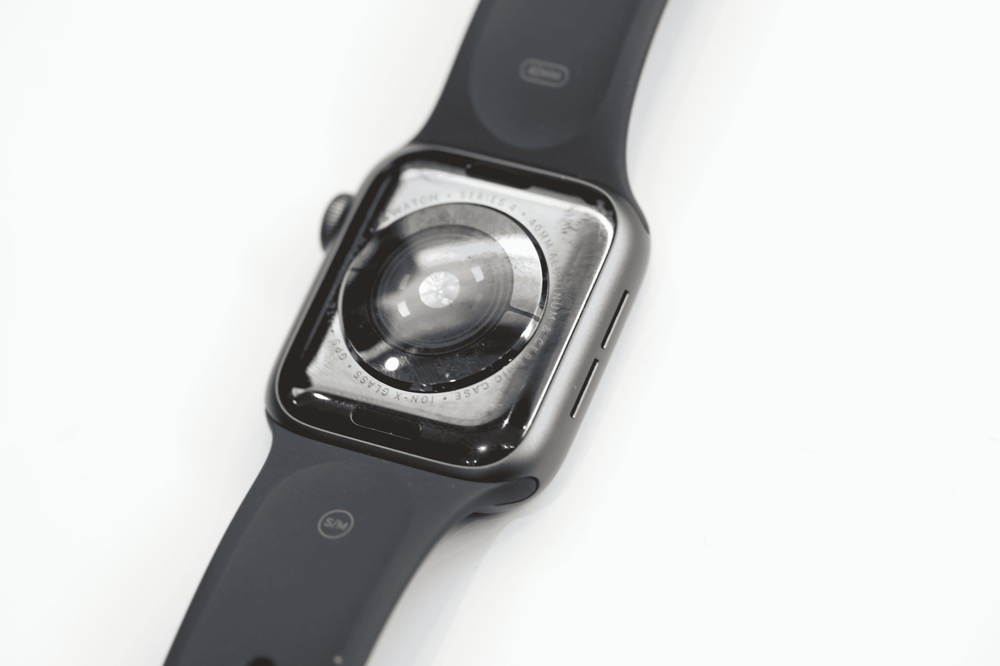
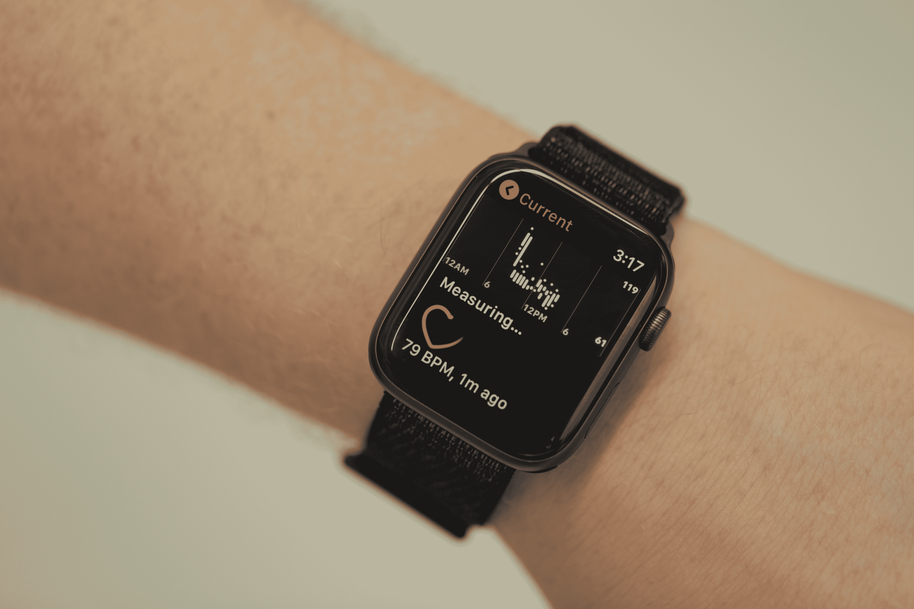
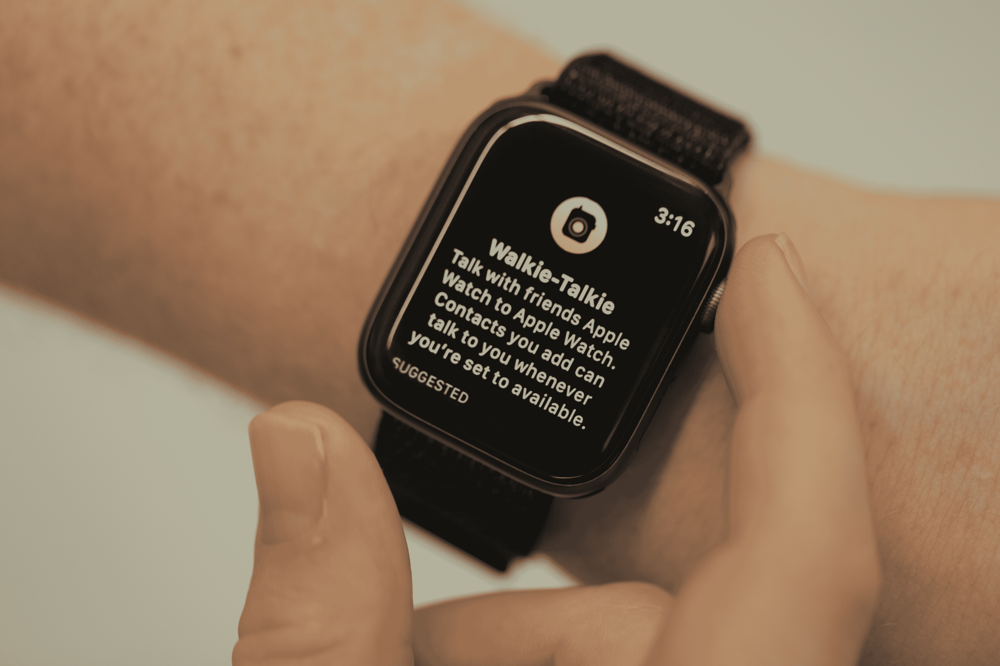

# 点评:Apple Watch 系列 4 

> 原文：<https://web.archive.org/web/https://techcrunch.com/2018/09/19/apple-watch-series-4-review/>

大约两分钟半后，手表开始工作。我的手腕上有触觉嗡嗡声。

“看起来你在健身，”表盘上写着。接着是一个黄色的大按钮，提示我开始室内跑步。我点了一下霓虹灯按钮，时钟开始计时，给我算出了手表确定检测到何种活动所需的合理时间近似值。

实际上，我并没有计划在这次运行中测试这个特性。在所有的拉伸/音乐选择/跑步机设置预跑仪式中，我只是忘记设置那该死的东西。这看起来像是一件小事，但是，从全局来看，大多数更新都是相对较小的。就苹果手表 T2 而言，彻底的背离几乎肯定是一件坏事。

你看，有智能手表，还有苹果手表。这与其说是对产品的默许，不如说是对数字的客观分析。[今年早些时候来自 IDC](https://web.archive.org/web/20230321114959/https://www.idc.com/getdoc.jsp?containerId=prUS43598218) 的数据显示，苹果凭借其单一的智能手表领先所有可穿戴设备。

事实上，该公司去年的智能手表出货量超过一半。简而言之，Apple Watch 长期以来一直代表着萎靡不振的可穿戴设备类别中的一个罕见亮点。这款设备已经成功了足够长的时间，分析师们再次看好这个类别的未来。无论从哪方面来看，这都是一个令人印象深刻的壮举。

那么，占据市场主导地位的智能手表制造商该怎么做呢？对苹果来说，答案是双重的。首先，在不改变太多的情况下改善整体体验。对于 Apple Watch Series 4，这意味着细微的硬件改进，如在保持类似外形的同时增加更大的屏幕，以及在手表的表冠上增加触觉反馈等调整。

毕竟，苹果的成功并不在于任何一个突出的功能。相反，与 iPhone 一样，该公司在提供整体硬件和软件体验方面表现出色，使人们可以几乎不用思考就可以使用该产品——正如上述锻炼功能所证明的那样。

第二，向世界展示你对健康的承诺。即使存在更便宜的健身追踪器，健康和健身长期以来一直被认为是智能手表销售的主要驱动力。对 Fitbit 来说，[意味着将公司的大部分业务转向医疗保健。](https://web.archive.org/web/20230321114959/https://techcrunch.com/2018/03/13/an-interview-with-fitbit-ceo-james-park)

对苹果来说，它正在想办法让手表作为一种健康监测设备得到更认真的对待。虽然该产品确实不会很快取代医疗产品，但可穿戴设备具有持续监控的明显优势。

这意味着，与医院设备和其他更昂贵的技术不同，它可以作为一种保护措施佩戴。设备背面的心电图(ECG)监视器和自动跌倒检测等新功能并不旨在取代医生检查。它们是在使用者没有医生护理时的安全措施。

分析师们将该品类未来的增长很大程度上押注于苹果识别和瞄准新市场的能力。在困住技术人员和年轻人群后，老年用户和有健康问题的人提出了一个扩大手表现有基础的明确方法。

## 天天

我戴了很多智能手表。这是这项工作的副产品/额外津贴。然而，在评论之间，我总是会回到 Apple Watch。首先，当我在 Android 和 iOS 手机之间来回切换时，我的主要手机是 iPhone。苹果最大的吸引力之一是它的生态系统。这些产品只是彼此配合得很好——一旦你被锁在里面，就很难出来。

当然，这不是唯一的原因。谷歌、三星和 Fitbit 现在都有 iOS 应用。虽然集成并不完美，但它肯定是有用的。事实是，从硬件和软件的角度来看，Apple Watch 都是一个优雅的解决方案。它走的是一条关键的可穿戴路线，即在必要的时候引人入胜，而在其余时间则退居幕后。

与早期的报道(以及对该事件邀请的猜测)相反，苹果这次坚持使用 squircle(这是一个真正的几何术语，请查阅)。这个设计在早期有点两极分化，但我怀疑大多数用户已经开始欣赏它所提供的东西，包括在屏幕上显示更多文本的能力。

## 表面上看

当然，这里的情况更是如此。最明显的区别是增加了显示屏尺寸的硬件方面，与 iPhone X 一样，苹果设法增加了屏幕，而没有对整体尺寸造成太大影响。

Series 4 的外壳比其前身略大、略宽，但除非你碰巧有两个并排的外壳，否则它不会真正引人注目。即使表面积稍大，Apple Watch 仍然是更可穿戴的可穿戴设备之一。

另一方面，如果您经常使用早期版本，那么表面积的增加是非常明显的，尤其是在收到电子邮件通知时。这也意味着应用程序开发人员可以加入更多细节，手表的表面可以增加额外的复杂性(我怀疑这一描述符让苹果设计师每次不得不说出它时内心都有点死气沉沉)。

借助 30%的大显示屏，你可以在脸上添加类似 Breathe 应用程序的东西，以便于访问。这是该公司推动为表面带来更多细节的罕见例子，但由于智能手表屏幕提供的有限空间，你可以抓住你能获得的每一毫米。事实上，挡板更小也意味着应用程序设计师不必过多依赖黑色背景来帮助掩盖未使用的空间。

## 在这个案子上

苹果还设法让新款手表比它的前辈更薄。当涉及到制造一种被设计成穿在身上的产品时，好处是显而易见的。略大的外壳尺寸意味着苹果能够在不影响电池寿命的情况下完成这一任务。

这是一个有趣的选择，因为大部分竞争都集中在最近升级的电池寿命上，其中包括，特别是，三星评级为“几天”的新 Galaxy Watch。有充分的理由——电池一直是智能手表最大的问题之一。

与早期版本一样，苹果将 Series 4 的电池评级为“全天”，这肯定与我自己的测试相符。即便如此，我也很乐意用一两毫米的厚度换一些额外的 mah。就目前情况而言，您应该可以使用一天，而不用担心找到充电器，但更长的电池寿命始终是受欢迎的。

我承认当苹果在台上提到数码皇冠的时候，我并没有多想。如果有的话，这听起来像一种客厅把戏。然而，当我终于有机会在几周前的活动中试用这款设备时，我惊讶于自己对它的喜爱程度。

旋转圆圈真的感觉像转动机械转盘。当屏幕上没有东西可以通过旋转来移动时，反馈就会自动关闭。再说一次，这是一个小的接触，但仍然是一个很好的接触。这可能仍然是三星真正胜过苹果的一点。Galaxy (nee Gear)的旋转表圈仍然是我最喜欢的与智能手表菜单交互的方式(也是考虑三星型号的首要原因)。虽然新的数字王冠是一个相当接近的第二名。

## 为了你的健康

苹果在 Apple Watch 的舞台上投入了大量的时间用于健康和保健。可以理解。该公司坚信，该产品作为健康监测器的功能是 Apple Watch 的前进方向。心电图仪等复杂工具的加入也有助于该公司继续将可穿戴设备定位为高端产品。

毕竟，小米等公司的预算设备代表了健身领域的另一个关键增长领域。苹果还看到了一个令人惊讶的成功竞争对手，价格为 200 美元的 Fitbit Versa。当然，该公司的开局并不顺利，但其最新的 Pebble 式智能手表看起来是真正的成功。对于那些寻求低成本或 Android 友好解决方案的人来说，这是一个非常可靠的解决方案。

心电图是一个有趣的补充，因为对大多数用户来说，它不是一个日常功能。对于老年用户和现有条件的用户来说，这是一个很好的补充。每天收集的信息可以通过苹果健康应用程序与医生分享。对于我们其余的人来说，这种产品有[的潜力来标记](https://web.archive.org/web/20230321114959/https://www.washingtonpost.com/technology/2018/09/14/what-cardiologists-think-about-apple-watchs-heart-tracking-feature/?utm_term=.da82de963cc0)不规则性和类似房颤的事情。

没有人建议 FDA 批准的功能可以或应该取代医生，但如果它有助于揭示心脏问题，那肯定是一个净积极因素。这也正是 Apple Watch 作为一款医疗保健设备蓬勃发展的地方——它提供了对更大问题的潜在洞察力。这包括在 watchOS 5 中增加了低心率通知(加入了前代产品的高心率通知)和通过心电图收到的不规则心律通知等功能。

这项功能要到今年晚些时候才可用，所以我无法测试这个东西。当它真的到来时，它将只在美国上市，可能是因为各国不同的卫生监管机构错综复杂。当它真的到来时，它将如下工作，据苹果公司称:“只需触摸数字表冠，即可在短短 30 秒内生成心电图波形。这些数据可以表明你的心律是否显示出房颤(一种严重的不规则心律)或窦性心律的迹象，这意味着你的心脏在正常模式下跳动。”

这意味着表冠实际上有双重功能，充当测量心律的两个电极之一(另一个在手表背面)。这是对现有功能的一个非常新颖的补充。

跌倒检测是另一个我很乐意承认的功能，这次我没能正确测试。该功能对 65 岁及以上的用户自动启用。其他人将不得不在紧急呼救设置下通过 iPhone 应用程序手动启用它。当它检测到有人跌倒时，会弹出一个紧急求救屏幕——这与 80 年代的生命警报设备没什么不同。如果佩戴者一分钟没有反应，它就会发出警报。

然而，我可以证明，我在佩戴该设备时没有发出任何错误警报。把你的手放在桌子上或者瘫倒在床上都不会引发它。显然特技演员和其他受过坠落训练的人也无法引爆它。我试着在我的兔子的地板垫上洒了一些受控的液体，除了手疼和一只困惑的兔子之外没有任何结果。孩子们，不要在家里尝试这个。

## (用于命令)等待下面发表的消息

还有其他有趣的功能分散在各处。对讲机是个很酷的东西。与其说它是一个不可或缺的附加物，不如说它是一个有趣的新奇事物。这是一种通过 Wi-Fi 或蜂窝网络与 Apple Watch 用户交流的快捷方式，只需按一下按钮即可通过传输进行发送。这也是利用 50%的扬声器的好方法。

Series 4 不是那种值得从上一代升级的更新，特别是考虑到标准和 LTE 型号的起价分别为 399 美元和 499 美元。但是，这里肯定有足够的东西让 Apple Watch 保持在智能手表堆的顶端。心电图和跌倒检测等重要健康功能的增加，进一步奠定了该设备及其类别未来发展的基础。