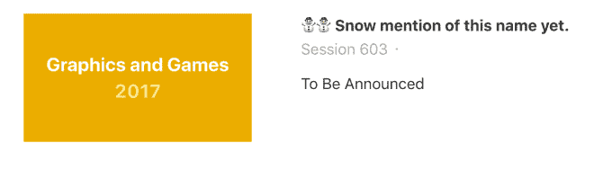
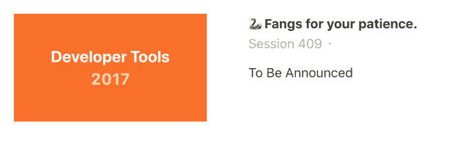

# 苹果开起了今年 WWDC 秘密面板的名字的玩笑 

> 原文：<https://web.archive.org/web/https://techcrunch.com/2017/05/30/apple-went-full-dad-joke-with-the-names-of-this-years-secret-wwdc-panels/>

# 苹果公司开起了今年 WWDC 秘密面板的名字的玩笑

*【可能在库比蒂诺的某个地方】*

“嘿，瑞克？”

“是啊，比尔？”

“我们需要一堆占位符名称，用于 WWDC 会议。那些关于…你知道的。那些我们还不被允许谈论的事情。人们把这些名字拆开，寻找未来的线索，所以你能把它们都命名为‘会话名 TBD’并放到网上吗？”

“当然可以！但是…我们用双关语代替怎么样？我们甚至会使用表情符号。”

“啊，让我们简单点，还有——”

“第一个上来了。”

“好吧，瑞克，一个就够了。但是让我们保留其余的——”

“我刚刚又贴了五张。德语的一个！”

“瑞克，停下来。人们正在去 T2 寻找这些 T3

“你再告诉我该怎么做，比尔。我们将全力以赴。”

"瑞克，你刚才是怎么大声说出甜甜圈表情符号的？"

“我在这里工作，比尔。请

和我一起工作的人可能会告诉你，我喜欢一些~~好的~~双关语。呻吟是我的良药。我尽量把它放在我们内部团队的聊天室里，不让它泄露到帖子里——我的同事只是更愿意放我一马。