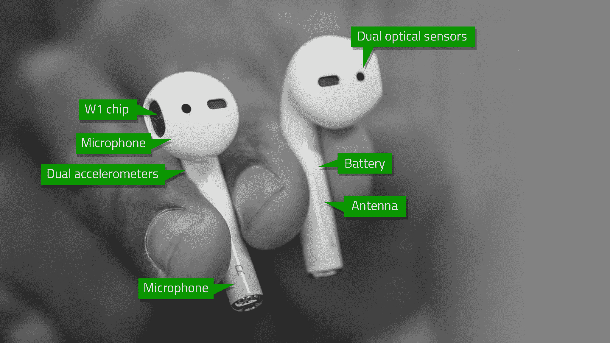

# 回顾:苹果的 AirPods 提供了 Siri 未来的愿景

> 原文：<https://web.archive.org/web/https://techcrunch.com/2016/09/13/apples-ai-if-by-air/>

在苹果的无线 AirPod 耳机问世仅几天后，很明显，基于可以与你交谈并接收命令的上下文人工智能的可靠、持续可用性，将会有一个巨大的平台业务。

这个平台将首先让苹果受益，但随后它将和 Siri 一起扩展到开发者和初创公司。

当然，其中的关键点是“可靠”和“持久”这非常类似于推送通知和 Apple Watch 日益复杂的方式，使得打开应用程序比以往任何时候都更具选择性。如果你知道一个 iPhone 用户将戴着 AirPods，可以随时通过 Siri 访问你提供的服务，那么你就有了一个强大的新渠道。

这在业外并不为人所知，但几年前，苹果从其语音提供商 Nuance 转型，组建了自己的内部语音团队。几个月后，Siri 的第二次重大改版发布，在命令的可靠识别方面带来了巨大的飞跃。仍然有很大的增长空间，但是已经在改善了。

然后，苹果在今年早些时候的开发者大会上向开发者推出了第一波 SiriKit 兼容性，允许少数几类应用向 Siri 提供服务，由用户控制。它比一些人希望的要差很多，但是它将会被迭代。还有像 Viv 这样的[竞争对手也在推动这些相互关联的上下文系统的权力边界。](https://web.archive.org/web/20230317082305/https://techcrunch.com/2016/05/09/siri-creator-shows-off-first-public-demo-of-viv-the-intelligent-interface-for-everything/)

但在苹果的人工智能成为真正的音频平台之前，它需要硬件来更容易地将 Siri 放在你的耳朵里——并且没有真正的理由将其取出。进入 AirPods。

苹果上周与 iPhone 7 和 iPhone 7 Plus 一起发布的 AirPods 是两款无线耳机，看起来像普通的 iPhone 耳机，但电缆被切断了。他们扣进一个看起来像 22 世纪井字游戏包的小盒子里。

AirPods 本身在每个 pod 中都有一个电池和一个新的无线芯片，苹果称之为 W1。它们也有加速度计和两个传感器，通过触摸耳屏和外耳来检测它们是否插入你的耳朵。它们在机箱内充电，机箱通过一个闪电口充电。

> 在苹果的 AI 成为真正的音频平台之前，它需要能够更容易地将 Siri 放入你耳朵的硬件。

马上，以下所有的应该是合格的事实，我得到的 AirPods 的审查集**是预生产模型**。由于它们将在今年晚些时候上市，最后一批还没有从生产线上下线。

多亏了 W1 芯片,“配对”AirPods 非常容易。事实上，这种方法非常简单，以至于苹果公司在其说明书中没有使用“配对”这个词，而是使用了“连接”这个词。这是营销，但也是大多数蓝牙配对会话的巴洛克戏剧和连接 AirPods 的过程之间的公平区分。

具体来说，W1 芯片是为了增加这种戏剧自由连接体验，以及调节功率，使 BTLE 连接 sip 和保持 AirPods 工作更长时间。它还在后台做一些服务质量工作。你可以把它想象成蓝牙声誉不佳的彩虹桥下的一个支柱。

要连接 AirPods，你可以将外壳靠近(几英寸远)iPhone，然后翻开盖子。屏幕上会弹出一个连接对话框，你可以点击机箱背面的连接按钮。就是这样。已连接。

将它们连接到非苹果设备是非常标准的。你按住后退按钮，搜索蓝牙设备，像平常一样连接。然后它们像普通耳塞一样工作。

在一个巧妙的工程中，为 AirPods 充电的相同触点使它们可以作为外壳本身的无线收音机，外壳只包含一个电池和一个按钮。

苹果公司表示，AirPods 的电池寿命为 5 小时，外壳可以额外充电 24 小时。如果有什么不同的话，我发现这个估计是保守的。收到 AirPods 的那天，我听了几个小时，把它们放在盒子里。然后我在路上连续听了 4 个小时，回到家的时候听了更多。我还没有把它们运行死，因为你把它们存放在箱子里，它们在它们的“存储”中不断地被充电。

音质很扎实。好听的重低音和清脆的高音产生了非常好听的声音，尽管它远非高保真音质。这些是非常好的和 T2 非常响亮的耳塞，它们的音质与它们 160 美元的价格相符。因为密封(无论如何在我的耳朵上)非常牢固，而且没有绳子拉着它们，它们可以很好地消除外部噪音(尽管没有官方的噪音消除功能)。

当然，你的里程可能会有所不同，因为耳朵是高度可变的，它们可能不适合或留在你的耳朵里。如果标准的苹果耳塞不适合你的耳朵，*ai rpods 也不太可能适合。*然而，如果标准耳塞*合适，*但不*留在原位*，在慢跑时掉出或诸如此类，我还是会看看 AirPods。

事实上，AirPods 在我的耳朵里呆得非常好，在我摇头、慢跑或锻炼时不会打滑。最大的原因是它们的质量非常小。没有绳子，也没有重量，没有什么可以把它们从耳朵里拉出来。无论人们对他们滑出(兼容的)耳朵有什么压力，可能都不应该给予太多的发挥。

就射程而言，它们相当标准，在 50 英尺左右被小障碍物切断。

> 好听的重低音和清脆的高音产生了非常好听的声音，尽管离高保真音质还很远。

与 AirPods 的交互超级流畅。将它们插入耳朵会发出音频提示，表明它们已打开并被激活(当它们离开耳朵时会关闭以节省电池，W1 会监控传感器)。从耳朵里取出一个耳塞将会暂停你的音频，重新插入耳塞将会再次启动音频。你只需插入一个就可以像耳机一样使用——它们彼此独立工作。

要控制它们，你可以轻敲两下(用力轻敲可能会导致耳屏疼痛)调出 Siri，然后给 Siri 你的命令。电话铃响时双击可以接听电话。就是这样。没有其他控制。

因为一切都是通过 Siri 进行的，所以我觉得对于音量或音轨推进这样的小互动来说，机会成本太高了。我一直在强迫自己使用 Siri，但我认为许多人一开始会把手伸进口袋进行调整。

这将需要一个大的文化调整。这既是为了习惯于看到这些无绳耳机像后现代的 Ceti eel 一样挂在人们的耳朵上，也是为了让人们能够舒服地大声对 Siri 说话，满足他们的每一个愿望。

然而，我确实发现，说话命令*轻声*——不是耳语，而是在低音域——工作得很好。两个波束形成麦克风和加速度计可以检测你的下巴何时移动，这是我用过的最好的入耳式麦克风之一。

我不禁想到，随着这种系统变得越来越普遍，对你的个人思维机器低声说话的“人工智能声音”可能会成为一种东西。

[gallery ids="1385391，1385392，1385449，1385383，1385381"]

白色的豆荚本身的风格将像最初的 iPod 耳机一样成为品牌——但我预计它们迟早会有金色、银色和黑色。作为真正的计算设备，我希望苹果手表有各种各样的表面，并与耐克和时装公司等公司合作。如果它们要在我们身上如此突出地展示，它们肯定会受益于个人风格的注入。

我的愿望清单上的另一个项目是:AirPods 可以自动连接到其他登录到同一个 iCloud 帐户的 iPhones、iPads 和 MAC，这非常棒。但它目前无法在苹果电视上运行。当我不想打扰家庭时，我希望能够像便携式家庭影院耳塞一样使用它们来听东西。毫无疑问，这是一个边缘案例，但它会很酷。

一些空中飞人的趣闻:

*   将 AirPod 拿出来暂停可能有点奇怪，因为将它握在手中并盖住接近传感器可以再次开始播放。
*   如果你想“忘记”AirPods，将它们连接到新设备上，请确保它们已连接并打开，外壳上的盖子没有合上。在这种情况下，我花了一段时间将它们重新连接起来，因为我是在瞎混。
*   您可以将 AirPods 连接到最多 5 个 iCloud 帐户上的每台设备。这意味着你可以在不同账户登录的手机之间共享 AirPods。非常适合与您的孩子分享。
*   您也可以将两对 AirPods 连接到同一个设备，尽管您必须在它们之间切换，并且不能同时使用它们。

###### *编者按:人们对 AirPods 的兴趣如此之大，以至于我们从 iPhone 7/7 Plus 评测中拿出了这篇评论。请务必在此阅读完整评论[。](https://web.archive.org/web/20230317082305/https://techcrunch.com/2016/09/13/review-apple-tees-up-the-future-with-iphone-7/)*