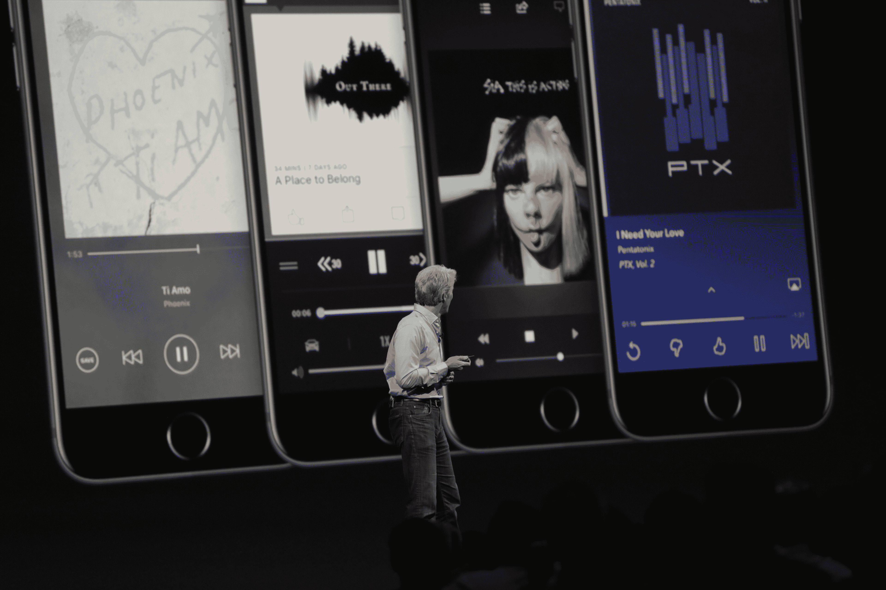

# 苹果的 AirPlay 2 为 HomeKit 和其他产品带来了多房间音频流 

> 原文：<https://web.archive.org/web/https://techcrunch.com/2017/06/05/apples-airplay-2-brings-multi-room-audio-streaming-to-homekit-and-beyond/>

# 苹果的 AirPlay 2 为 HomeKit 和其他产品带来了多房间音频流

苹果的 AirPlay 2 是其原始无线音频流媒体协议的续集，增加了多房间同步流媒体支持，与苹果智能家居控制平台 HomeKit 的集成，以及第三方应用支持。AirPlay 2 的功能还可以让你的 Wi-Fi 上的任何人都可以随时加入合作派对播放列表。

AirPlay 2 的公共 API 意味着任何制作应用程序的人也可以利用流媒体的乐趣，让他们自己的应用程序向多房间的扬声器播放。苹果还公布了扬声器方面的一长串硬件合作伙伴，这意味着你应该不缺乏配件选择。AirPlay 2 还可以与第四代 Apple TV 硬件配合使用，这样你就可以马上将家庭影院系统集成到混音中。

多房间音频是 Sonos 已经做了一段时间的东西，但它要求应用程序支持自己的软件，并由它的应用程序控制。这可能会开放系统级的 iOS 支持，这对于 YouTube、播客等东西来说将是惊人的。这也是谷歌 Cast 的桌面赌注，谷歌在 Android 上提供了系统级功能。这可能是 Siri 扬声器发布的前奏，因为它也是 Google Home 的一个关键功能。敬请关注。