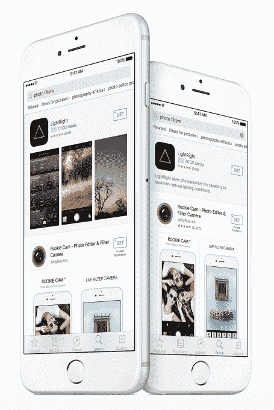

# 应用时代结束时的苹果应用商店

> 原文：<https://web.archive.org/web/https://techcrunch.com/2016/06/12/apples-app-store-at-the-end-of-the-app-era/>

就像冻结在琥珀中的苍蝇一样，App Store 的基本交易从一开始就没有改变。随着一个巨大的生态系统在它周围膨胀，新规则的晶体结构和客户互动的途径也在增长——但对大多数开发者来说还不够快。尤其是独立应用程序制造商的“长尾”,如果不是下载量的主要部分，也是呼声最高和最忠诚的部分。

接着在上周，苹果公司宣布了三项关于应用商店的重大变化。它将为商店带来搜索广告，使开发者的审核时间更快，并允许任何类别的应用程序使用订阅——如果人们订阅超过一年，就向这些开发者支付额外的收入份额。

为什么这些变化是在明天开始的苹果全球开发者大会之前宣布的，这是一个你问谁的问题。了解 keynote 的公司内部人士告诉我，当时太拥挤了，没有时间讨论这些变化以及随之而来的细微差别。公司以外的消息灵通人士向我暗示，苹果不确定开发者社区会对一些有争议的变化做出多么激烈的反应。

不管是什么原因，过去的几天给了开发者时间去思考它们，给了人们时间在 Twitter 上抱怨它们，给了记者时间去创造一百个热门话题。

我有一些想法和一些关于公告的额外细节，现在我已经和知道他们实际上会如何被执行的人谈过了，所以我想我应该在我们在接下来的一周被清扫之前把它们写下来。我一个一个来。

## 应用审查次数

应用审查通常需要五个工作日。他们通常会花更长的时间，尤其是在苹果发布新版本 iOS 之前的繁忙的几周或几个月。这一直是苹果和社区之间摩擦的根源。现在，我们的目标是让 50%的应用程序在 24 小时内获得批准，90%在 48 小时内获得批准。

苹果公司对这些新时代非常有信心，以至于它已经完全移除了告诉开发者网站的审查时间的图表。我一直在跟踪时间，他们似乎符合索赔至今。一个[追踪时间的独立网站](https://web.archive.org/web/20230320050155/http://appreviewtimes.com/)也在排队。

苹果已经增加了员工，改变了政策(它与已知的开发者变得多么费力),并改进了用于评估应用程序的程序和工具，以实现这些时代。

审查时间的改变意味着开发者可以考虑在一个完全不同的时间范围内推出什么样的功能，修复什么样的错误，进行什么样的更新。现在，从你在内部锁定应用程序的那一刻起，只需一天时间就可以对应用程序进行错误修复或重大更新。虽然审查时间比其他变化少得多，但我觉得这可能会对应用程序的更新和迭代频率产生重大影响。作为一名独立开发者，你可能不能像脸书一样每个月发布一个主要的新版本，但是你现在有了更多的选择。

## 捐款

从一开始，在 App Store 上销售的开发者从应用程序中获得 70%的收入，苹果获得 30%。上周的声明第一次打破了琥珀，让一只微小的苍蝇脚自由蠕动。

现在，制定订阅费的开发者将会看到他们的利润在订阅的第二年膨胀到 85%。如果他们留住顾客，他们会看到更多的钱。为了促进这一点，苹果还允许任何应用类别利用订阅。

现在有 200 个定价等级，尽管这些要到今年晚些时候才会公布。收入分配在本周发生了变化。开发者现在将能够允许用户非常容易地从一个包升级、侧升级和跨升级到另一个包，苹果正在寻找使界面比现在更容易的方法。当订阅将要续订时会有一个通知，续订是*选择加入*，而不是选择退出。你必须肯定地说这对你有效。

将订阅范围扩大到所有类别并不能完全取代免费试用，但它提供了比以前更好的情况。任何决定推出订阅的应用程序现在都可以在一段时间内免费提供其产品，直到它需要订阅或选择一个子集。这些工具已经存在于新闻和音乐等应用中，但占据应用商店最大类别的游戏开发者现在可以使用这些工具了。

订阅模式和第二年从 70/30 到 85/15 的分成背后的逻辑很简单:它激励开发者继续维护和开发应用程序，从而减少没有出路的应用程序；随着具有后端服务的应用扩大规模并留住用户，使他们能够抵消成本，它还能提振收入。

这就是为什么我发现谷歌的[有点可疑，在苹果的第二天发布的](https://web.archive.org/web/20230320050155/http://www.recode.net/2016/6/8/11889298/google-apple-subscription-app-revenue-share)有点未经充分考虑。通过从第一天开始就增加削减，你鼓励每个应用程序都是基于订阅的，无论这实际上是该应用程序的最佳模式。现在有，而且将继续有成千上万的实用程序需要你一次性购买，定期或偶尔使用。它们不在你的主屏幕上，但是当你需要它们的时候它们就在那里，它们完成一个简单的任务，除了更新 iOS 的新版本之外，没有任何持续的维护。

巴纳德指出，一款名为 MileIQ 的应用已经在订阅方面表现良好。

是的，从现在开始，最大的应用程序可能都是基于订阅或免费的，并有其他收入来源。但是，有趣的胶囊应用程序的长尾，无论是游戏、生产力、商业相关还是仅仅是公用事业——这些应用程序将会消失，或者  它们将不得不弥补收入损失，否则它们将被迫在毫无意义时采用订阅。

[Contrast](https://web.archive.org/web/20230320050155/http://contrast.co/perfect-weather/)的大卫·巴纳德说:“我认为许多没有密切关注应用商店的开发者(和其他行业人士)会对有多少应用已经在订阅方面做得很好感到惊讶，即使这些应用没有杀手级的服务和/或内容。”。“我认为很多人都过早地吓坏了。许多人已经对苹果音乐、Spotify、网飞、Hulu 等产生了订阅疲劳。但这与为像 Launch Center Pro 这样的应用程序支付 3-5 美元的年费完全不同。我怀疑是否会有足够多的应用程序被普通用户订阅，从而让他们注意到很大的不同。大概 10 美元/年。问题是，订阅需要某种免费试用或免费等级，所以人们在订阅最适合他们的应用之前会先检查几个应用。对于付费应用，你最终会花 10 美元尝试几个应用，而且只用过一个。”

“我确实认为苹果有责任为这一转变做好准备，”巴纳德继续说道。“选择订阅的开发人员需要确保他们的应用程序确实能够随着时间的推移提供价值，值得订阅，但如果苹果能够以某种面向公众的方式规范和验证订阅的想法(以及软件的总体价值)，那将会有很大帮助。类似于 Your Verse 广告，但更直接地暗示了应用程序对我们生活的价值。

## 搜索广告和发现

除了添加出现在应用搜索中的广告，苹果正在对应用商店的发现机制进行一些改变。比如，它将类别标签带了回来。它还以更好的智能增强了特色标签，过滤掉你已经安装的应用程序。顺便说一下，一些 iOS 软件测试版也过滤了排行榜，但那是一个*错误*，而不是一个预期的功能。排行榜总是会显示你已经安装和没有安装的应用程序。

这里还有一个有趣的问题:如果你在主屏幕上的任何应用程序上进行 3D 触摸(硬按)，默认情况下，它很快就会有一个动作，允许你向某人推荐该应用程序。这是一个很好的补充，将通过口碑促进发现，也提供了一个任何人都可以使用 3D Touch 的基本操作，许多开发人员尚未实现。

关于那些广告。

席勒引用了一个公开的统计数据，65%的下载来自应用商店的搜索。我已经澄清了，这是 T2 所有 iOS 下载量的 65 %,而不是仅包含来自商店的下载量的子集。这是一个相当大的目标。这就是为什么苹果首先追求搜索广告——这是收入和开发者推广的最大可能目标。

苹果的广告系统在很大程度上基于相关性，高于所有其他因素。相关性始于应用程序的元数据，用于自动创建广告。广告的资源也来自应用商店预先批准的列表，这使得游戏系统更加困难。

这种相关性设置意味着，如果你在搜索一款赛车游戏，一款文字搜索游戏永远不会在该项目的广告拍卖过程中“胜出”。苹果还试图不惩罚类别中没有很多评级的新应用程序，让它们有机会赢得广告拍卖并出现在类别中。当然，所有的应用程序都只在水龙头上付费，而不是在视觉上。苹果也在探索类似商店再参与广告的东西——这样你就可以引导人们到你应用程序中的特定点，即使他们已经在使用它。

然而，相关性度量是需要注意的。具体来说，苹果称之为“最小相关性阈值”。如果你的应用程序没有通过你正在尝试的搜索的门槛，这个应用程序甚至不会进入拍卖。苹果将对该术语的广告的相关性分数进行平均，如果你的应用程序没有通过基于关键词、评论、下载和其他因素的特定相关性分数，它将不会被允许混淆“非相关”类别。

一些隐私说明:

*   苹果没有为用户创建搜索档案(这是大多数广告产品的常见做法)，但他们会在内部查看数据*以确保他们向人们展示相关的广告。这包括你是否点击广告，你下载了什么，你的年龄，你的位置和你的性别。*
*   苹果不会*将自己的数据与 Axiom 或其他跨网络收集用户数据的外部来源合并。苹果不会与外部网络或其他开发者分享这些数据。你不会在苹果商店搜索一个应用，然后在谷歌广告中看到它。*

*   在任何 App Store 搜索广告上点击“Ad ”,你也可以看到向你展示广告的确切数据。这对透明度非常好。

苹果现有的广告产品，如 iAd，效果不太好，但仍将为这项新的努力贡献技术、数据和发现。因此，即使第一次失败了，苹果仍然可以利用这项技术来解决这个问题。

苹果的搜索广告程序在测试期可以在*免费获得。因此，如果你是一名应用商店开发者，你应该帮自己一个忙，在从周一开始的这段时间里尝试一下。广告可能是测试(苹果正在观看以防止游戏)，但下载是真实的。该项目将于秋季正式启动。*

苹果正在尽最大努力降低独立开发者的复杂性。苹果的幕后工具将自动构建你的创意，选择你的关键词，并为你设置拍卖。它只需要一张信用卡和预算。大玩家有更多的工具可供他们使用，但这种易用性意味着任何开发者都可以尝试这个系统，不管他们有多少广告经验。

没有一家开发商，无论规模有多大，永远都买不到某个类别或搜索的排他性或“封锁”。荷兰拍卖系统没有最低出价。

我采访过的开发人员似乎对苹果的搜索广告是否会对他们产生影响持乐观态度。

App Store 中的搜索广告让我们能够在用户寻找应用的时候准确地接触到他们。这是一个相关的环境，应用程序商店真正达到了规模，很少有广告渠道能做到这一点，尤其是对移动设备来说。

制作音乐问答游戏 [SongPop](https://web.archive.org/web/20230320050155/http://www.songpop2.com/) 的 FreshPlanet 的 Mathieu Nouzareth 也有同感。

> “每个应用开发者都面临着同样的问题:一旦我发布了我的应用/游戏，我如何让我的潜在用户知道它？我得到的估计/报告显示，app store 中每天都有大约 1，500-2，000 款新应用推出！可发现性是所有游戏/应用开发者的问题，只有几种方法可以让你的应用被发现:
> 
> 你祈祷并希望奇迹发生
> 
> b)你是苹果的特色
> 
> 你接触记者
> 
> 你把事情掌握在自己手中，决定投资营销活动。
> 
> 在脸书移动广告出现之前，任何人都不太可能大规模开展高效的移动安装营销。没有人提供手机安装营销的圣杯:结合 reach、 的定位和报告。根据我所读到的，我认为搜索广告将能够结合这三者。”

顺便说一句，这是与开发者交谈时的一个常见主题，我认为脸书受到的威胁将小于他们得到的支持——让开发者更熟悉搜索广告只会增加他们对其他同类产品的好奇心。

Nouzareth 继续说道:“就成本而言，看看搜索广告相对于其他解决方案的实际价格会很有意思。“苹果声称他们的解决方案将具有成本效益，因为广告相关性优先于支出。这将对较小的应用程序开发者非常有吸引力，因为 CPI(每次安装的成本)往往会在其他平台上大幅上升，从而有利于较大的开发者和那些拥有最高 LTV(生命周期价值)的应用程序/游戏的人。”

来自 [Speakaboos](https://web.archive.org/web/20230320050155/http://www.speakaboos.com/) 的 Neal Shenoy 说，搜索广告可能会帮助开发者，因为它们直接基于下载意图。Shenoy 说:“…消费者越来越挑剔，下载的应用程序越来越少，这增加了应用程序营销的成本。”。“结果是，应用商店中的发现是一个真正的‘最后一英里’问题，我们相信搜索广告可以帮助解决这个问题。无论应用开发商是在寻找新客户，还是向现有潜在客户进行再营销，搜索广告都应该能够提高下载量，产生更多合格的潜在客户，并提高转化率，因为它们是在消费者意图的精确点上投放的。”

## 变化

开发者中目前的气质是，如果这是 2016 年 App Store 的“它”，那么它是不够的。特别是，许多印度人希望看到一个重新焕发活力的苹果，因为对 App Store 的控制权已经从埃迪·库伊手中转移到了 SVP·菲尔·席勒手中。

苹果的内容交易商和 Beats 交易的经纪人 Cue 已经成为开发者中一个非常两极分化的人物。许多人认为，Cue 没有给予推动商店前进适当的关注，而是专注于与内容制作者、名人和其他有影响力的人的交易。

社区中有一种谨慎的乐观情绪，认为席勒将会拨乱反正，打破应用商店在过去几年中的停滞状态。

“总的来说，我不认为有什么灵丹妙药可以让印度的一切都好起来，所以我很高兴负责人考虑到我们并尝试了一系列事情，”即将到来的[的 Phill Ryu 说。](https://web.archive.org/web/20230320050155/http://impending.com/)

我听到的所有消息都是，这是 App Store“众多变化中的第一个”。其中一些变化将在今年出现，一些将在以后出现，因为对一个服务于数亿人的商店进行重大变革存在许多结构性挑战。

在我看来，这些变化是联系在一起的。订阅为无法明确定义为“服务订阅”的大量应用类别增加了更多的灵活性。可发现性的提高(只要持续下去)有助于长尾仍然是商业建立的地方。缩短审核时间创造了更快的移动和更迭代的应用商店心态。

但我认为这只是开始。苹果需要承认，坦率地说，与谷歌最近在 Play Store 上向开发者宣布的许多事情相比，这些改进只是微不足道的。一个新的时代即将到来:分布式应用的时代。

我以前写过[关于“隐形应用”，](https://web.archive.org/web/20230320050155/https://techcrunch.com/2014/05/15/foursquares-swarm-and-the-rise-of-the-invisible-app/)不在主屏幕上，不被打开，甚至不在手机上有一个“家”，就能给用户带来好处。近年来的情况表明，事情就是这样发展的。人们[下载更少的应用](https://web.archive.org/web/20230320050155/http://www.recode.net/2016/6/8/11883518/app-boom-over-snapchat-uber)并保留他们更常用的应用。但是他们比以往使用更多的服务。

我们正在走向这样一个点，人们在 iPhones 上使用更多的“不可见的”分布式服务，而不是“通过图标启动的应用程序”。那是必然的。因此，苹果有两个选择——要么从我们所知的胶囊应用生态系统中榨取最后一滴，要么开始构建应用商店工具来支持这类应用和服务，并帮助开发者从中获利。

当然，订阅和服务是相辅相成的。如果一个开发者可以设计出一个软件，提供真正有用的服务，但是没有图标，[不需要安装](https://web.archive.org/web/20230320050155/https://techcrunch.com/2016/05/18/google-takes-a-new-approach-to-native-apps-with-instant-apps-for-android/)，并且从基于使用的一体化应用商店订阅中付费，会怎么样？当虚拟和增强现实无处不在，手机再次变小，主屏幕毫无意义时，会发生什么？

那会发生的。这已经在机器人身上发生了。唯一的问题是，苹果是否对 App Store 足够灵活和专注，以允许它利用这个新时代。

所以，这些变化是小步前进，但它们是有着正确的基本心态的小步前进。开发商应该希望这种趋势继续下去。