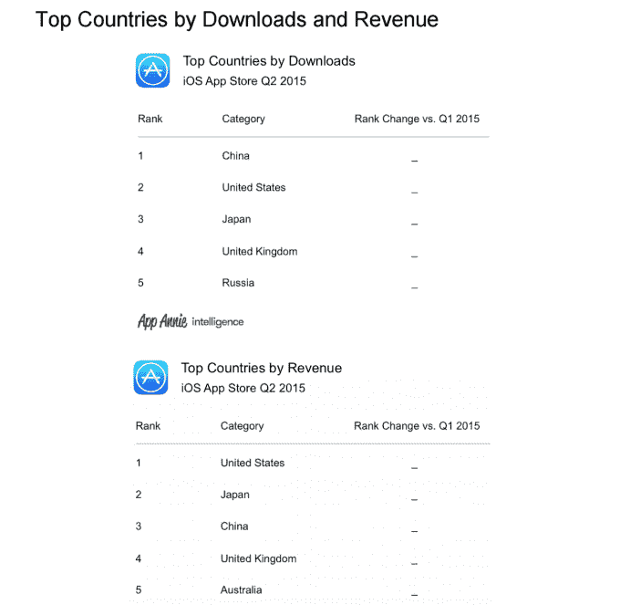
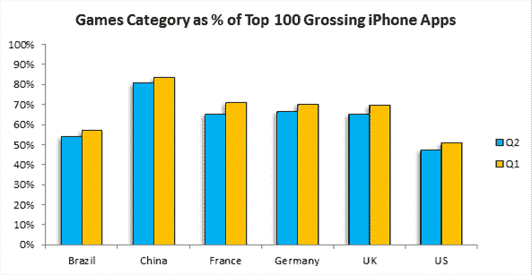

# 7 月份，苹果应用商店的营业额达到 17 亿美元，打破了顾客记录

> 原文：<https://web.archive.org/web/https://techcrunch.com/2015/08/07/apples-app-store-saw-1-7b-in-billings-and-broke-customer-records-in-july/>

或许是为了消除对 iPhone 销量和中国的担忧，苹果本周发布了与 App Store 增长相关的数据，这些数据显示了中国对其应用生态系统和开发者社区的真实影响。

该公司表示，7 月份，它的交易客户数量最多，账单收入超过 17 亿美元。此外，苹果公司说，同一个月也打破了中国的记录，中国的交易客户数量也是最多的。

该公司表示，迄今为止，该公司已向应用商店开发者支付了 330 亿美元——仅在 2015 年就支付了 80 亿美元。相比之下，[就在一年多前](https://web.archive.org/web/20230314100428/https://techcrunch.com/2014/07/22/apple-has-paid-20-billion-to-ios-devs-half-of-it-in-the-past-year/)，苹果公司表示已经向开发者支付了 200 亿美元。

尽管有迹象表明，在 App Store 中获得知名度变得越来越困难，目前有超过 150 万款移动应用和游戏可供下载，但新应用的增长没有放缓的迹象。

当然，中国在移动应用生态系统中的巨大作用已经展现了一段时间。

例如，根据 App Annie 的[报告](https://web.archive.org/web/20230314100428/http://blog.appannie.com/china-surpasses-united-states-ios-downloads/)，今年 4 月，中国超过美国成为 iOS 下载量的第一来源。当时，App Annie 指出，2015 年 Q1，中国的应用商店下载量呈爆炸式增长，年增长率为 30%。这一趋势是由于该国 iPhone 用户的安装基数不断增长，其中一些人选择 iPhone 是因为 iPhone 6 和 6 Plus 的屏幕尺寸现在更大了。

对更大屏幕的偏好源于中国移动优先的特性——在该国，智能手机的采用率超过了个人电脑的采用率，这意味着许多用户在手机上而不是电脑上执行任务。

苹果还通过投资在中国的零售店迎合了中国对 iPhones 的需求。截至今年 4 月，该公司的门店数量已从 2013 年 10 月的 8 家增至 19 家。苹果表示，将在 2016 年年中前在大中华区开设 40 家门店。

与此同时，到 2015 年第二季度，中国早期的下载增长也开始严重影响 iOS 收入。在此期间，中国的收入份额出现了最大的季度环比增长。这反过来帮助 iOS 应用商店保持了对 Google Play 的收入领先优势，尽管该季度 Google Play 下载量比 iOS 应用商店高出约 85 %,高于 Q1 70%的差距。

换句话说，对于行业观察人士来说，苹果最近披露的中国 7 月份客户交易量不错的消息并不意外。

App Annie 营销、传播和社区副总裁杨奇煜-皮埃尔·尼古拉斯解释说:“苹果 7 月份的强劲货币化增长与 iOS 作为大多数市场的领先货币化平台的总体趋势是一致的。“自今年 3 月以来，中国已经是 iOS 下载量排名第一的市场，在增长方面处于领先地位。”

想知道什么样的应用对中国 iOS 应用商店的收入增长贡献巨大吗？

App Annie 在 Q2 的报告中说，最近是视频流媒体领域。包括优酷、爱奇艺和腾讯视频在内的这些应用在本季度实现了“爆炸性”的收入增长，同时也主导了中国 iOS 娱乐应用的用户排名。这些应用程序本身提供了一系列内容，从类似 YouTube 的用户提交内容到电影和热门电视节目，包括来自海外的内容，以及原创节目。

为了说明这些应用的影响力和范围，App Annie 指出，爱奇艺最近宣布了 500 万付费用户，比去年增长了 765%。优酷表示，其每日视频浏览量超过 9 亿，而其来自订阅和按次付费的消费者收入增长了 649%。(毕竟，剪脐带是一种影响全球消费者的趋势，不仅仅是美国！)

当然，游戏在中国也仍然是一个受欢迎的类别——下载量和收入都是最多的。在这方面，Strategy Analytics [上个月](https://web.archive.org/web/20230314100428/https://www.strategyanalytics.com/strategy-analytics/news/strategy-analytics-press-releases/strategy-analytics-press-release/2015/07/09/strategy-analytics-finds-mobile-app-gaming-companies-poised-for-record-second-half#.VcT9QhNViko)的一份报告指出，中国前 100 大 iPhone 应用中有 81%是游戏。这也对中国不断增长的应用商店收入产生了巨大影响。

在下载量方面，中国今天仍然是第一，保持了在 Q2 的头把交椅。现在，它的收入排名也在稳步上升。中国与 Q2 并列第三，仅次于美国和日本。