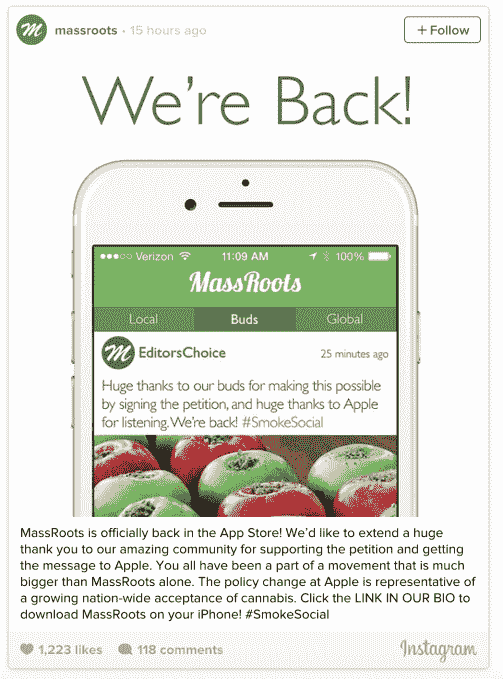
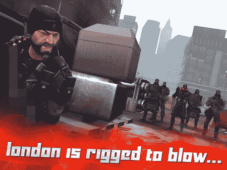

# 苹果应用程序商店拒绝枪支，但接受杂草

> 原文：<https://web.archive.org/web/https://techcrunch.com/2015/02/13/apples-app-store-says-no-to-guns-but-yes-to-weed/>

苹果对道德的定义在本周得到了展示，它对应用程序商店提交的政策进行了一些修改。显然，苹果的应用程序商店现在可以接受大麻主题的应用程序，这在以前是受限制的，但它现在也在执行一项政策，要求游戏开发商从他们的应用程序商店截图中删除枪支的图像。

关于大麻相关应用的最新政策反映了美国法律对毒品禁令的不断放松。

几个星期以来，包括社交网络应用 MassRoots 在内的许多大麻倡导团体和移动开发者一直在[请愿](https://web.archive.org/web/20230304075303/http://blog.massroots.com/app-store-prohibits-social-cannabis-apps/)苹果改变其禁止应用商店中毒品主题应用的立场。超过 10，000 名 MassRoots 用户也给苹果发电子邮件，要求他们改变立场。

周五，MassRoots [报道](https://web.archive.org/web/20230304075303/http://blog.massroots.com/apple-changes-cannabis-policies-massroots-returns-app-store/)其先前被禁的应用程序已经被允许回到商店，但有一个新的要求。

今后，该应用程序必须执行地理位置检查，以防止授权区域以外的用户访问其网络。这些被允许的地区是美国 23 个大麻使用已经合法化的州。

“我们要感谢 App Store 拥抱大麻社区，并继续作为社会进步机构树立榜样，”MassRoots 团队在其公司博客上表示。“我们很高兴与苹果一起开启新的篇章，我们可以一起努力影响有意义的社会变革。”该公司补充说，它“有责任向世界表明，大麻消费可以在遵守州法律和联邦执法准则的情况下以安全和负责任的方式进行。”

这一政策逆转是有意义的，因为在全国范围内全面禁止大麻应用程序不再是必要的，因为各州法律的变化使该药物的使用合法化，无论是出于医疗目的，娱乐用途还是两者都是如此，视情况而定。移动应用程序可以很容易地确定一个人的位置，以确定他们是否应该能够访问应用程序的内容。

## 枪支政策得到更好的执行

与此同时，App Store 政策的另一项最新变化影响了游戏中包含枪支暴力的应用开发商。虽然这些应用程序仍然允许在应用程序商店中使用(如果评级适当的话)，但那些提交应用程序并附上描述枪支使用情况的截图的人现在被拒绝了。

上个月，一个名叫 OrangePixel 的开发者更新了他的游戏 *Gunslugs 2* ，首次注意到了这一变化。苹果当时拒绝了这款游戏，称一张截图显示了“对人类的暴力”。这款游戏最初是在更新前几周发布的，使用了相同的截图，所以被拒绝似乎表明了 App Store 政策的变化。

然而，直到博客 [PocketGamer](https://web.archive.org/web/20230304075303/http://www.pocketgamer.co.uk/r/iPhone/Tempo/news.asp?c=63862) 进一步调查此事，才可以确定这是一个更广泛的变化，而不是一次性的情况。或者，更准确地说，与其说这是政策*的改变*，不如说这是苹果公司决定正确执行一项已经成文的政策。

这条规则，[指出](https://web.archive.org/web/20230304075303/http://www.marco.org/2015/02/12/apple-rejecting-violent-screenshots) Instapaper 开发者 Marco Arment 一直存在，[指出](https://web.archive.org/web/20230304075303/https://developer.apple.com/app-store/review/guidelines/#metadata):

*3.6 应用程序的图标、截图和预览不符合 4+年龄分级的将被拒绝*

显然，描述枪支暴力的应用程序不符合这一特定准则。

PocketGamer 现在已经听到许多应用程序商店开发者说他们被要求改变他们的截图——在某些情况下，角色甚至没有拿着真枪。例如，一个名为 Team Chaos 的开发者不得不更新一个截图，上面显示一个角色拿着一把 NES Zapper 枪。

一些开发者已经从截图中移除了枪支，而其他人则模糊了它们。

你可能会问，为什么像这样的变化如此重要？嗯，苹果作为移动行业的主要参与者，以及数百万人每天随身携带的设备的创造者，这意味着它能够影响公众对这类话题的看法。苹果的道德立场何去何从，从而可能会影响到这个国家的其他地方？这些变化代表了对美国毒品政策更进步的看法，以及对枪支和暴力更严厉的立场。

此外，越来越多的年轻用户访问苹果的应用市场。苹果也一直在努力更好地满足这些孩子及其父母的需求，部分原因是联邦政府对儿童广告和收集个人信息的规定，但也因为它认为自己有责任提供某种体验——不允许将成熟或暴力内容放在儿童眼前。