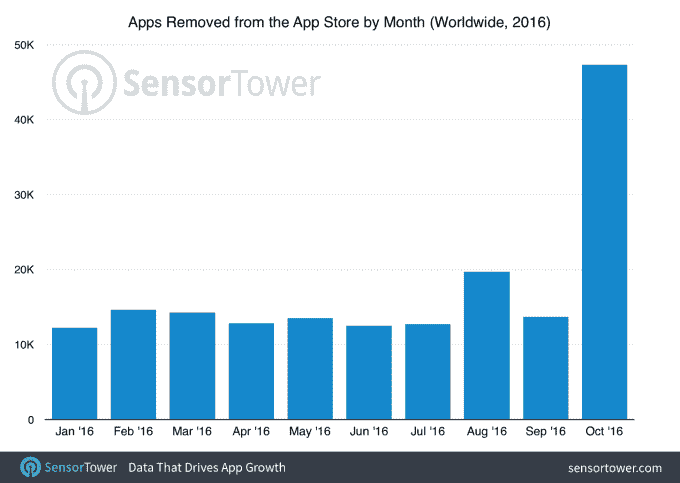

# 苹果的大规模应用商店清理正在进行中

> 原文：<https://web.archive.org/web/https://techcrunch.com/2016/11/15/apples-big-app-store-purge-is-now-underway/>

今年早些时候，[苹果承诺将清理其 iOS 应用商店](https://web.archive.org/web/20230404051249/https://techcrunch.com/2016/09/01/apple-is-going-to-remove-abandoned-apps-from-the-app-store/)，移除过时、废弃的应用，包括那些不再符合当前指导方针或功能不符合预期的应用。根据应用情报公司[传感器塔](https://web.archive.org/web/20230404051249/https://sensortower.com/)的新数据，这场大规模的应用商店清洗似乎正在进行中。该公司发现，2016 年 10 月，应用删除量增加了 238%，其中手机游戏删除量最大。

苹果最初表示，希望自己过时的应用程序幸免于难的开发者的截止日期是 2016 年 9 月 7 日。然而，苹果在这个月没有立即采取大规模下架的行动。

Sensor Tower 发现，这种情况在 10 月份似乎有所改变，当时有 47，300 款应用被从 App Store 下架。

虽然苹果确实会定期删除应用程序，但这个数字比 1 月至 9 月的月平均水平 14000 高出约 3.4 倍。(见下图)。

这一数字表明，苹果正在兑现其从应用商店中移除 cruft 的意图，如前所述。

鉴于“游戏”是 App Store 上最大、最受欢迎、访问量最大的类别之一，它被删除次数最多也就不足为奇了。该报告发现，在被移除的 47300 个应用中，大约 28%是游戏。其次是娱乐、书籍、教育和生活方式。

但在非游戏类别中，被删除的应用要少得多。娱乐和书籍几乎并列第二，分别为 8.99%和 8.96%。教育和生活方式的差距更大，分别为 7%和 6%。

尽管数据清楚地指出了删除的高峰，这个过程可能仍在进行中。[之前对今天的应用商店中被放弃的应用的状态的分析表明，几乎一半的应用自 2015 年 5 月以来没有更新过。25.6%的人自 2013 年 11 月以来没有更新过。](https://web.archive.org/web/20230404051249/https://techcrunch.com/2016/09/06/upcoming-app-store-purge-could-see-hundreds-of-thousands-of-apps-deleted/)

我们不能确定的是，苹果将如何定义“被抛弃”。在[今年秋天给开发者的信息中，](https://web.archive.org/web/20230404051249/https://techcrunch.com/2016/09/01/apple-is-going-to-remove-abandoned-apps-from-the-app-store/)该公司表示，除了那些不符合当前审查指南或不能按预期工作的应用程序，它还将删除那些“长期以来不支持兼容性更新**”的应用程序(强调我们的。)**

 **这种说法是故意含糊的——它让苹果能够对单个应用程序做出判断，而不必对应用程序上次更新的时间做出硬性规定。

尽管进行了这次大清理，App Store 本身仍在增长。Sensor Tower 估计，到 2020 年，它的规模可能会翻一番以上，有 500 万个应用程序可供使用。

此外，苹果公司表示，每周提交大约 10 万个新的和更新的应用程序，商店本身就有超过 200 万个应用程序。随着 iMessage 应用商店的推出，iOS 应用可以通过 iMessage 界面进行扩展，苹果的应用市场将继续扩大。**