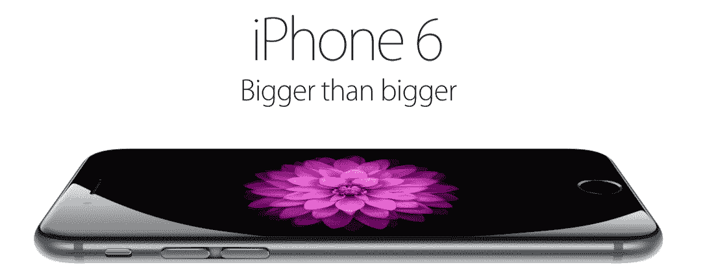

# 苹果的大屁股 iPhone 6 和 6 Plus 现在可以预购 

> 原文：<https://web.archive.org/web/https://techcrunch.com/2014/09/12/apples-big-ass-iphone-6-and-6-now-available-for-pre-order/>

苹果最新也是最大的一对 iPhone，即 [iPhone 6 和 6 Plus](https://web.archive.org/web/20221006184220/https://beta.techcrunch.com/2014/09/09/hands-on-with-the-iphone-6-and-the-iphone-6-plus/) ，现在已经可以在许多国家预订，包括美国、英国、法国、德国、西班牙和意大利。这些手机将于 9 月 19 日发货给买家。

在美国，iPhone 6 的起价为 199 美元(两年运营商合约)，iPhone 6+的起价为 299 美元(也是合约)。英国苹果商店正在销售无锁设备，没有运营商合同，iPhone 6 的起价为 539 英镑，iPhone 6+的起价为 619 英镑。

尽管远东是大手机趋势的驱动力，但在亚洲的主要市场中国，预购似乎尚未开放。

韩国手机制造商三星最初的 Galaxy Note phablet 可以说引发了一场屏幕尺寸竞赛，苹果被迫效仿。最初是在 iPhone 5 上相对递增的屏幕凸起。但现在有了更大的转变，新款 iPhone 6 将之前的 4 英寸旗舰屏幕尺寸提升至 4.7 英寸，6 Plus 则提升至 5.5 英寸。后者的尺寸第一次让 iPhone 膨胀到合适的比例。

两款屏幕尺寸足够大的旗舰机的选择意味着，对于希望将 Cupertino 最新硬件塞进口袋/钱包的苹果买家来说，这是一个“更大还是最大”的困境。

让不同尺寸的 iPhone 旗舰同时发布不是苹果以前提供的选择，所以看看 iOS 买家是倾向于大还是最大会很有趣。尽管苹果不太可能公布具体型号的销售数据，因此任何分析都将从传闻开始，并保持非官方。

苹果显然也面临着自己的难题:鉴于平板手机的出现较晚，如何宣传更大尺寸智能手机的魅力。

该公司在其网站上确定的(英语)口号是“比更大更大”，这给人的感觉是笨拙而无意义的。尽管如此，这绝不是苹果营销部门第一次犯语言错误。还记得《最有趣》吗？和“果断”？你现在知道了…

苹果的新款手掌伸展式 iPhones 手机于本周早些时候发布，库比蒂诺的高层称其为“我们制造的最好的手机”。他们肯定在之前的 iPhone 发布会上用过这句话。(“自上一个最佳以来的最佳”没有完全相同的铃声，尽管它听起来更符合“比更大更大”。)

尽管有“有史以来最好”的吹嘘，新 iPhones 在苹果的活动中几乎没有播放，因为它们只是明年将在库比蒂诺推出的一种新的苹果设备类别的副手:它的 [Apple Watch 智能手表](https://web.archive.org/web/20221006184220/https://beta.techcrunch.com/2014/09/09/hands-on-with-the-apple-watch/)。

这并不令人惊讶，因为苹果需要证明，当人们口袋里已经有一台便携式电脑时，为什么还要花更多的钱把另一台便携式电脑绑在身上。此外，鉴于智能手机类别——实际上是更大的智能手机屏幕——现在已经在市场上站稳了脚跟，因此无需介绍。