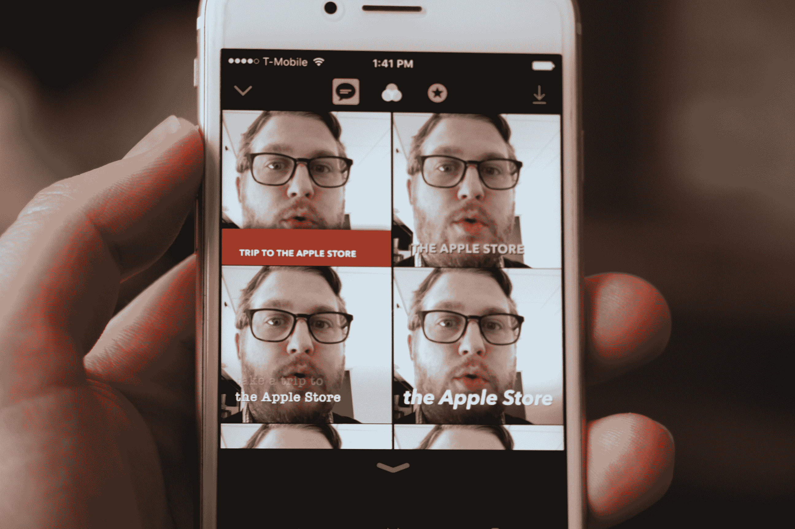
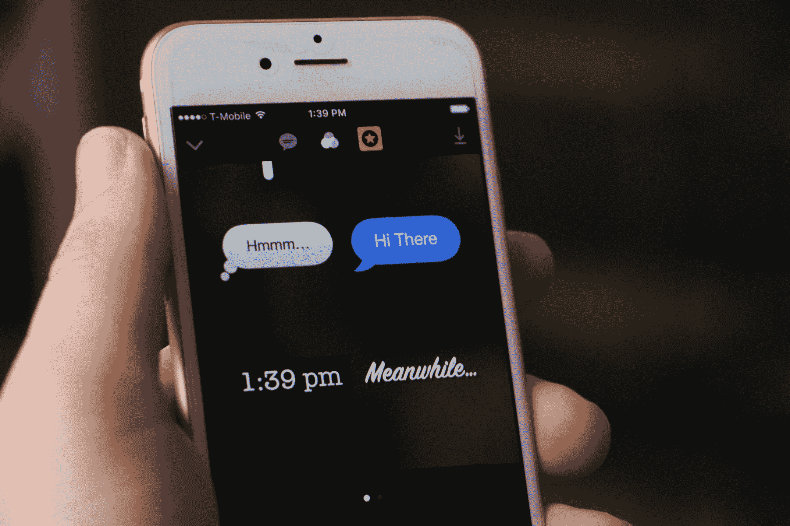

# 苹果的 Clips 应用是社交视频编辑，简单到了极点 

> 原文：<https://web.archive.org/web/https://techcrunch.com/2017/04/06/apples-clips-app-is-social-video-editing-thats-simple-to-a-fault/>

在发布会上很难知道如何制作剪辑。当然，苹果不时推出自己的独立应用，但它从未提供过类似的东西。对于苹果来说，Clips 是移动视频编辑的另一个玩法——对于那些没有时间、技能或渴望摆弄 Final Cut 甚至 iMovie 的人来说，这是一个非常简单的解决方案。

从外部来看，Snapchat 和 Instagram 的故事有一些不可避免的阴影。Clips 允许用户将短视频和照片剪辑在一起，添加滤镜、表情符号和音乐，并将它们发送到世界各地——尽管没有独立的社交网络。这是设计出来的，一方面是为了防止应用被锁定在专有平台上，另一方面是因为，老实说，谁想在 2017 年建立另一个 Snapchat/Instagram 风格的社交网络呢？

现实情况介于这两个阵营之间。Clips 确实提供了一种超级简单的方法，可以将视频和图像整合到一个有凝聚力的包中，你可以在许多媒体账户(对苹果来说，最重要的是消息)上发布，在这个过程中利用该公司现有的编辑软件。

从包装、新闻材料以及补充贴纸和表情剪辑功能来看，很明显该公司坚定地瞄准了 Snapchat 和 Instagram 的千禧一代用户群。对苹果来说，这是展示该公司对相机硬件和编辑软件的关注的一种方式，同时有可能让用户脱离现有的社交生态系统，支持其专有产品。

## 保持记录

Clips 在易用性方面表现出色。苹果非常擅长构建一个非常简单的界面。这在一定程度上要归功于这样一个事实，即与 Final Cut 和 iMovie 不同，Clips 是作为一个移动应用程序从头开始构建的。这意味着不需要移植，不需要将方钉卡在圆孔中，也不需要遗留的部件。该公司显然从体验所需的最基本元素开始，只在它觉得必要的地方添加一个元素。

这意味着这个应用程序的最早期版本缺少一些功能。虽然它旨在提供从拍摄到编辑视频包的最短路径，但在这个过程中会留下一定程度的定制。尽管我怀疑苹果可能会告诉我 iMovie 或 Final Cut 更适合我。

简单的结果是，真的没有包袱压着你。应用程序的中心是相机的实时视图(默认情况下在自拍模式下)。下面是一个长长的红色按钮，上面有“保持录音”的字样。你按住那个按钮来记录，仅供参考。

Clips 实际上是一个内置了一些基础级后期处理的相机应用程序。取景器上方有几个按钮，用于添加字幕、切换滤镜、添加表情符号/印章和标题。在它下面是在视频、静止图像和从你的手机库中提取图像之间切换的选项。

从多个方面来看，红色的大记录按钮是整个项目的焦点。所有进入底部时间轴的东西都需要先通过那个按钮——甚至是标题卡和剧照。您可以将它添加到视频中，方法是在您希望它出现在最终剪辑中的时间内按住它。

## 标题、过滤器和图章

直播标题是这里最突出的特色。这个插件是苹果各个团队大量幕后工作的结晶。看起来，很少几个片段是专门为这个功能开发的，但综合起来，它们形成了一个简单的片段，为整个剪辑体验增加了很多。使用语音技术，该应用程序能够以八种不同的文本风格实时为视频添加字幕。它利用 iOS 听写功能，需要互联网连接才能工作。

该功能还提供了一个非常关键的洞察，即苹果对剪辑的关键用例——即发送个人信息。除了在 iOS 10 中推出的大量消息升级，该应用程序旨在补充苹果的短信系统，通过一个人一天的小快照，为基于文本的消息系统增加一点光彩。毫无疑问，这也是相机默认自拍模式的很大一部分原因。

Live Titles 在捕捉文本方面做得相当不错。尽管有一些警告。你需要大声清晰地说话，吐字清晰。如果你说得太快或含糊不清，它往往会听错或遗漏单词。此外，确保你在一个环境噪音尽可能小的环境中。

在中央车站苹果商店前尝试，事情并不顺利。它也不适用于多声部。正如该公司巧妙地指出的那样，它实际上更像是一种叙事工具，因此非常适合这种格式。

在其目前的产品中，过滤器感觉有点有限，总共只有八个。当然，它们与 Snapchat 等公司复杂的增强现实产品有所不同。目前的 Clips 产品建立在苹果现有的照片过滤器基础上，并添加了一些新的小说选择，如漫画，它在将直播视频转换成纸浆样的图像方面做得很好。过滤器方面的产品仍然非常有限，但苹果无疑将很快增加这些产品。

邮票正面有更多种类，有十几种风格，其中一些默认为视频拍摄的地点、时间和日期。它并不完全是用户界面所固有的，但是在它们被添加到一个特定的视频片段之后，你可以通过按住文本来直接编辑它们。

表情符号也是如此。默认情况下，该应用程序提供了你最常用的 30 个。你也可以添加其他人，但为了做到这一点，你需要选择一个顶部的，然后点击它，调出表情键盘。一旦添加到视频中，图像可以在屏幕上拖动，旋转和调整大小。

等式中的另一个关键部分是头衔卡。这些给视频添加了漂亮的书尾，让它更具专业氛围——对于你可能花了 5 分钟以上创作的东西来说，这是一个不错的壮举。就像邮票一样，苹果显然为创造流畅的体验做了很多工作，这些加在一起，构成了一个不错的小包装。

为了简单起见，有些功能感觉有点隐藏。在我测试的早期版本中，我联系了苹果公司，但该公司表示，当该应用程序今天上线时，将会有一个帮助部分来指导用户完成这些步骤。所以，这应该能改善一点体验。

## 我们生活的原声音乐

添加音乐同样简单。该应用程序附带了几十个音乐床，真正涵盖了情感领域。你需要下载它们来添加到视频中——这无疑是为了降低应用程序的总大小。但这是一个很好的小功能，就像直接在视频编辑应用程序中建立一个免版税的音乐库。此外，该公司甚至聘请动作配乐大师汉斯·季默创作了一段足够紧张的音乐。

该应用程序还可以自动无缝地循环播放音乐，因此感觉就像一个连续的音轨，最长可达 30 分钟。也就是说，用户实际上不能从特定场景中删除音乐。一旦它被添加到一个剪辑中，它就被添加到整个作品中。尽管对于那些有音频的场景它会自动降低。至于其他方面，最好是将视频的音频静音，只让配乐接管。

用户也可以使用 iTunes 资料库中购买的音乐来获取自己的音乐。这是一个很好的功能，也是免费应用的潜在盈利途径。这几乎是一个偷偷摸摸的应用内购买功能，推动音乐下载。

## 剪辑室的地板

所有记录下来的东西都会出现在底部的时间线上。每个片段都显示为自己的方块，用户可以通过拖放直接在时间轴中重新排列。轻按其中一个会将您带入剪辑。从那里，你可以进一步摆弄过滤器等，静音的音频，垃圾或编辑它的长度点击剪刀图标。

其实“修剪”可能是更准确的描述。当您点按时，该片段会显示为其自己的可视时间线，类似于您在 iMovie 中看到的内容。在那里，您可以拖动任一侧的箭头来缩短视频。

## 没有网络的社交

剪辑以 1080 x 1080 的尺寸导出。正方形的格式与其他社交媒体输出保持一致，除其他外，旨在以人像模式拍摄——这是对这里的目标受众的又一次洞察。或许，这也让我们看到了 iPhones 未来可能的新长宽比，它可能更适合并排放置的两个正方形图像，就像我们在 LG 和三星的新旗舰上分别看到的 18:9 或 18.5:9。

这些视频可以在任何支持 MPEG 格式的平台上分享，默认情况下，它有 Instagram、脸书、Vimeo 和 YouTube 的分享按钮。当然，还有信息。这一个在最上面，联系人按经常联系的顺序排列，还有从视频中抓取的上下文信息，比如文本中的姓名。这种消息共享功能对 Clips 来说是新的，但你可能会期待它在不久的将来推广到其他苹果应用程序。

## 今后

苹果告诉我，它将“定期更新应用程序”，所以预计这些过滤器将很快更新。我也不会太惊讶于该公司向第三方开放应用支持，允许开发者创建自己的附加功能。或许，该公司将提供额外的优质内容，帮助它进一步赚钱的免费应用程序。然而，就目前而言，这还只是猜测。

同样有趣的是，该公司没有立即将该应用程序与任何硬件捆绑在一起的计划，这与目前设备附带的许多其他苹果应用程序不同。如果不说别的，这似乎表明该公司将这款应用视为一种乐趣，而不是一款必不可少的软件。

在目前的状态下，Clips 是一个简单的应用程序。这是设计好的。这是制作可分享视频的一种快速简单的方法。对许多人来说，这将是一次艰难的推销。它当然不适合那些认真对待视频编辑的人，而且与前面提到的社交媒体产品有不可避免的重叠。但是这很有趣也很容易，而且最终的软件包比竞争对手的要漂亮得多。

iPhone 和 iPad 版本的应用程序之间没有任何真正的区别，尽管该公司对平板电脑版本的定位略有不同，提供了一种快速简便的方式来使用平板电脑为教室做演示。显而易见，这款应用作为一个简单的教育视频编辑解决方案可能会有第二次生命，尽管一些教育技术特定的内容包将有助于改善这种体验。

就目前的情况来看，Clips 主要是关于简单性和一点点乐趣——它们本身都不是坏目标，但看看该公司最终会把事情带到哪里会很有趣。