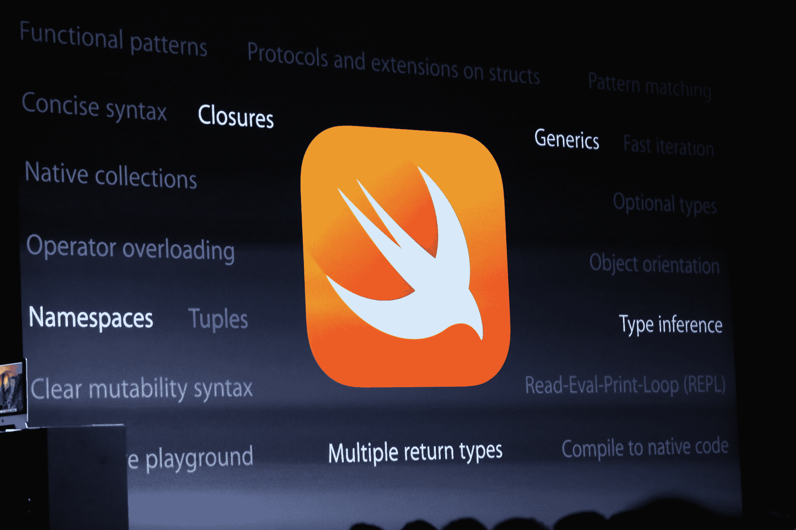
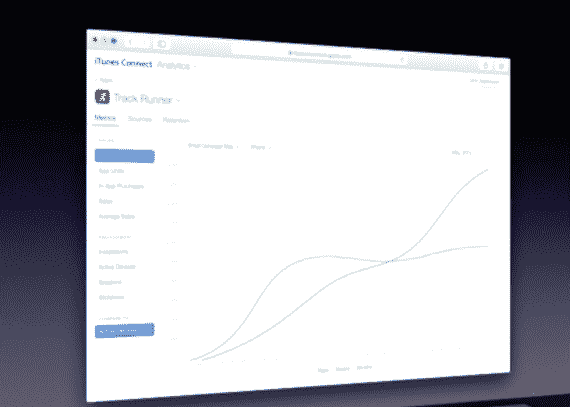
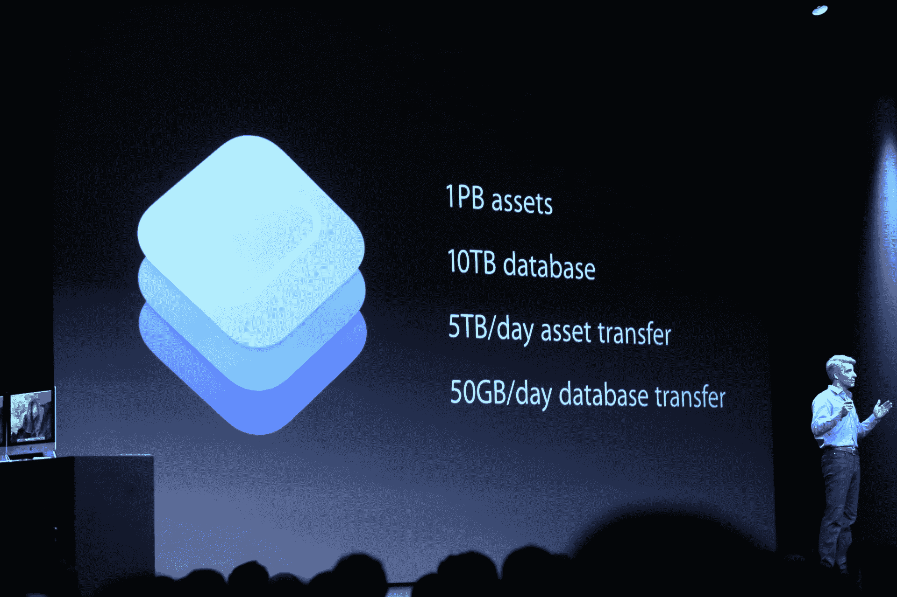

# 苹果的 WWDC 为开发者提供粉丝服务 

> 原文：<https://web.archive.org/web/https://techcrunch.com/2014/06/02/apples-delivers-developer-fanservice/>

苹果今天早上在 WWDC 的主题演讲中展示了一些受欢迎的面向消费者的 iOS 和 OS X 功能。但到目前为止，最大的宣布是苹果向开发者提供了一份愿望清单，抓住了生态系统中的每个主要痛点。

今天下午，苹果扩展了它为开发者提供的产品，到目前为止，我接触过的每个开发者都对苹果在这一轮更新中修复的问题数量感到欣喜若狂。

在早上的主题演讲中，苹果推出了一种叫做 Swift 的新编程语言。它有望成为一种更简单、更专注的语言，帮助人们以更具交互性的方式构建应用。一个名为操场的新功能可以实时显示代码对应用程序的影响。该公司还表示，它正在将 App Store 上的 WWDC 应用程序更新为使用 Swift 构建的版本，以证明它是一种“真正的”语言，随时可供使用。

苹果还通过将最近收购的 TestFlight 整合到其开发者提供的工具中来扩展其后端支持。TestFlight 将允许开发者[向 1000 名用户提供其应用程序的测试版](https://web.archive.org/web/20221213003956/https://beta.techcrunch.com/2014/06/02/ios-testflight/)。这是 1000 名个人用户，而不是*设备——*这是一个重要的区别，任何曾经测试过其应用的开发者都会喜欢。

以前，开发人员只能为所有用户提供 100 台设备。这个扩展的 beta 测试套件将会带来更好、更无 bug 的应用。

对个人资料的繁琐处理也不复存在，因为只需要用户的苹果 ID。简单易懂——苹果之前的测试版解决方案并非如此。苹果公司完全免费提供。

苹果向开发者提供的工具 iTunes Connect 也进行了改进，设计更加简洁。此外，它现在提供了扩展的分析功能，让开发者可以跟踪应用的下载量、留存率(人们持续使用应用的时间)，甚至是开发者应用页面的访问量。

值得注意的是，谷歌的开发者控制台一直在为 Android 开发者提供更深入的分析和测试选项。Android 开发者享受到了内置的翻译功能，并通过数字真正了解了人们是如何下载、使用和保留他们的应用程序的。

今天的声明显示了苹果对这些竞争工具的认可，并使苹果的后端与竞争对手的最佳套件保持一致。

### 竞争与精致

“Swift 的引入对该平台的未来非常重要，但最好的产品是新的分析和测试版分发工具。“自从 App Store 发布以来，这两个都是主要的痛点，”Second Gear 的贾斯汀·威廉姆斯说。“多年来，能够跟踪你的应用在 App Store 中的浏览量一直是一项必备功能。我很高兴它终于来了。”

此外，苹果还表示，它将推出一套完整的崩溃报告套件，开发者可以用它来跟踪应用程序中的崩溃。这是标准配置，将取代许多公司的第三方选项，这些公司已经建立了跟踪应用程序中致命错误的业务。

这也适用于 beta 测试。苹果给开发者的 TestFlight 礼物给第三方选项的未来带来了一点麻烦，比如 HockeyApp 或 Crashlytics 的新(也是免费的)测试套件。但是长期以来，测试情况一直如此糟糕，以至于开发者对此反应积极。

HockeyApp 的联合创始人迈克尔·西蒙斯说:“宣布的内容不多，所以我们不太确定它将如何运作，但新的 1000 名用户限制和每个用户无限的设备是一个很好的开始。”“HockeyApp 的使命是成为最好的应用程序开发平台，所以我们支持 OS X、iOS、Android 和 Windows Phone。除了测试版分发，我们还提供分析和实时崩溃报告。”

西蒙斯说:“苹果的解决方案，或者至少是他们迄今为止宣布的非常少的解决方案，似乎只是对 beta 测试的改进，虽然他们确实宣布了实时崩溃报告，但他们说要到明年晚些时候才会推出。”

### 照片

苹果还为开发者扩展了照片和相机工具。你可以在 iOS 中设置快门速度、白平衡和 ISO，甚至镜头位置和括号曝光。iOS 开发者也可以使用苹果的 CPU 来处理图像。

让开发者对 iPhone 相机拍摄图像的方式进行精细控制，是那些开发照片应用程序的人长期以来的要求。摄影应用是 iOS 上最受欢迎的应用之一，苹果使 iPhone 成为历史上最受欢迎的相机之一。

布局工具也有一些新的调整，比如更好的横向支持和对自适应 UI 的支持，这表明苹果希望开发者为 iOS 设备测试更大的屏幕尺寸。虽然它没有明确预言更大的 iPhones 正在路上，但它没有做任何事情来消除这些谣言。

尽管细节仍然有些模糊，但苹果也将对 iCloud 存储的支持扩展到了开发者，向开发应用的开发者免费提供高达 1pb 的存储空间，足以存储约 100 亿张照片。因为 iCloud 用户不需要任何额外的凭据就可以开始使用存储，所以 onboarding 理论上很容易，不需要开发者使用 AWS 或 Dropbox 这样的透明服务。苹果对 iCloud 的宣传很简单:我们有大量的 iCloud 用户，其中的每一个都可能是你的。

### 粉丝服务

总的来说，今年 WWDC 会议的主题演讲描绘了一幅苹果倾听开发者意见并解决他们最大的痛点的强烈画面。几乎每一个主要的公告都致力于使开发的各个方面更加容易。

苹果还对 App Store 进行了一些不错的改进，包括更好的搜索和视频截图。

“我最兴奋的是苹果对 App Store 的改变。Contrast 的开发人员大卫·巴纳德说:“拥有开发更好应用的工具固然很好，但开发应用并不是重点。“重点是娱乐和授权 iOS 用户。如果没有人下载，或者开发这个应用在经济上不可行，那么这个应用再好也没用。App Store 中有超过 100 万个应用程序，iOS 8 的变化本质上不可能是所有应用程序的灵丹妙药，但苹果正在向一个更好地突出优秀应用程序并赋予尽责开发者权力的应用程序商店迈出一大步。”

最重要的是，苹果已经秘密开发了一种新的编程语言，这将使数百万人投入到应用程序开发中。这并不是说 Objective-C 有什么大问题(取决于你问谁),但是 Swift 更干净、更简单、更友好。

这些开发人员中有许多学龄 WWDC 奖学金的参加者，苹果公司首席执行官蒂姆·库克说其中最小的只有 13 岁。通过 Swift 及其今天发布的所有公告，苹果正在积极争取下一代开发人员。

