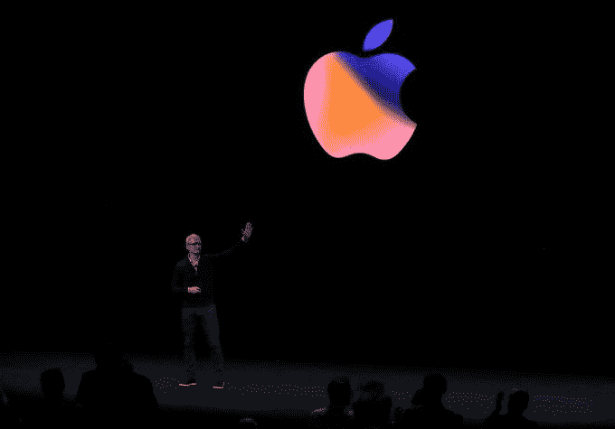
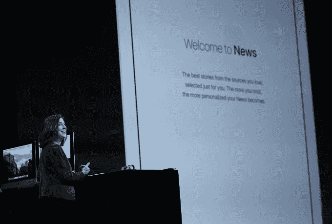
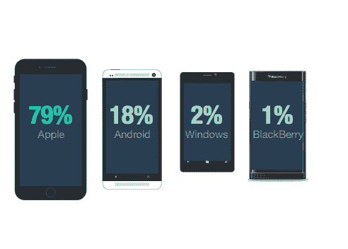

# 苹果的企业发展 

> 原文：<https://web.archive.org/web/https://techcrunch.com/2018/01/20/apples-enterprise-evolution/>

回到 2010 年，苹果标志性的联合创始人史蒂夫·乔布斯并没有完全被这个企业迷住。事实上，乔布斯[有一句名言](https://web.archive.org/web/20221209161255/https://www.techrepublic.com/blog/tech-sanity-check/why-steve-jobs-hates-the-enterprise/)“我喜欢消费市场，但我一直讨厌企业市场，那就是我们推出一款产品，我们试图告诉每个人，每个人都为自己投票。”

他补充道，“他们说‘是’或‘不是’，如果足够多的人说‘是’，我们明天就可以开始工作了。这就是它的工作原理。”

这足够准确地描述了乔布斯发表声明时的工作方式。在那些日子里，它对企业保持着严格的控制，发放黑莓和 ThinkPads 等设备(你可以要任何你想要的颜色——只要是黑色)。乔布斯，[于 2011 年](https://web.archive.org/web/20221209161255/https://beta.techcrunch.com/2011/10/05/steve-jobs-has-passed-away/)去世，没能活到看到“自带设备”(BYOD)和“IT 消费化”，这两个趋势在他去世时刚刚出现在企业的视野中。

我觉得他会非常喜欢这两个运动，并且会对这些趋势在许多方面都是由他的公司的移动设备 iPhone 和 iPad 驱动的这一事实感到非常高兴。人们在家里使用这些设备，并且越来越多地把它们带到工作中。它别无选择，只能开始接纳他们。

这场运动帮助推动了苹果的企业发展。随着时间的推移，苹果已经与 IBM、SAP 和思科等企业巨头合作。它为 It 部门提供了更好地管理 i-devices 和 MAC 的工具，并将企业打造成了一个庞大的企业(就我们所知)。

## 这是什么？

试图找到苹果企业业务规模的数据是一个挑战，因为它通常不会在财报电话会议上公布企业收入，但为了让你对市场有一个概念，蒂姆·库克在 2015 年第四季度的财报电话会议上透露了一个数字。

“我们估计，在过去 12 个月中，企业市场占苹果年度收入的约 250 亿美元，比上一年增长 40%，它们代表了未来的主要增长载体，”库克当时表示。

在 2017 年 6 月的彭博采访中，库克没有提供任何数字，但他称这家企业为“所有机会之母”这是因为企业倾向于批量购买，当他们在内部建立苹果支持系统时，它会满足企业市场的其他部分，因为公司购买 MAC 电脑来为内部用户和他们的产品和服务的消费者建立定制应用程序。

在彭博的采访中，这种联系没有逃过库克的眼睛。“对于大多数企业来说，iOS 是首选的移动操作系统。IOS 是一个非常棒的平台，因为你可以轻松地编写应用程序，这些应用程序可以帮助你高效地运营业务或直接与客户互动。我们看到很多很多企业现在都在编写应用程序。他们用什么来编写应用程序？他们使用苹果电脑。Mac 是 iOS 的开发平台，”库克告诉彭博。

照片:贾斯汀·沙利文/盖蒂图片社

另一种看待市场的方式是看看 Jamf，这是一个苹果企业工具合作伙伴，帮助公司在大型组织中管理苹果设备。该公司成立于 2002 年，远早于 iPad 或 iPhone，一直在突飞猛进地发展。据报道，目前该公司拥有 13，000 名客户。客观地说，达到 6，000 名客户花了 13 年时间，翻了一番达到 13，000 名客户仅用了 2.5 年时间。

“很多人说苹果越来越专注于企业，但我相信苹果帮助企业更加专注于用户，他们取得了更多的成功，”Jamf 首席执行官迪安·哈格告诉 TechCrunch。“它始于苹果创造人们想带到工作中的伟大产品，然后他们就要求它，”他说。

## 强行进入企业

这种有机的势头不能被低估，但一旦它进入，苹果必须给它一些东西来工作。IT 一直将其角色视为硬件和软件的看门人，保护企业免受外部安全威胁。

最终，该公司从未打算用 iPhone 和 iPad 打造企业级设备。他们只是想要比当时更好的设备。人们非常喜欢使用它们，以至于把它们带到工作中，这是这个目标的延伸。

事实上，苹果公司负责市场、应用和服务的副总裁苏珊·普雷斯科特(Susan Prescott)在第一代 iPhone 发布时就在公司，她知道公司的目标。“通过 iPhone，我们开始彻底反思移动，让我们知道人们想做的事情成为可能，包括在工作中，”她说。

苹果公司的苏珊·普雷斯科特。照片:贾斯汀·沙利文/盖蒂图片社

应用程序和应用程序商店的概念，以及让各种各样的开发者来创建它们，对企业来说也是有吸引力的。当 IBM 和 SAP 介入时，他们开始开发专门面向企业客户的应用程序。客户可以从经过审查的应用商店获得这些应用，这也对它很有吸引力。与思科的交易让苹果设备更快地进入运行思科设备(大多数企业都使用)的网络。

在 2010 年的 iPhone 4 主题演讲中，乔布斯已经在宣传对企业 IT 有吸引力的各种功能，包括移动设备管理、通过 App Store 的无线应用分发，甚至是对当时流行的企业电子邮件解决方案 Microsoft Exchange Server 的支持。

他可能在一般意义上嘲笑了这个企业，但他清楚地看到了他公司的设备通过让人们获得以前普通工人无法获得的工具和技术来改变人们工作方式的潜力。

苹果也在幕后悄悄与企业对话，弄清楚他们在 iPhone 问世初期需要什么。“在早期，我们与企业和 IT 接触，以了解他们的需求，并在每个主要软件版本中添加了企业功能，”Prescott 告诉 TechCrunch。

## 推动转型

推动组织内部变革的一个因素是，移动和云在 2011 年的时间框架内走到了一起，推动了业务转型并增强了员工的能力。如果它不能给员工他们想要的工具，App Store 和类似的结构给了他们自己做的权力。这推动了 BYOD 和 IT 消费化运动，但在某种程度上，它仍然需要某种程度的控制，即使这不涉及他们曾经拥有的相同级别。

iPhone 和其他移动设备开始创造移动工作者，他们在防火墙的保护之外工作。人们可以在等火车的时候突然看他们的文件。他们可以在客户之间更新 CRM 工具。他们可以叫辆车去机场。所有这一切都是通过移动云连接实现的。

这也导致了每个企业内部的深刻变化。你再也不能以同样的方式做生意了。你必须开发出高质量的移动应用程序，并且让它们出现在你的客户面前。它改变了公司做生意的方式。

这当然是首都一号看到的东西。他们意识到，他们不能再像“乏味的银行”一样，控制计算堆栈的方方面面。如果他们想吸引人才，他们必须开放，这意味着允许开发人员开发他们想开发的工具。根据 Capital One 移动、网络、电子商务和个人助理主管斯科特·托特曼(Scott Totman)的说法，这意味着让用户能够使用苹果设备工作，无论是他们自己的设备还是该公司发放的设备。

第一资本公司的员工。图:首都一号/苹果。

“当我(五年前)加入时，苹果支持小组是一个叫特拉维斯的人。他表示:“当时，我们没有在企业中(广泛)使用苹果。”。如今，他们有几十个人支持 40，000 多台设备。

不仅仅是公司内部的人的需求在变化。消费者的期望也在改变，公司开发的面向消费者的移动工具必须满足这些期望。这意味着将这些应用程序开发人员吸引到企业中来，并为他们提供一个舒适的工作环境。显然，Capital One 在这方面取得了成功，他们已经找到了在整个组织中适应和支持苹果产品使用水平的方法。

## 得到一点帮助

无论如何，Capital One 都不是一个异类，但如果苹果本质上仍然是一家消费公司，它将需要帮助来占领企业市场，并了解大型组织的需求。这就是为什么它在过去几年里采取了一系列行动，与企业基础公司合作，与 IBM、SAP 和思科，与专业服务巨头埃森哲和德勤，以及最近的 T2 通用电气公司达成协议。后者让该公司在工业物联网市场获得了立足点。与此同时，通用电气承诺为其 30 多万名员工实现 iPhone 和 iPad 的标准化，同时也将 Mac 电脑作为官方电脑产品。

Moor Insights & Strategy 总裁兼首席分析师帕特里克·穆尔黑德(Patrick Moorhead)认为，合作是苹果的一个明智之举。“苹果知道它是一家消费者公司，因此需要与纯粹的企业合作来执行其企业战略。每家公司都在战略中加入了不同的元素。IBM 和 SAP 都是移动应用。思科致力于加速联网和边缘安全。摩尔黑德解释说:“通用电气的业务就是物联网软件。

J Gold Associates 总裁兼首席分析师杰克·高德表示，这些公司为苹果公司提供了进入企业的主要入口。“与其说他们是真正的零部件供应商，不如说他们是解决方案提供商，如果没有合作关系，他们将很难产生影响。利用合作关系使他们能够在完整的解决方案层面上竞争，而不是在组件的基础上竞争，”Gold 说。

## IT 评审团仍然不在

虽然苹果在过去十年里建立了企业业务，以及内部和外部支持组件，但他们在这一过程中建立的合作伙伴关系不仅给了他们企业街的信誉，还往往提供了他们自己更难提供的覆盖面。

“它非常习惯于获得大量支持，能够直接与主要供应商合作。就苹果而言，真正的大公司可以这样做，但许多公司必须通过中介。这不一定是坏事，但这是苹果利用其更有限的企业资源的一种方式，”戈尔德说。

星座研究公司(Constellation Research)创始人兼首席分析师王(Ray Wang)认为苹果企业客户面临一些挑战。“他们对苹果的挑战是，像戴尔这样的公司让维护他们的设备变得如此容易，以至于苹果不得不复制这种服务水平。对大多数 IT 商店来说，被告知去天才吧并不是正确的答案，”他说。

公平地说，[苹果确实有企业级的 AppleCare 支持](https://web.archive.org/web/20221209161255/https://www.apple.com/support/enterprise/)，它恰好由合作伙伴 IBM 在[运营。普雷斯科特说，苹果正在与大客户合作，满足他们的需求。“我们直接与客户合作，帮助他们集成和管理苹果设备。我们通过 AppleCare 提供技术支持，我们的 Apple at Work 网站提供 IT 资源和指南。我们与世界一流的公司建立战略合作伙伴关系，以补充我们的企业努力，并帮助客户开始重新思考以移动为核心的业务流程，”她解释道。](https://web.archive.org/web/20221209161255/http://www.zdnet.com/article/apple-details-applecare-enterprise-ibm-support/)

值得注意的是，Jamf 在 2016 年进行的一项[调查](https://web.archive.org/web/20221209161255/https://resources.jamf.com/documents/books/employee-choice-program-ebook.pdf)发现，在谈到手机时，79%的受访者强烈偏好 iPhones。

来源: [Jamf 2016 年调查](https://web.archive.org/web/20221209161255/https://resources.jamf.com/documents/books/employee-choice-program-ebook.pdf)

这项调查包括来自世界各地大、中、小型组织的 480 名高管、经理和 IT 专业人员。这些数字表明，苹果除了支持 iPhones 和其他苹果产品之外别无选择，苹果一直在想办法帮助他们。

自从史蒂夫·乔布斯在 2010 年对企业发表评论以来，苹果显然已经在企业领域取得了长足的进步。与 Capital One、Schneider、Lyft 和 British Airways 等公司的合作表明，它可以与周围最大的公司合作。事实上，与企业巨头的合作进一步帮助其在企业中找到了自己的位置。