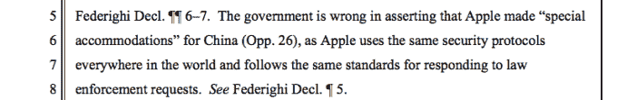

# 苹果法律部门负责人表示，苹果拒绝了中国索要其源代码 TechCrunch 的请求

> 原文：<https://web.archive.org/web/https://techcrunch.com/2016/04/19/apples-head-of-legal-says-it-refused-chinas-request-for-its-source-code/>

# 苹果法律部门负责人表示，苹果拒绝了中国索要其源代码的要求

苹果法律部门的负责人否认了一个由来已久的谣言，即苹果与中国政府合作提供其源代码。

在这个问题上有很多猜测，因为中国是苹果最重要的市场之一，中国政府对科技公司的强硬立场是出了名的——例如，[已经在该国的顶级企业中安插了警察](https://web.archive.org/web/20221007185346/https://beta.techcrunch.com/2015/08/05/china-internet-policing/)，并屏蔽了它认为对其政权构成威胁的西方服务。

以苹果为例，其来自中国的收入同比增长 14%，在 Q1 2016 年达到[183.7 亿美元的巨额收入，其与政府的关系有许多模糊之处。北京在 2015 年 1 月有点隐晦地称赞苹果允许“安全检查”，其含义不清楚，正如 Quartz 报道的](https://web.archive.org/web/20221007185346/https://beta.techcrunch.com/2016/01/26/apple-shows-q1-china-revenues-of-18-37b-up-14-yoy/)。

一些人猜测这是苹果公司屈服于政府的要求，以维持其在中国的利润丰厚的业务，但是，在周二围绕加密的国会听证会上宣誓发言时，[苹果公司总法律顾问布鲁斯·休厄尔否认了任何这样的说法](https://web.archive.org/web/20221007185346/http://www.reuters.com/article/us-apple-encryption-idUSKCN0XG28Z)。

在直接回应印第安纳州警察队长查尔斯·科恩(Charles Cohen)的指控时，休厄尔承认中国曾要求获得代码，但表示苹果拒绝了。

“我们没有向中国政府提供源代码。我们没有 19 个月前扔掉的钥匙，”Sewell 说。"那些指控毫无根据。"

苹果在法庭文件中也强调了这一点:

科恩声称引用了媒体报道，而不是提供自己的情报，但 Sewell 的回应是苹果迄今为止在这个问题上做出的最高姿态(公开)评论。这家手机制造商此前一直保持沉默，可能是为了避免暴露中国当局的敏感问题，但也有其他例子表明，它正在以我们在美国看到的同样的力度保护中国的用户数据，特别是围绕圣贝纳迪诺 iPhone 的[。](https://web.archive.org/web/20221007185346/https://beta.techcrunch.com/2016/02/24/tim-cook-a-backdoor-into-the-iphone-would-be-the-software-equivalent-of-cancer/)

2014 年 8 月，当苹果[开始首次加密存储在中国](https://web.archive.org/web/20221007185346/https://beta.techcrunch.com/2014/08/15/apple-taps-china-telecom-as-icloud-storage-provider-for-customers-in-china/)的数据时，苹果开始保护其在中国的数据。虽然 iOS 8 中的[加密功能挫败了美国政府获取用户数据的努力，但它们也让中国用户的数据更加安全。或许与此相关，](https://web.archive.org/web/20221007185346/http://www.usatoday.com/story/tech/2014/09/17/apple-ceo-tim-cook-privacy/15810009/)[中国政府被指控实施“恶意攻击”](https://web.archive.org/web/20221007185346/https://beta.techcrunch.com/2014/10/20/chinese-government-accused-of-staging-malicious-attack-on-apples-icloud-service/)欺骗 iCloud 用户提供对其数据和账户的访问。