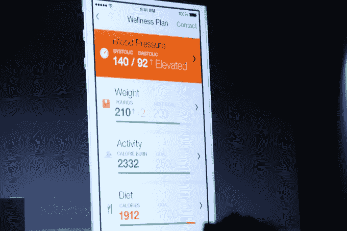
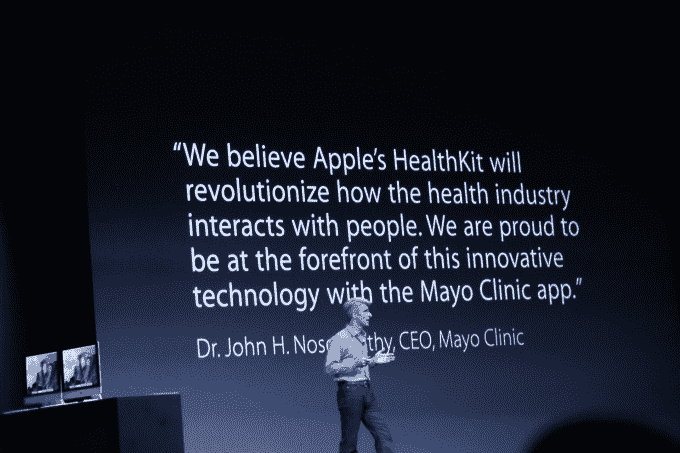

# 苹果的健康产品专注于数据收集，而不是解读

> 原文：<https://web.archive.org/web/https://techcrunch.com/2014/06/03/apples-health-offerings-focus-on-data-collection-not-interpretation/>

昨天苹果 iOS 8 发布会上的一个主要公告是健康应用程序和 HealthKit 系统，该系统允许开发人员将数据输入应用程序。

HealthKit 被宣传为一种统一的力量，将应用商店中大量与健康相关的应用联系在一起。部分目标是减轻开发人员的负担，他们不再需要构建定制工具来传输、同步和整理存储库中的健康数据。

相反，他们可以将 HealthKit 集成到他们的应用程序中，将数据注入苹果的整体数据收集应用程序 Health。

虽然商店里有很多健康应用，但大多数都属于几个群体。有些能为你提供图表或趋势，比如说，你的体重或身体质量指数。还有一些专注于让用户输入关于他们的饮食、锻炼或其他因素的数据。

第三类是来自医疗服务提供商的应用程序，允许用户明确选择将他们的健康数据发送给医生、医疗团体或医院。

HealthKit 系统会自动转换单位，例如，从一个系统转换到另一个系统。

苹果的健康系统可以识别 60 种不同类型的数据，如血糖水平、身高、体重、血型和出生日期。那些被分成永久的事物，像你出生的那一天，和被一次又一次取样的事物，像体重。

蓝牙心率监测器或 iPhone 中的步数追踪器就是可以通过 HealthKit 将数据输入健康应用程序的设备。当然，没有人会谈论苹果是否打算用自己的可穿戴传感器包将数据输入健康领域。

在权限方面，苹果也为开发者提供了精细的控制。这让用户可以非常明确地选择应用程序将与 Health 共享的数据类型。但它也提供了特定的、独立的数据读写权限。这意味着你可以选择让一个应用程序向 Health 发送数据，但不读取你不想让它看到的其他类型的数据。甚至特定类型数据的“读/写”状态也对第三方应用程序隐藏，因此他们不知道您不想让他们知道的内容。

鉴于健康数据如此敏感，对权限细节的额外关注当然是受欢迎的。

苹果的健康产品并不仅限于从第三方应用程序或通过你设备中的运动跟踪器收集数据。他们还与两个最大的健康相关数据仓库合作:梅奥诊所和 Epic 系统。

苹果公司的 Craig Federighi 在周一的主题演讲中提到了梅奥诊所的合作伙伴关系，他说这将允许患者选择与他们的医疗服务提供商共享记录和数据。

“[梅奥诊所]应用程序能够自动检查读数是否在患者的个性化医疗保健参数阈值内。如果没有，它可以主动联系医院通知医生，医生可以联系该患者，提供更及时的护理。"

正如 [Mobihealthnews](https://web.archive.org/web/20221206080503/http://mobihealthnews.com/33728/apple-reveals-tracking-app-healthkit-and-partners-with-mayo-clinic-epic/) 所指出的，与 Epic Systems 的合作也是苹果的一项重大举措，尽管在主题演讲中没有重点强调。Epic Systems 是世界上最大的电子健康记录(EHR)存储库之一。根据最近的统计，Epic 占美国所有医疗记录的一半以上

“我们刚刚超过了 51%的大关。去年底，Epic Systems 公司首席执行官朱迪·福克纳(Judy Faulkner)在其巨大的深空礼堂举行的一次活动中说:“你照顾了(美国)一半多一点的病人。Epic 拥有约占世界人口 2.4%的 EHR。

因此，让苹果与他们合作是有意义的，至少在最初是这样。目前还没有消息表明苹果是否会与其他提供商合作，或者健康提供商是否必须采用 Epic Systems 的健康应用兼容格式和记录。

这里也提出了一些有趣的问题，当谈到流行的健康应用程序有多愿意将它们收集的数据导出到苹果的健康应用程序中。定位很明确:用户有一个中央存储库，为他们提供清晰、简明的生物特征数据。

但是，尽管这对苹果设备的用户有利，但它也将焦点从收集数据的应用程序转移到了苹果的应用程序上。因此，根据这些应用的商业模式，这可能会转移人们对应用内广告的注意力。这可能会改变健康应用在商店中的盈利方式。与需要用户主动打开这些应用程序的赚钱方法相比，解锁更多苹果健康应用程序数据管道的应用内购买可能会变得更加普遍。

当然，如果一个应用程序需要用户交互来输入数据，那么这里不会有太大的变化。

但这确实符合“隐形”应用的趋势，这种应用甚至不用接触就能给用户带来好处。如果一个应用程序是一个简单的数据管道，那么苹果的系统软件如 Health 就提供了端点，用户可以看到的部分。

当谈到健康数据的碎片化世界时，苹果的健康应用程序和面向开发者的 HealthKit 工具是一种一致性和凝聚力。但是仍然没有太多的细节说明这些数据将如何被解析，从而给人们提供对这些数据意味着什么的实际解释。

这确实是任何跟踪和监控我们生物模式的努力在变得不可或缺之前必须达到的门槛。就目前而言，苹果的方法是收集数据，并将解释工作交给健康专家，这是谨慎的，在现阶段可能是明智的。